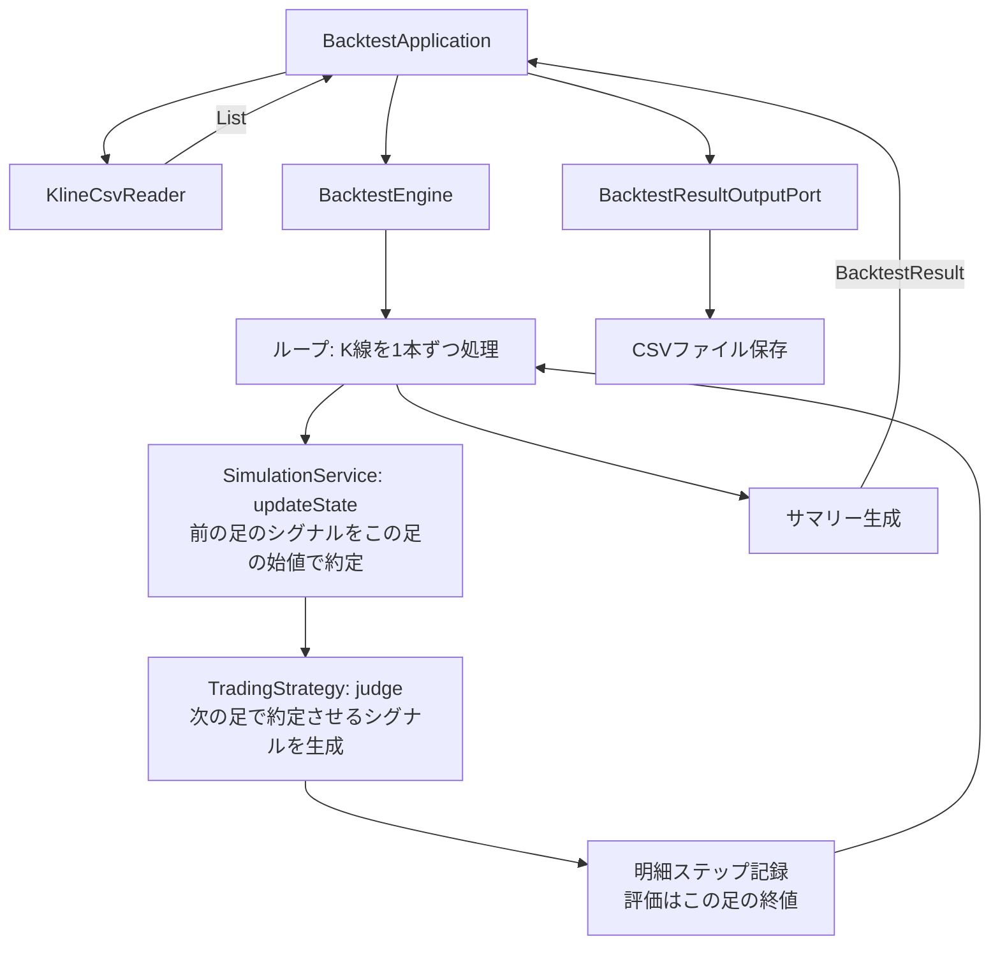

# バックテスト機能 設計書

| 項目 | 内容 |
| --- | --- |
| 想定読者 | バックテスト機能を実装・変更する開発者 |
| 読んだあとできること | バックテストの処理をどの層のどのクラスに置くかを判断できる |
| 状態 | 現行 |
| 機密区分 | 公開可 |
| 作成者 | リポジトリ管理者 |
| 保守責任者 | リポジトリ管理者 |
| 最終確認日 | 2026-08-30 |

## 1. 文書の目的

この文書では、対応する仕様（バックテスト本体）をどのように実装するかを定義する。

## 2. 対応する仕様書

- [対応する仕様書](../specifications/features/backtest.md)

## 3. 設計方針

- **依存の逆転**: `BacktestEngine` はドメイン層に置く。CSVの読み書きや Strategy の生成は外から注入する。
- **ドメインロジックの再利用**: 売買判定は `TradingStrategy`、資産更新は `SimulationService` をそのまま使う。バックテストエンジン自身に新しい売買ルールは書かない。
- **小数計算の正確性**: 金額・数量・利益率の計算には必ず `BigDecimal` を使う。誤差を防ぐためである。

## 4. 責務分担

| 層・部品 | 役割 |
| --- | --- |
| application (`BacktestApplication`) | 入力パスの受け取り、CSV読み込み機能の呼び出し、Strategyの生成、エンジンの起動、結果CSV出力機能の呼び出し |
| domain (`BacktestEngine`) | K線ごとのループ処理、Strategy呼び出し、SimulationService呼び出し、明細・サマリーデータの生成 |
| infrastructure | K線CSVの読み込み、結果（サマリー・明細）CSVの書き込み |

## 5. 配置予定のクラス・ファイル

| 種類 | 配置 | 役割 |
| --- | --- | --- |
| class | `application.backtest.BacktestApplication` | 全体のオーケストレーション |
| class | `domain.backtest.BacktestEngine` | バックテストのコアロジック |
| data class| `domain.backtest.BacktestResult` | バックテスト全体の戻り値（サマリーと明細を保持） |
| data class| `domain.backtest.BacktestSummary` | サマリー情報モデル |
| data class| `domain.backtest.BacktestStepResult` | 各時点の明細情報モデル |
| data class| `domain.backtest.BacktestCostConfig` | 手数料率・スリッページ率の設定 |
| interface | `domain.repository.BacktestResultOutputPort` | 結果出力の抽象 |
| class | `infrastructure.output.BacktestCsvFileRepository` | 結果のCSV出力実装 |

## 6. 処理フロー

**準備する**

1. presentation が `BacktestApplication` を起動する
2. `BacktestApplication` が `KlineCsvReader` を使って過去K線リストを取得する
3. `BacktestApplication` が設定から指定された `TradingStrategy` のインスタンスを生成する
4. `BacktestApplication` が `BacktestEngine` にK線リスト、Strategy、初期資金を渡す

**K線を1本ずつ回す**

5. `BacktestEngine` はK線を1本ずつループする
6. 直前のK線の判定結果があれば、**このK線の始値**を約定価格として状態更新を依頼する
   - 約定価格には手数料率とスリッページ率を織り込む
7. その時点までのK線を Strategy に渡して判定を依頼する
   - 結果は「次のK線で約定させるシグナル」として保持する

**結果を出す**

8. `BacktestEngine` は毎ステップの `BacktestStepResult` を記録し、最後に `BacktestSummary` を作成して `BacktestResult` を返す
9. `BacktestApplication` が `BacktestResultOutputPort` を使ってCSVファイルを出力する

判定と約定を1本ずらしています。判定に使った終値でそのまま約定させると、成績が楽観化するためです。
詳細は [バックテスト機能の仕様](../specifications/features/backtest.md) にあります。

## 7. Mermaid による設計フロー

## 8. データの流れ

| データ | 発生元 | 渡し先 | 説明 |
| --- | --- | --- | --- |
| List&lt;Kline&gt; | application | BacktestEngine | テスト対象の全K線データ |
| BacktestResult | BacktestEngine | application | 実行結果。サマリーと全ステップの明細を包含する。 |

## 9. 状態管理

バックテストではファイルシステム等への永続化（`state.json` の更新など）は行わない。すべてオンメモリで計算を完結させ、最終結果のみをCSVに出力する。

## 10. エラー処理設計

| エラー | 検知する場所 | 扱い |
| --- | --- | --- |
| 不正な初期資金 | application | 初期化時にバリデーションし、例外を投げる |
| 存在しないStrategy名 | application | ファクトリや設定解決時に例外を投げる |

## 11. 具体例

実装時に判断が分かれやすい箇所を、具体的な処理の流れで示します。

### 例1: サマリー作成時の責務

`BacktestEngine` はループ終了後に `BacktestSummary` を組み立てる。
計算する値は `totalAssetValue`・`maxDrawdown`・`tradeCount` などである。この計算はドメイン知識である。`BacktestEngine` か専用のドメインサービス内で行う。

## 12. テスト方針

| テスト対象 | 確認内容 |
| --- | --- |
| BacktestEngine | 少数の固定K線データを与え、期待通りのサマリー（利益率、取引回数、ドローダウン等）と明細が出力されるか計算の正確性をテストする |
| infrastructure | サマリーおよび明細が正しいフォーマットとヘッダーでCSVに出力されるかテストする |

## 13. 関連ドキュメント

- [対応する仕様書](../specifications/features/backtest.md)
