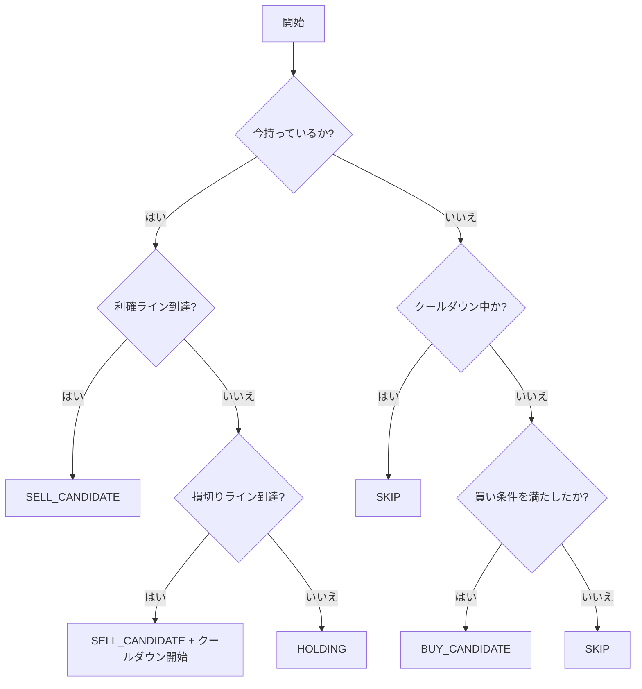

# CooldownReboundStrategy 仕様書

## 文書の目的

- 新しい売買戦略 `CooldownReboundStrategy` を追加する理由と目的を定義する。
- 既存の `SafeReboundStrategy` との違いを明確にし、解決すべき課題を整理する。
- 損切り後にすぐ再エントリーしない（クールダウン）方針の具体的な仕様を定義する。
- バックテストにおける比較観点と評価項目を整理する。

## 対象読者

- 開発者、運用者、バックテスト実行者
- 戦略の違いや新しい戦略の挙動を理解したい方

## 関連ドキュメント

- [trading-logic.md](trading-logic.md): 既存戦略の売買ロジックの解説
- [backtest.md](backtest.md): バックテストの実行・評価方法

## 1. 新しい戦略を追加する理由と背景

既存の `SafeReboundStrategy` のバックテスト結果から、以下の問題点が確認されました。

**SafeReboundStrategy のバックテスト結果サマリ（BTC 5分足 / 2026-01-01 〜 2026-05-05）:**

- **最終総資産:** 10,061.63735957
- **最大ドローダウン:** 2.16%
- **売買回数:** 1070 (買い535回, 売り535回)
- **利確回数 / 損切り回数:** 284回 / 251回
- **平均利益 / 平均損失:** 6.18 / -6.63
- **最大連続損切り回数:** 7回

### 既存バックテスト結果から見えた問題

- **最大連続損切り回数が多い**: 相場が連続して下落する局面において、反発を期待してエントリーしてはすぐに損切りに引っかかる、いわゆる「往復ビンタ」状態が発生している。
- **損切り回数が多い / 平均損失が平均利益を上回る**: 細かい反発を狙うがあまり、ダウントレンドに巻き込まれるケースが多い。
- **最大ドローダウンの悪化**: 連続した損切りにより、資産の目減りが大きくなるリスクがある。

### 解決の方針

上記の課題を解決するため、**「損切りした直後は、一定期間相場が不安定であるとみなし、すぐには再エントリー（買い）を行わない」**というクールダウン期間を設ける新しい戦略 `CooldownReboundStrategy` を導入します。

目標とする改善項目:

1. 最大連続損切り回数を減らす
2. 損切り回数全体を減らす
3. 平均損失を小さくする
4. 最大ドローダウンを下げる

## 2. SafeReboundStrategy との違い

基本的な「下落後の反発を狙う」買い条件と、「買った価格（buyPrice）を基準にする」売り条件は `SafeReboundStrategy` と同じです。
最大の違いは**「損切り直後のエントリー制限（クールダウン）」**の有無です。

| 項目                   | SafeReboundStrategy                  | CooldownReboundStrategy                                  |
| :--------------------- | :----------------------------------- | :------------------------------------------------------- |
| **買い条件**           | 急変動がなく、下がって反発したら買う | **同左 ＋ 「クールダウン期間中ではないこと」**           |
| **売り条件（利確）**   | 買った価格より一定割合上がったら売る | 同左                                                     |
| **売り条件（損切り）** | 買った価格より一定割合下がったら売る | 同左 **（＋ 損切り実行時にクールダウン期間を開始する）** |
| **保有中の判定**       | 買った価格ベースで判定               | 同左                                                     |

## 3. クールダウン（再エントリー制限）の仕様

### 損切り後にすぐ再エントリーしない方針

- **損切り時:** 損切り判定により売却を実行した際、「最後に損切りした時刻（またはK線のインデックス）」を記録し、クールダウン期間を開始します。
- **利確時:** 利益確定で売却した場合は、相場が想定通りに動いているため、クールダウン期間は開始しません（通常通りすぐに次のエントリー機会を探します）。
- **再エントリー制限中の買い判定:** クールダウン期間中にエントリー条件（反発など）を満たしたとしても、**買い判定は見送り（SkipBuy）**とします。

### 再エントリー制限の設定値（何本のK線を待つか）

- 本戦略は主に5分足を対象とします。
- **初期候補:** `12本` （5分足 × 12本 = 1時間）
- つまり、**損切りを実行してから1時間は、いかなる買い条件を満たしてもエントリーしない**設定とします。
- この値は将来的に設定ファイル（TradingConfig等）で調整可能にする想定です。

### 判定の扱いまとめ

- **保有中の売却判定:**
  - 利確ライン到達時 ➔ `SELL_CANDIDATE`
  - 損切りライン到達時 ➔ `SELL_CANDIDATE` ＋ **クールダウン開始**
  - 利確・損切りライン未到達時 ➔ `HOLDING`
- **非保有時の買い判定:**
  - クールダウン期間中の場合 ➔ `SKIP`
  - クールダウン期間外 ＋ 買い条件成立 ➔ `BUY_CANDIDATE`
  - クールダウン期間外 ＋ 買い条件不成立 ➔ `SKIP`

### 判断フロー

## 4. バックテストでの比較観点

新しい戦略が実装された後、既存の `SafeReboundStrategy` と同じ条件（BTC 5分足、同一期間）でバックテストを実施し、以下の項目を比較・評価します。

### 比較項目と期待する結果

| 比較項目                | 期待する変化 (Cooldown vs Safe)  | 理由                                     |
| :---------------------- | :------------------------------- | :--------------------------------------- |
| **最大連続損切り回数**  | **減少** するはず                | 下落トレンドでの連続エントリーを防ぐため |
| **損切り回数**          | **減少** するはず                | 無駄なエントリーが減るため               |
| **売買回数（全体）**    | 減少するはず                     | クールダウンによって機会が減るため       |
| **最大ドローダウン**    | **改善（低下）** するはず        | 連続した損失による資産減少を防ぐため     |
| **平均利益 / 平均損失** | 平均損失が相対的に小さくなるか？ | 悪いエントリーを回避できているか確認     |
| **最終総資産 / 利益率** | 向上するか？                     | 機会損失とリスク回避のトレードオフの確認 |

機会損失（本来勝てていたはずの場面を見送ってしまうこと）よりも、**リスク回避（無駄な連続損失を防ぐこと）によるドローダウンの改善**が上回っているかを確認することが最大の目的です。
