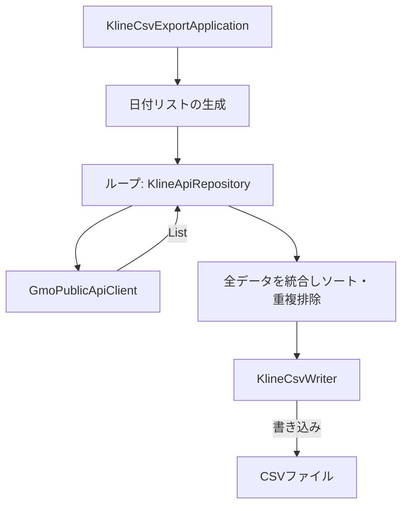

# 過去K線CSV作成機能 設計書

| 項目 | 内容 |
| --- | --- |
| 想定読者 | K線CSV作成機能を実装・変更する開発者 |
| 読んだあとできること | GMO Public API からの取得とCSV保存を、層を守って実装できる |
| 状態 | 現行 |
| 機密区分 | 公開可 |
| 作成者 | リポジトリ管理者 |
| 保守責任者 | リポジトリ管理者 |
| 最終確認日 | 2026-08-30 |

## 1. 文書の目的

この文書では、対応する仕様（過去K線CSV作成機能）をどのように実装するかを定義する。

## 2. 対応する仕様書

- [対応する仕様書](../specifications/features/kline-csv-export.md)

## 3. 設計方針

- **ドメインロジックの排除**: この処理には売買判定のようなドメイン知識がない。`application` と `infrastructure` の協調として実装する。
- **データ型**: DTO は `infrastructure` 内で `Kline` に変換する。アプリケーション層では `Kline` のリストだけを扱う。
- **ファイル保存の抽象化**: CSV保存はライブラリに依存するため `infrastructure` に置く。呼び出しは抽象インターフェース経由とする。

## 4. 責務分担

| 層・部品 | 役割 |
| --- | --- |
| application | 開始日〜終了日の日付リスト生成、APIクライアントとCSV保存処理の呼び出し順序制御 |
| infrastructure (API) | GMO Public API から指定された日付のK線をフェッチし、DTOから `Kline` へ変換 |
| infrastructure (File) | `List<Kline>` を受け取り、指定されたパスへCSVフォーマットで書き込む |

## 5. 配置予定のクラス・ファイル

| 種類 | 配置 | 役割 |
| --- | --- | --- |
| class | `application.export.KlineCsvExportApplication` | アプリケーションフローの制御 |
| interface | `domain.repository.KlineApiRepository` | API取得処理の抽象化 |
| class | `infrastructure.exchange.gmo.GmoPublicApiClient` | API取得の具体実装 |
| interface | `domain.repository.KlineCsvWriter` | CSV出力処理の抽象化 |
| class | `infrastructure.output.KlineCsvFileWriter` | CSV出力の具体実装（opencsv利用等） |

## 6. 処理フロー

1. presentation が実行され、入力パラメータを受け取る
2. `KlineCsvExportApplication` が開始日から終了日までの日付リストを作る
3. 日付リストをループし、`KlineApiRepository`（実体は`GmoPublicApiClient`）を呼び出して1日分の `List<Kline>` を取得する
4. すべてのデータを1つのリストにまとめ、`openTime` で昇順ソートする
5. ソート後、隣接する要素を比較して `openTime` が重複するデータを排除する
6. `KlineCsvWriter` にリストと出力パスを渡し、CSVファイルとして書き出す

## 7. Mermaid による設計フロー

## 8. データの流れ

| データ | 発生元 | 渡し先 | 説明 |
| --- | --- | --- | --- |
| GMOレスポンスDTO | GMO Public API | GmoPublicApiClient | JSONレスポンス |
| List&lt;Kline&gt; | GmoPublicApiClient | Application | ドメインモデルに変換されたK線データ |

## 9. 状態管理

この機能はバッチ的な一過性の処理であり、状態管理（`state.json` の更新など）は行わない。

## 10. エラー処理設計

| エラー | 検知する場所 | 扱い |
| --- | --- | --- |
| 必須パラメータ不足 / 日付不正 | application | 例外を投げ、処理を中止する |
| API取得失敗 | infrastructure | 例外を application に伝え、処理を中止する |
| ファイル書き込み権限エラー | infrastructure | 同上 |

## 11. 具体例

実装時に判断が分かれやすい箇所を、具体的な処理の流れで示します。

### 例1: 日付範囲の作り方

- 入力: 開始日 `20260501`、終了日 `20260503`
- アプリケーションは `2026-05-01` から `2026-05-03` を生成する。
- API へは `yyyyMMdd` 形式の文字列（`20260501` など）で渡す。

## 12. テスト方針

| テスト対象 | 確認内容 |
| --- | --- |
| application | 日付生成ロジック、ソート、重複排除が正しく機能するか |
| infrastructure | APIレスポンスが正しく `Kline` にマッピングされるか、CSVが期待通りのヘッダーとフォーマットで書き出されるか |

## 13. 関連ドキュメント

- [対応する仕様書](../specifications/features/kline-csv-export.md)
