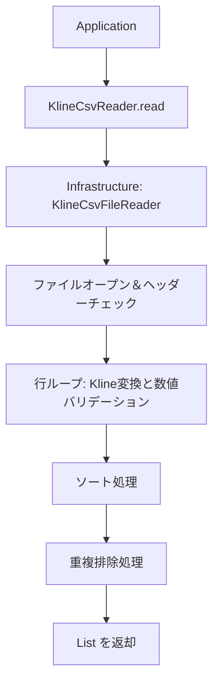

# 過去K線CSV読み込み機能 設計書

| 項目 | 内容 |
| --- | --- |
| 想定読者 | K線CSV読み込み機能を実装・変更する開発者 |
| 読んだあとできること | CSVの読み込みと整列・重複排除を、層を守って実装できる |
| 状態 | 現行 |
| 機密区分 | 公開可 |
| 作成者 | リポジトリ管理者 |
| 保守責任者 | リポジトリ管理者 |
| 最終確認日 | 2026-08-30 |

## 1. 文書の目的

この文書では、対応する仕様（過去K線CSV読み込み機能）をどのように実装するかを定義する。

## 2. 対応する仕様書

- [対応する仕様書](../specifications/features/kline-csv-import.md)

## 3. 設計方針

- **CSV読み込みの隠蔽**: パース・ヘッダー検証・ダブルクォート処理は外部ライブラリに依存する。すべて `infrastructure` 層に置く。
- **戻り値の型**: 上位層にはファイル操作の情報を漏らさない。返すのは `List<Kline>` だけとする。

## 4. 責務分担

| 層・部品 | 役割 |
| --- | --- |
| application | CSV読み込みの呼び出し |
| infrastructure | CSVファイルの読み込み、ヘッダー順序検証、行ごとの `Kline` モデル変換、ソートと重複排除 |

## 5. 配置予定のクラス・ファイル

| 種類 | 配置 | 役割 |
| --- | --- | --- |
| interface | `domain.repository.KlineCsvReader` | CSV読み込み機能の抽象インターフェース |
| class | `infrastructure.input.KlineCsvFileReader` | opencsv等を使った具体的な読み込み実装 |

## 6. 処理フロー

1. application が `KlineCsvReader.read(path)` を呼び出す
2. `KlineCsvFileReader` がファイルを開く
3. 1行目を読み込み、ヘッダーが期待通り（`openTime,open,high,low,close,volume`）かチェックする
4. 2行目以降を順次読み込み、空行を無視して `Kline` インスタンスを生成する（数値変換も行う）
5. すべての行を読み込んだ後、リストを `openTime` の昇順でソートする
6. ソートされたリストから、同じ `openTime` を持つ重複要素を排除する（最初に出現したものを残す）
7. `List<Kline>` を application に返す

## 7. Mermaid による設計フロー

## 8. データの流れ

| データ | 発生元 | 渡し先 | 説明 |
| --- | --- | --- | --- |
| CSVの行データ | File System | KlineCsvFileReader | テキストデータ |
| List&lt;Kline&gt; | KlineCsvFileReader | Application | 変換済みのK線リスト |

## 9. 状態管理

一過性の読み込み処理であるため、状態管理は行わない。

## 10. エラー処理設計

| エラー | 検知する場所 | 扱い |
| --- | --- | --- |
| ファイルが存在しない / 読めない | infrastructure | 例外（FileNotFoundException等）を投げ、applicationで捕捉または上位へ伝播する |
| ヘッダー不正 | infrastructure | 専用の例外を投げ、エラーメッセージで期待するヘッダーを伝える |
| 数値変換エラー | infrastructure | 専用の例外を投げ、行番号とエラーの原因となった値を含める |

## 11. 具体例

実装時に判断が分かれやすい箇所を、具体的な処理の流れで示します。

### 例1: ソートと重複排除の実装方針

Kotlin の標準ライブラリを利用し、読み込み完了後に `list.sortedBy { it.openTime.toLong() }.distinctBy { it.openTime }` のような処理を行うことで、仕様を満たすソートと重複排除を簡潔に実装する。

## 12. テスト方針

| テスト対象 | 確認内容 |
| --- | --- |
| infrastructure | 正常なCSVの読み込み、ヘッダー不正時の例外、数値フォーマットエラー時の例外、重複排除とソートが正しく機能するか |

## 13. 関連ドキュメント

- [対応する仕様書](../specifications/features/kline-csv-import.md)
