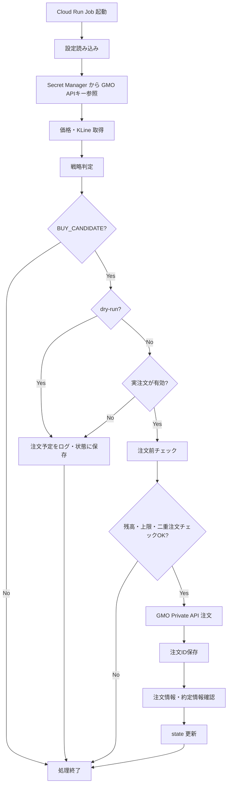
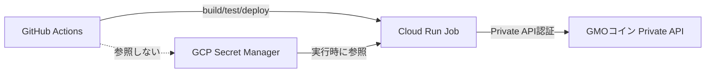

# リアル購入処理の設計方針（GMOコイン）

## 概要

本ドキュメントは、シミュレーション検証から実際の資金を用いた運用（リアル購入処理）へ移行する際に必要となる、GMOコイン Private API を利用した実注文機能の設計仕様を定めます。

- **この仕様書で決めること**: 実注文を実行するための処理フロー、APIキーの安全な管理方法、注文前後の状態確認の手順、および安全装置の設定。
- **リアル購入処理が必要な理由**: バックテストやシミュレーションで有効性が確認された売買ロジックを、実際の市場環境で稼働させ、利益を獲得するため。
- **移行の安全性（dry-run）**: 本機能の実装後も、いきなり実注文をONにはしません。デフォルトは `dry-run` モードとし、実際のAPI呼び出しを行わずに注文予定のログ出力と状態更新だけを行い、安全性を十分に確認します。
- **GMOコイン Private API の利用**: 実注文、残高確認、約定確認には認証が必要な GMOコインの Private API を使用します。
- **APIキーの管理と責務分離**:
  - 実売買に必要な API Key と Secret Key は、GitHub Secrets には**絶対に保存しません**。
  - すべての秘密情報は **GCP Secret Manager** で管理します。
  - GitHub Actions はビルド・テスト・デプロイのみを担当します。
  - デプロイされた Cloud Run Job が、実行時のみ Secret Manager から直接APIキーを参照し、GMO Private API にアクセスします。

## 具体例

以下は、リアル購入処理が導入された場合の動作の具体例です。

1. **シグナル発生**: `AtrTrendConfirmReboundStrategy` などの売買ロジックが `BUY_CANDIDATE`（買い候補）を判定する。
2. **dry-run 確認**:
   - `dry_run = true` の場合: 実注文は行わず、これまで通り「注文予定」をログに出力し、シミュレーション上の状態（`state.json`）を更新して終了する。
3. **実注文の実行前確認**:
   - `dry_run = false` かつ `real_trade_enabled = true` の場合のみ実注文プロセスへ進む。
   - 注文前に GMO Private API を呼び出し、口座残高、設定された注文上限（1回・1日）、および最大保有金額の制限に引っかからないかを確認する。
4. **注文の実行**:
   - チェックを通過した場合、GMO Private API（`/private/v1/order`）へ注文リクエストを送信する。
5. **注文後の処理**:
   - 成功した場合、レスポンスから `orderId` を取得し保存する。
   - 約定情報API（`/private/v1/executions` または `/private/v1/latestExecutions`）を呼び出し、約定を確認する。
6. **異常ハンドリング**:
   - 注文エラーや約定未確認などの異常が発生した場合は、次回以降の実注文フラグを強制的に停止（フェイルセーフ）する。

## 処理フロー

1. 戦略による売買判定（シグナル生成）
2. 実注文許可チェック（`real_trade_enabled`）
3. `dry-run` 判定
4. 注文前チェック（GMO APIによる残高確認、注文上限・保有上限の計算）
5. 注文パラメータ作成
6. GMO Private API 呼び出し（注文の送信）
7. 注文ID（`orderId`）の保存
8. 約定確認（GMO APIによるステータス確認）
9. アプリケーションの状態（`state.json` 等）の更新
10. エラー発生時、次回以降の実注文の強制停止

## Mermaid による図

### 注文処理フロー

### シークレット管理とアーキテクチャ

## 詳細仕様

### 全体構成

アプリケーションは既存のレイヤードアーキテクチャを維持します。ビジネスロジックは `domain` レイヤに留め、GMO API クライアントの実装やシークレットの取得は `infrastructure` レイヤに配置します。

### GMO Public API / Private API の使い分け

- **Public API**: ティッカー取得、KLine取得などの相場データ収集に引き続き使用します（認証不要）。
- **Private API**: 残高照会、注文実行、有効注文一覧、約定情報の取得に使用します。これらのエンドポイントにはすべて認証が必要です。

### Private API 認証方式

GMOコインの公式ドキュメントに準拠し、リクエストごとに以下のHTTPヘッダを付与します。

- `API-KEY`: Secret Managerから取得したアクセスキー
- `API-TIMESTAMP`: リクエスト時のUnix Timestamp(ミリ秒)
- `API-SIGN`: Timestamp, HTTPメソッド, パス, リクエストボディを連結した文字列を Secret Key を用いて `HMAC-SHA256` 形式で署名し16進数でエンコードした文字列。

### APIキー管理と GCP Secret Manager の使い方

- APIキーとシークレットは、GCPプロジェクトの Secret Manager にそれぞれ格納します（例: `gmo-api-key`, `gmo-api-secret`）。
- Cloud Run Job の実行用サービスアカウント（Runtime Service Account）にのみ、該当シークレットへの `Secret Manager Secret Accessor` ロールを付与します。
- `infrastructure` 層の初期化時に、GCP SDK または環境変数の統合を通じてこれらの値を取得し、メモリ上に一時保持して通信に使用します。ログなどには絶対に出力しません。

### GitHub Actions との責務分離

- GitHub Actions の Workflow（`deploy-gcp.yml` 等）では、GCP リソースへのデプロイ操作のみを行います。
- ワークフロー内に GMOコインのキー情報を渡したり、`Repository Variables` や `Secrets` に保存することは禁止します。

### dry-run の仕様

- `dry_run` 設定が `true` の場合、ドメインロジックの売買判断までは実行されますが、`infrastructure` レイヤの Private API クライアント（注文メソッド）は実際のHTTPリクエストをスキップし、成功したとみなして疑似的な `orderId` を返すか、単にログを記録して終了します。
- デフォルト値は安全のため必ず `true` に設定します。

### 実注文ON/OFFの仕様

- `real_trade_enabled` が `true` の場合のみ実注文が許可されます。
- `dry_run` が `false` でも、`real_trade_enabled` が `false` なら注文は行われません。

### 注文前チェック

1. **残高確認**: Private API `/private/v1/account/margin` (または `assets`) を呼び出し、取引余力 (`availableAmount`) を確認します。注文金額以上の余力がない場合は注文を見送ります。
2. **有効注文一覧確認**: `/private/v1/activeOrders` を呼び出し、未約定の注文がないか確認し、二重注文を防ぎます。
3. **設定上限チェック**: 1回あたりの注文上限、1日の累積注文金額上限、および最大保有金額の上限を超えないかを計算します。

### 注文APIの利用方針

- エンドポイント: `POST /private/v1/order`
- パラメータ: `symbol` (例: BTC_JPY), `side` (BUY/SELL), `executionType` (現状は安全のため LIMIT や MARKET を検討、GMOの仕様に合わせて FAS/FAK を設定), `price`, `size` を指定します。

### 注文情報・約定情報取得

- 注文後、`/private/v1/orders` または `/private/v1/executions` (もしくは `latestExecutions`) を使用して、注文のステータスが `EXECUTED` になっているか確認します。

### 注文ID保存と state.json との関係

- 注文が成功した場合、返却された `orderId` と実際の `executionPrice` (約定価格), `executionSize` を `SimulationState` (またはそれに類する拡張モデル) に記録し、`state.json` に保存して次回の状態把握に用います。

### 二重注文防止

- 状態 (state) として `isHolding` を管理するだけでなく、GMO側の `/private/v1/activeOrders` や実際の建玉 (`/private/v1/openPositions`) を定期的に同期させ、システム状態と取引所の実際の状態のズレを検知します。ズレがあれば注文をブロックします。

### 異常時停止とエラー時の扱い

- APIからのエラーレスポンス（特に `ERR-xxx` のエラーコード）、タイムアウト、署名エラーなどが起きた場合は、直ちにシステム全体のステータスを異常状態とし、強制的に実注文を停止します。
- 復旧は人間の確認（ログ確認および手動でのフラグリセット）が必要な設計とします。
- 重大な例外情報をログ出力する際、リクエストヘッダや署名情報等の機密情報は必ずマスキングします。

### API制限への対応

- GMO Private API には Tier ごとの呼び出し制限（例: Tier 1 で 20 req/s）が存在します。過度なポーリングを避け、必要なタイミング（5分に1回のインターバル実行など）でのみリクエストを行うことで制限を回避します。
- 制限エラー (`ERR-5003`) を受けた場合はバックオフ（再試行遅延）を導入します。

### テスト観点

- 実注文ロジックのテストでは、GMO API クライアントを Mock 化（WireMock または MockK）し、正常系・異常系（残高不足、エラーコード返却など）すべての分岐を網羅します。

### バックテスト結果との違い

- バックテストはスリッページや約定遅延を考慮していません。実際のリアル購入では、注文から約定までにタイムラグがあり、指定した価格で約定しないリスクや、注文がキャンセルされるリスクがある点を念頭に置いたエラーハンドリングが必要です。

## 設定方針

設定項目は `application-gmo.yaml` 等に追加し、意味と用途を明確にします。

| 設定名                       | 日本語の意味             | 用途                                                                   | デフォルト方針               |
| ---------------------------- | ------------------------ | ---------------------------------------------------------------------- | ---------------------------- |
| `real_trade_enabled`         | 実注文を有効にするか     | `true` の場合だけ実注文を許可する安全フラグ                            | `false`                      |
| `dry_run`                    | 実注文せず検証だけ行うか | `true` の場合はAPIを叩かず注文予定だけ記録する                         | `true`                       |
| `max_order_jpy`              | 1回あたりの最大注文金額  | 1回の注文で消費できる日本円の上限額                                    | 小さく始める (例: 1000)      |
| `max_daily_order_jpy`        | 1日あたりの最大注文金額  | 1日の中で取引できる累積金額の上限                                      | 小さく始める                 |
| `max_position_jpy`           | 最大保有金額             | リスク過多を防ぐための保有資産の総額上限                               | 小さく始める                 |
| `gmo_api_key_secret_name`    | GMO APIキーのSecret名    | Secret Manager からAPIキーを取得するための名前                         | 環境別に設定                 |
| `gmo_api_secret_secret_name` | GMO Secret KeyのSecret名 | Secret Manager からSecret Keyを取得するための名前                      | 環境別に設定                 |
| `order_symbol`               | 注文対象の銘柄           | 注文する通貨ペア（例: BTC_JPY）を指定する                              | 既存設定に合わせる           |
| `order_execution_type`       | 注文方法                 | 成行（MARKET）や指値（LIMIT）など、GMO APIの注文方式                   | 安全な方式を検討 (LIMIT推奨) |
| `order_time_in_force`        | 注文の有効条件           | FAS, FAK など、注文の有効期限の条件                                    | GMO API仕様に合わせる        |
| `stop_on_order_error`        | 注文エラー時に止めるか   | APIエラーなどで注文失敗時、次回以降の実注文を停止する                  | `true`                       |
| `stop_on_unconfirmed_order`  | 約定未確認時に止めるか   | 注文後の約定ステータスが確認できない場合、危険とみなし実注文を停止する | `true`                       |

## 安全装置

リアル購入処理における重大な損失を防ぐため、以下の安全装置を実装します。

- **デフォルトは常に `dry-run`**: 誤ってデプロイした場合でも実資金が動かないようにする。
- **実注文許可フラグ**: `real_trade_enabled` が明示的に `true` に設定された場合のみ実注文を行う二重チェック。
- **金額上限の厳守**: `max_order_jpy`, `max_daily_order_jpy`, `max_position_jpy` を設け、これらを超える注文は全てブロックする。
- **残高不足時のブロック**: GMO API の資産・余力情報を注文前に必ず確認し、不足があれば実行しない。
- **二重注文の防止**: 実行中の有効注文一覧を確認し、同一のシグナルによる意図しない重複注文を防ぐ。
- **注文IDの保存と約定確認の必須化**: 注文実行後、返却された注文IDを保存し、必ず約定情報APIで結果を確かめる。
- **異常時・未確認時の自動停止**: APIエラー、約定未確認、システム例外などの重大エラー発生時は `stop_on_order_error` などの設定に従い、以降の実注文を強制停止する。
- **機密情報のログ出力禁止**: APIキー、Secret Key、および署名に使用する情報をログに一切出力しない（マスキング処理）。
