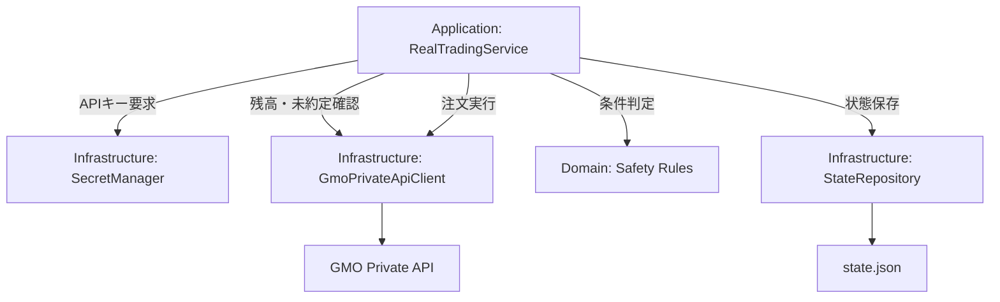

# リアル購入処理（GMOコイン） 設計書

## 1. 文書の目的

この文書では、対応する仕様（GMOコイン Private APIを利用したリアル注文処理）をどのように実装するかを定義する。

## 2. 対応する仕様書

- [対応する仕様書](../specifications/features/real-trading-gmo-order.md)

## 3. 設計方針

- **domain に外部APIを依存させない**: `domain` パッケージにはAPI通信やファイル保存のロジックを含めません。
- **DTOとモデルの分離**: GMO API のレスポンス型（DTO）は `infrastructure` 層に閉じ込め、`domain` や `application` 層には変換後のドメインモデルのみを渡します。DTOは1APIごとに独立したクラス/ファイルとし、`GmoPrivateApiModels.kt` のような集約クラスは使用しません。
- **シークレット管理**: APIキーなどの機密情報は GCP Secret Manager から必要なタイミング（実注文の直前）でのみ取得し、メモリ上に長期間保持せず、またログにも出力しません。
- **状態管理**: 注文状態や保有状態は `state.json` の `realTrading` ブロックで管理し、システム再起動時にも二重注文を防ぎます。
- **型変換**: GMO API が返す orderId は Long 等であっても、ドメイン層では `String` に変換して扱います。また、APIレスポンスの price や size は、実際の約定値を表すドメインモデルでは `actualPrice`、`actualSize` などの明確な名前に変換します。

## 4. 責務分担

| 層・部品 | 役割 |
| --- | --- |
| presentation | Cloud Run Job からの実行エントリポイント |
| application | Strategyの判定結果を受け取り、安全チェックを経て、実注文プロセス全体の順序を管理 |
| domain | 安全チェックの閾値判定、注文状態（ドメインモデル）の表現、Strategyによる売買判定 |
| infrastructure | GMO Private API クライアントの実装、GCP Secret Manager からのキー取得、state.jsonの保存 |

## 5. 配置予定のクラス・ファイル

| 種類 | 配置 | 役割 |
| --- | --- | --- |
| interface | `domain.repository.ExchangeApiRepository` | 取引所API（残高、注文、約定）の抽象化 |
| class | `infrastructure.exchange.gmo.GmoPrivateApiClient` | GMO APIの具体的な通信処理 |
| data class| `infrastructure.exchange.gmo.dto.*Dto` | GMO APIのリクエスト/レスポンス用DTO（1クラス1ファイル） |
| class | `application.trading.RealTradingService` | 実注文の安全チェックと実行フローの制御 |
| class | `infrastructure.secret.GcpSecretManagerClient` | APIキーの取得 |

## 6. 処理フロー

1. `application` が Strategy からの判定結果（`BUY_CANDIDATE`）を受け取る
2. `application` が設定（dry_run, real_trade_enabled）を確認する
3. `infrastructure` 経由で Secret Manager から APIキーを取得する
4. `infrastructure` の `GmoPrivateApiClient` を使って残高と未約定注文を取得する
5. `domain` のルールに基づいて安全チェックを実施する
6. チェックOKなら `GmoPrivateApiClient` で注文APIを呼び出し、`orderId` を取得する
7. 約定APIを呼び出して確認し、`state.json` を更新する

## 7. Mermaid による設計フロー

## 8. データの流れ

| データ | 発生元 | 渡し先 | 説明 |
| --- | --- | --- | --- |
| GmoActiveOrderDto | GMO API | infrastructure | GMO APIからの未約定注文レスポンス |
| ExchangeActiveOrder | infrastructure | domain / application | DTOから変換された、ドメイン層で扱う未約定注文モデル |
| API Keys | GCP Secret Manager | infrastructure | 注文APIの署名生成に使用（ログ出力厳禁） |

## 9. 状態管理

| 保存先 | 保存内容 | 更新タイミング |
| --- | --- | --- |
| `state.json` (realTrading) | orderId, 注文ステータス, 約定結果, 停止フラグ(isStopped) | 注文送信直後、約定確認後、またはエラーによる強制停止時 |

## 10. エラー処理設計

| エラー | 検知する場所 | 扱い |
| --- | --- | --- |
| APIエラーレスポンス | infrastructure | application に伝播し、`isStopped=true` にして次回注文を停止する |
| 通信タイムアウト / 署名エラー | infrastructure | 同上 |
| 約定未確認 | application | `state.json` に未確認として記録し、次回起動時に状態不整合を防ぐため新規注文を停止 |

## 11. 具体例

### 例1: 正常処理（DTO変換と実行）

- 10:00 にアプリが Strategy から `BUY_CANDIDATE` を受け取る。
- `RealTradingService` が `ExchangeApiRepository.getAssets()` を呼び出す。
- `GmoPrivateApiClient` が API通信し、`GmoAccountAssetDto` を受け取る。
- `GmoAccountAssetDto` をドメインモデル `ExchangeAsset` に変換して返す。
- 残高チェックを通過後、`ExchangeApiRepository.placeOrder()` を実行し、`AcceptedOrder` モデルを受け取って `state.json` に保存する。

## 12. テスト方針

| テスト対象 | 確認内容 |
| --- | --- |
| domain | 安全条件のロジック（上限超過、未約定あり）が正しく弾くこと |
| application | `dry_run=true` 時にAPIクライアントが一切呼ばれないこと |
| infrastructure | DTOからドメインモデルへの変換が正しく行われること、APIキーがログに出ないこと |
| Architecture | DTOがドメイン層に漏れていないこと（Konsistによる検査）、DTOが1クラス1ファイルで配置されていること |

## 13. 関連ドキュメント

- [対応する仕様書](../specifications/features/real-trading-gmo-order.md)
