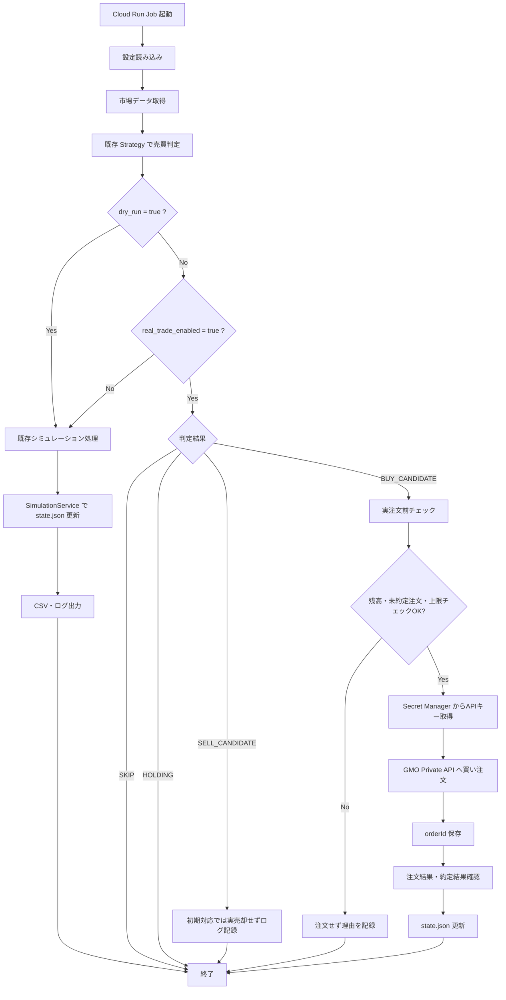

# リアル購入処理の設計仕様（GMOコイン）

## 概要
本ドキュメントは、GMOコイン Private API を利用した「リアル注文処理」の仕様を定めます。

- リアル注文処理では相場の売買判断（テクニカル条件等）を行わず、既存の Strategy が出力した判定結果（シグナル）を元に、安全に実注文を行えるかどうかの確認とAPI呼び出しのみを担当します。
- `dry_run=true` または `real_trade_enabled=false` の場合は、今まで通りのシミュレーション動作を行います。
- `dry_run=false` かつ `real_trade_enabled=true` の場合だけ、実注文処理に進みます。
- **初期対応の範囲**: 初期対応では「現物取引（Spot）」のみを対象とし、レバレッジ取引は対象外とします。また、売り注文（SELL）の自動化は初期対応の対象外とし、買い注文のみを自動化します。
- APIキー等の機密情報はすべて GCP Secret Manager で管理し、ログへの出力は厳禁とします。

## 既存 Strategy とリアル注文処理の責務分離
リアル注文処理と、相場を分析する Strategy の責務は以下のように明確に分離します。

- **Strategy の責務**: 相場データ（KLine等）を分析し、「今買うべきか」「売るべきか」「見送るべきか」を判断する。判断結果は `TradeDecision`（`action`: `BUY_CANDIDATE`, `SELL_CANDIDATE`, `SKIP`, `HOLDING`）として返す。
- **リアル注文処理の責務**: Strategy の判定結果を受け取り、残高や上限設定などの「安全面」から実注文してよいかを判断し、GMOコイン Private API に注文を送信する。
- **留意事項**:
  - リアル注文処理側では「価格が下がったから買う」「MAを上抜けたから買う」といった Strategy の買い条件・売り条件を一切再実装しません。
  - Strategy を切り替えても、リアル注文処理の安全チェック（残高確認、二重注文防止など）は共通で動作します。

### 判定結果（シグナル）の扱い
- **`BUY_CANDIDATE`**: 買い注文の候補として扱い、注文実行条件（後述）の安全チェックに回します。
- **`SELL_CANDIDATE`**: 売り注文の候補として扱います。
  - **初期対応**: 実売却は対象外とします。受け取った場合は実注文は行わず、理由とともにログに記録するのみとします。
  - **将来対応**: 保有数量、約定状態、GMO側残高を確認したうえで、売却注文を行う仕様とします。
- **`SKIP` / `HOLDING`**: 実注文は行いません（処理をスキップまたは現在状態の維持のみ行います）。

## 注文実行条件
既存 Strategy の判定結果が `BUY_CANDIDATE` の場合、注文候補として扱います。
ただし、以下の**安全条件をすべて満たす場合のみ**実注文を許可します。一つでも満たさない条件がある場合は実注文せず、理由をログまたは状態（state.json）に残します。

1. `real_trade_enabled` が `true` であること
2. `dry_run` が `false` であること
3. 現在対象の銘柄を保有中ではないこと（二重注文・多重保有の防止）
4. GMO側に未約定の注文（Active Orders）が存在しないこと
5. GMO Private API で確認した利用可能なJPY残高（`available`）が、今回の注文予定額以上であること
6. 注文予定額が、1回あたりの注文金額上限（`max_order_jpy`）を超えないこと
7. 1日の累計注文額が、上限（`max_daily_order_jpy`）を超えないこと
8. 現在の保有金額と注文予定額の合計が、最大保有金額（`max_position_jpy`）を超えないこと

## 注文金額と数量の計算仕様
注文時の金額や数量は、以下のルールに従って決定します。新しい独自の金額ロジックは追加しません。

- `trading.trade_amount`（既存設定）を、1回あたりの「注文予定額の基本値」として扱います。
- `max_order_jpy` を「1回あたりの注文金額の安全上限」として扱います。
- `trade_amount > max_order_jpy` の場合は安全条件違反とし、実注文を見送ります。
- **実注文数量の計算**: 注文予定額と現在価格から実際の注文数量を計算します（例: 予定額 1000円 / 価格 10,000,000円 = 0.0001 BTC）。
- 数量の丸め処理は、GMOコインの銘柄ごとの注文仕様（最小注文数量や小数点以下の桁数）に厳密に合わせます。

## dry-run と実注文ONの仕様

### dry-run モード（デフォルト）
dry-run は、新しい注文予定モードではなく、既存のシミュレーション実行モードとして定義します。
`dry_run=true` の場合、以下の挙動となります。

- 既存 Strategy による売買判定は今まで通り行います。
- `BUY_CANDIDATE` / `SELL_CANDIDATE` / `SKIP` / `HOLDING` の判定結果を今まで通り扱います。
- dry-run では、既存のシミュレーション処理として `state.json` を更新します。
- 既存のCSV出力・ログ出力も今まで通り行います。
- GMO Private API は**一切呼び出しません**。
- GCP Secret Manager から GMO APIキーや Secret Key を**取得しません**。
- GMO側の残高、注文状態、約定状態は一切変化しません。
- 実際のお金は動きません。
- 疑似 orderId は作りません。

### 実注文ON モード
`dry_run=false` かつ `real_trade_enabled=true` の場合のみ、以下の挙動となります。
- `BUY_CANDIDATE` を受け取り、注文候補となったタイミングで初めて GCP Secret Manager から APIキー と Secret Key を取得します。
- 残高確認 API や Active Orders 確認 API を呼び出します。
- 安全条件をクリアした場合のみ、注文 API を呼び出します。
- 注文成功後、GMOコインから返却された本物の `orderId` を保存します。

## 具体例

### パターン1: dry-run で BUY_CANDIDATE になった場合
- **起動時刻**: 2026-05-11 10:00
- **使用 Strategy**: `AtrTrendConfirmReboundStrategy`
- **Strategy の判定結果**: `BUY_CANDIDATE`
- `dry_run=true`
- `real_trade_enabled=false`
- **現在価格**: 10,000,000円
- `trading.trade_amount`: 1,000円
- **シミュレーション上の購入数量**: 0.0001 BTC

**この場合の動作**:
- GMO Private API は呼ばない
- APIキーは取得しない
- 実際のお金は動かない
- 既存シミュレーションと同じく、`state.json` の残金・保有BTC数量・買値を更新する
- CSVとログも今まで通り出力する

### パターン2: dry-run で SELL_CANDIDATE になった場合
- **使用 Strategy が `SELL_CANDIDATE` を返した**
- `dry_run=true`

**この場合の動作**:
- GMO Private API は呼ばない
- 実際の売却注文は送らない
- 既存シミュレーションと同じく、`state.json` 上で売却済みとして残金・保有数量・確定損益を更新する
- CSVとログも今まで通り出力する

### パターン3: 実注文ONの場合
- `dry_run=false`
- `real_trade_enabled=true`
- Strategy の判定結果が `BUY_CANDIDATE`
- 安全条件をすべて満たす

この場合だけ、GMO Private API を使った実注文処理に進む。

### パターン4: 実注文ONで注文しない例（安全条件違反）
- `dry_run=false` だが、GMO APIで確認した利用可能残高が 500円しかなく、注文予定額（1000円）を下回っていた。
- 注文を見送る。GMO Private API への注文リクエストは送信せず、「残高不足」という理由をログに記録して終了する。

## Mermaid による図

## エラーと異常時の停止条件
GMO Private API の呼び出し時等に以下の異常が発生した場合は、重大な問題として扱い、**以降の実注文を強制的に停止**します。

- APIからエラーレスポンス（特に `ERR-xxx` 等のエラーコード）が返却された場合
- API通信のタイムアウトや、署名エラーが発生した場合
- 注文送信後、約定ステータスが正しく確認できない（`stop_on_unconfirmed_order=true` の場合）
- 未定義のシステム例外が発生した場合

停止からの復旧は、原因調査（ログ確認等）と手動でのフラグリセットによってのみ行うものとします。

## セキュリティと機密情報の扱い
- **APIキー等の保存先**: GMO Private APIキー、Secret Keyは GCP Secret Manager のみに保存します。GitHub Secrets等には保存しません。
- **ログ出力の厳禁**: APIキー、Secret Key、およびリクエスト送信時に生成した署名文字列は、**いかなる場合もログに出力してはいけません**（マスキングを徹底するか、出力そのものを省く）。
- **キーの取得タイミング**: アプリケーション起動時ではなく、`BUY_CANDIDATE` が発生し、実注文の安全条件チェックを行う直前など、本当に必要なタイミングでのみ取得・利用します。

## state.json に保存する情報
リアル注文処理において、次回の実行時（状態復元時）に必要な以下の情報を `state.json` に保存します。

- `orderId`（実注文の場合はGMOから返却されたID）
- 注文予定額（日本円）と、計算された実際の注文数量（BTC等）
- 注文実行時点の価格
- 判定理由や適用した Strategy の記録
- 注文実行時刻

これらを保持することで、次回起動時に GMO Private API の `activeOrders` や `executions` の結果と突合し、二重注文の防止や約定状態の確認を行います。
