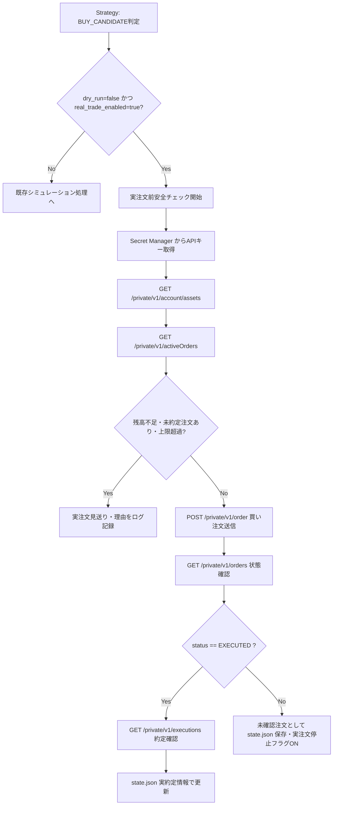

# GMOコイン リアル購入処理 詳細設計書

| 項目 | 内容 |
| --- | --- |
| 想定読者 | 実注文処理を実装する開発者 |
| 読んだあとできること | 呼び出すAPI、DTO、アプリ内モデルの対応を実装に落とせる |
| 状態 | 将来案（Phase3） |
| 機密区分 | 公開可 |
| 作成者 | リポジトリ管理者 |
| 保守責任者 | リポジトリ管理者 |
| 最終確認日 | 2026-08-30 |


## 1. 目的
この文書は、GMOコイン Private API を利用した「リアル注文処理」の実装に必要な設計を定める。
扱うのは、呼び出す API の特定・DTO とアプリ内モデルの設計・安全な実注文実行の処理手順である。

## 2. 実装対象
- `dry_run=false` かつ `real_trade_enabled=true` の場合にのみ動作する実注文処理
- GMOコイン Private API の呼び出し。対象は資産残高取得・有効注文一覧・新規注文・注文情報取得・約定情報取得
- infrastructure層に配置するリクエスト/レスポンスDTO（1クラス1ファイル）の作成と、アプリ内モデルへの変換処理
- GMO APIキーを GCP Secret Manager から取得する処理（必要なタイミングのみ）
- 注文後、約定が確認できた場合のみ `state.json` を更新する仕組み
- 初期対応としての現物取引（Spot）の「買い注文」の自動化

## 3. 実装対象外
- 自動売買の相場判断ロジック（Strategy の買い条件・売り条件の再実装は行わない）
- レバレッジ取引の対応
- 指値注文（買い・売りとも成行のみ）、分割売却、トレーリングストップ
- `GmoPrivateApiModels.kt` のような複数DTOを1つのファイルにまとめる実装

## 4. 既存シミュレーション処理との関係
- リアル注文処理と既存の `Strategy` は明確に責務を分離する。
- 既存の `Strategy` は相場データを分析し、`TradeDecision` を出力するのみとする。値は `BUY_CANDIDATE` / `SELL_CANDIDATE` / `SKIP` / `HOLDING`。
- リアル注文処理は `TradeDecision` を受け取り、残高や上限設定などの「安全面」のチェックを行い、条件をクリアした場合のみAPI呼び出しを行う。

## 5. dry-run 時の処理
- **条件:** `dry_run=true` または `real_trade_enabled=false`
- **動作:**
  - 既存のシミュレーション動作を維持する。
  - GMO Private API は一切呼び出さない。
  - GCP Secret Manager からのAPIキー取得も行わない。
  - 疑似 `orderId` を生成しない。
  - 既存のシミュレーション処理として `state.json` の残金、保有数量、確定損益などを更新し、CSV・ログを出力する。

## 6. 実注文ON時の処理
- **条件:** `dry_run=false` かつ `real_trade_enabled=true`
- **動作:**
  - この条件を満たした場合のみ、実注文処理に進む。
  - 初期対応は現物の「買い注文」のみ。
  - GMO Private API を呼び出して注文を送信し、APIから `orderId` が返却された時点では「保有状態（isHolding=true）」にはしない。
  - GMO側で約定済み（EXECUTED）であることを確認できた場合のみ、実約定価格および実約定数量で `state.json` の保有状態を更新する。
- 約定が確認できない場合は未確認注文として保存し、次回以降の新規の「実注文」を停止する。
  - ただし、既存の未確認注文の状態確認だけは次回起動時に引き続き行う。
  - その状態確認で約定済み（EXECUTED）を確認できた場合のみ、`state.json` の保有状態を更新する。
  - それ以外の状態（未約定のままなど）の場合は実注文停止状態を維持する。

## 7. BUY_CANDIDATE の処理
- **実注文実行条件（安全チェック）:**
  1. `real_trade_enabled=true` である。
  2. `dry_run=false` である。
  3. 現在対象銘柄を保有中ではない（二重注文・多重保有の防止）。
  4. GMO側に未約定の注文（Active Orders）が存在しない。
  5. GMO Private API で確認した利用可能なJPY残高（`available`）が、今回の注文予定額以上である。
  6. 注文予定額が、1回あたりの注文金額上限（`max_order_jpy`）を超えない。
  7. 1日の累計注文額が、上限（`max_daily_order_jpy`）を超えない。
  8. 現在の保有金額と注文予定額の合計が最大保有金額（`max_position_jpy`）を超えない。
- **実行:** 全て満たす場合のみ、APIキーを取得して買い注文APIを送信する。

## 8. SELL_CANDIDATE の処理
- **dry-run時の処理:**
  既存シミュレーションとして売却処理を実行し、`state.json` とCSV/ログを更新する。
- **実注文ON時の処理:**
  1. 記録上の保有数量（`holdingAmount`）が0以下なら何もしない。
  2. `/private/v1/account/assets` で取引所の売却可能残高を取得する。
  3. 取引所の残高が記録上の保有数量より少ない場合、**売らずに `isStopped=true` にして人の確認を待つ**。このアプリの知らないところで資産が動いているため、そのまま売ると状態が食い違ったまま進む。
  4. 売却数量は**記録上の保有数量を上限**とする。取引所の残高をそのまま全量売ると、同じ口座にある「このアプリ以外が買った資産」まで売ってしまう。
  5. `RealTradingSafetyChecker.checkPreSellOrderSafety()` で安全チェックを行う。買いの `checkPreOrderSafety()` は「保有していたら注文しない」判定なので、売りには使えない。
  6. 通過した場合のみ `/private/v1/order` に `side=SELL` / `executionType=MARKET` で送信し、`orderId` を `state.json` に保存する。
  7. **保有状態はこの時点では変更しない。** 次回以降の実行で注文照会と約定照会を経て反映する。

### 8.0 注文数量の丸め（`OrderSizeSpec`）

取引所の注文数量の制約は、`domain/realtrading/OrderSizeSpec.kt` の値オブジェクトで表す。`min_order_size` / `size_step` の設定から組み立て、買い・売りの両方で使う。

| メソッド | 役割 |
| --- | --- |
| `roundDownToStep()` | 数量を刻みの整数倍に**切り捨てる**。切り上げると注文金額の上限を超えうるため |
| `isTradable()` | 最小注文数量以上か。満たさない場合は発注せず見送る（停止させない） |
| `isHoldingAmount()` | 保有とみなせるか。ダストを保有とみなすと二重保有防止のチェックに永久に引っかかる |

設定が未設定のまま実注文を有効にすると注文のたびに拒否されるため、`Main.kt` の `validateOrderSizeSettings()` で起動時に検証する。`RealTradingService` 側にも `resolveOrderSizeSpec()` の防御を置いているが、通常は起動時ガードで弾かれる。

### 8.0.1 注文価格と手数料（`OrderPriceSpec`）

注文価格と手数料の制約は `domain/realtrading/OrderPriceSpec.kt` の値オブジェクトで表す。`taker_fee_rate` / `max_slippage_rate` の設定から組み立てる。

| メソッド | 役割 |
| --- | --- |
| `isWithinAllowedSlippage()` | 2つの価格の乖離が許容範囲かを判定する。注文前（K線終値と Ticker）と約定後（想定価格と約定価格）の両方に使う |
| `calculateTotalCostWithFee()` | 手数料を含めた注文金額を計算する。上限判定に使うため端数は切り上げる |
| `calculateAffordableOrderAmount()` | 残高から手数料を差し引いた注文金額を計算する。`ALL_IN` で残高を全額注文に回すと手数料の分だけ足りなくなるため |

注文数量の計算には Ticker の最新価格を使う。K線の終値は最大で1本分古く、急騰時に想定より多い数量を注文することになるためである。`TradingApplication` が Ticker を取得して `tickerPrice` として渡し、`RealTradingService.resolveOrderPrice()` が使える価格かどうかを判断する。

**未確認注文の照合は、価格が使えるかどうかに関係なく先に行う。** 価格が取れないことを理由に、注文の行方が分からないまま放置してはいけない。

### 8.1 停止中（`isStopped=true`）の振る舞い

停止が止めるのは**新規の買いだけ**である。売りは実行する。停止中に売りまで止めると、ポジションを抱えたまま損切りできなくなるためである。この例外は `checkPreSellOrderSafety()` が `isStopped` を参照しないことで表現している。

### 8.2 約定の反映

`handleExecutedOrder()` は `latestOrder.side` で処理を分ける。買いの約定処理（`isHolding=true` にする）を売りに流用すると「売ったのに保有中」になり、以降の損切り判断がすべて狂う。

| side | 反映内容 |
| --- | --- |
| BUY | `isHolding=true`、`buyPrice`＝平均約定価格、`holdingAmount`＝約定数量 |
| SELL | 残量が0なら `isHolding=false` / `buyPrice=0`、`cashBalance` に売却代金（手数料控除後）を加算、`realizedProfitAndLoss` に確定損益を加算 |

確定損益は「売却代金 - 取得原価 - 売却時の手数料」で計算する。**買い時の手数料は `buyPrice` に含まれないため反映されない。**

## 9. GMO Private API IFマッピング

| 処理 | GMO API | HTTP Method | Request DTO | Response DTO | アプリ内モデル | 利用箇所 | 備考 |
|---|---|---|---|---|---|---|---|
| 残高確認 | `/private/v1/account/assets` | GET | なし | `GmoAccountAssetsResponseDto` | `ExchangeAsset` | `BUY_CANDIDATE`時のJPY残高チェック、`SELL_CANDIDATE`時の売却可能残高チェック | 利用可能残高(available)を確認 |
| 未約定注文確認 | `/private/v1/activeOrders` | GET | `GmoActiveOrdersRequestDto` | `GmoActiveOrdersResponseDto` | `ExchangeActiveOrder` | `BUY_CANDIDATE` / `SELL_CANDIDATE` 時の二重注文防止チェック | 処理中の注文がないか確認 |
| 注文送信 | `/private/v1/order` | POST | `GmoPlaceOrderRequestDto` | `GmoPlaceOrderResponseDto` | `AcceptedOrder` | 安全チェック通過後の注文発注（買い・売り共通） | `side` に BUY / SELL を指定。戻り値の orderId を取得 |
| 注文状態確認 | `/private/v1/orders` | GET | `GmoOrdersRequestDto` | `GmoOrdersResponseDto` | `ExchangeOrderStatus` | 注文送信直後または次回起動時の状態確認 | status (EXECUTED/CANCELED等) を確認 |
| 約定確認 | `/private/v1/executions` | GET | `GmoExecutionsRequestDto` | `GmoExecutionsResponseDto` | `ExecutedOrder` | `ExchangeOrderStatus`が約定済みの場合の詳細確認 | 実約定価格・実約定数量の取得 |

**各APIの詳細:**

- **残高確認 (`GET /private/v1/account/assets`)**
  - **Path:** `/private/v1/account/assets`
  - **Method:** `GET`
  - **目的:** 注文予定額以上の JPY 利用可能残高（`available`）があるか確認する。
  - **タイミング:** `BUY_CANDIDATE` 判定後、注文前安全チェック時。
  - **Query Parameter:** なし
  - **Request Body:** なし
  - **対応するRequest DTO:** なし
  - **レスポンスから使う項目:** `data` の配列内から `symbol` と `available`
  - **対応するResponse DTO:** `GmoAccountAssetsResponseDto`, `GmoAccountAssetDto`
  - **変換後のアプリ内モデル:** `ExchangeAsset`
  - **エラー時:** エラーログを出力し、以降の注文処理を中止する。
  - **dry-run:** 呼び出さない。

- **未約定注文確認 (`GET /private/v1/activeOrders`)**
  - **Path:** `/private/v1/activeOrders`
  - **Method:** `GET`
  - **目的:** 既存の未約定注文が存在しないか確認し、二重注文を防止する。
  - **タイミング:** `BUY_CANDIDATE` 判定後、注文前安全チェック時。
  - **Query Parameter:** `symbol`, `page`, `count`
  - **Request Body:** なし
  - **対応するRequest DTO:** `GmoActiveOrdersRequestDto`
  - **レスポンスから使う項目:** `data.list` (未約定注文のリスト) 内の `orderId`, `symbol`, `side`, `size`, `price`, `status`
  - **対応するResponse DTO:** `GmoActiveOrdersResponseDto`, `GmoActiveOrderDto`
  - **変換後のアプリ内モデル:** `ExchangeActiveOrder`
  - **エラー時:** エラーログを出力し、以降の注文処理を中止する。
  - **dry-run:** 呼び出さない。

- **買い注文送信 (`POST /private/v1/order`)**
  - **Path:** `/private/v1/order`
  - **Method:** `POST`
  - **目的:** 実際にGMOへ買い注文を送信する。初期対応では成行(MARKET)注文で実装する。MARKET注文の場合 `price` の指定は不要。
  - **タイミング:** 安全条件をすべてクリアした後。
  - **Query Parameter:** なし
  - **Request Body:** `symbol`, `side` (BUY), `executionType` (MARKET), `size`
  - **対応するRequest DTO:** `GmoPlaceOrderRequestDto`
  - **レスポンスから使う項目:** `data` (orderId)
  - **対応するResponse DTO:** `GmoPlaceOrderResponseDto`
  - **変換後のアプリ内モデル:** `AcceptedOrder`
  - **エラー時:** 未確認注文として扱い、以降の注文を強制停止する。
  - **dry-run:** 呼び出さない。

- **注文状態確認 (`GET /private/v1/orders`)**
  - **Path:** `/private/v1/orders`
  - **Method:** `GET`
  - **目的:** 発注した注文が約定(EXECUTED)したか、キャンセルされたか確認する。
  - **タイミング:** 買い注文送信後（または次回起動時）。
  - **Query Parameter:** `orderId`
  - **Request Body:** なし
  - **対応するRequest DTO:** `GmoOrdersRequestDto`
  - **レスポンスから使う項目:** `data.list` 内の `orderId`, `status`, `cancelType`
  - **対応するResponse DTO:** `GmoOrdersResponseDto`, `GmoOrderDto`
  - **変換後のアプリ内モデル:** `ExchangeOrderStatus`
  - **エラー時:** 未確認注文として扱い、状態不整合を防ぐため次回以降の実注文を停止する。
  - **dry-run:** 呼び出さない。

- **約定確認 (`GET /private/v1/executions`)**
  - **Path:** `/private/v1/executions`
  - **Method:** `GET`
  - **目的:** 約定済み注文の実際の約定価格や約定数量を取得する。
  - **タイミング:** 注文状態確認で `EXECUTED` が確認できた場合。
  - **Query Parameter:** `orderId`
  - **Request Body:** なし
  - **対応するRequest DTO:** `GmoExecutionsRequestDto`
  - **レスポンスから使う項目:** `data.list` 内の `executionId`, `orderId`, `price`, `size`, `fee`, `lossGain`
  - **対応するResponse DTO:** `GmoExecutionsResponseDto`, `GmoExecutionDto`
  - **変換後のアプリ内モデル:** `ExecutedOrder`
  - **エラー時:** 未確認注文として扱い、状態不整合を防ぐため次回以降の実注文を停止する。
  - **dry-run:** 呼び出さない。

## 10. 注文送信と約定確認の流れ
1. Strategy から `BUY_CANDIDATE` を受け取る。
2. APIキーを取得し、`/private/v1/account/assets` と `/private/v1/activeOrders` を呼んで安全チェックを行う。
3. 条件をクリアしたら `/private/v1/order` を呼び、返却された `orderId` を一時記録する。
4. 直後に `/private/v1/orders` を呼び出し、該当 `orderId` のステータスを確認する。
5. `status` が `EXECUTED` の場合、`/private/v1/executions` を呼び、実際の約定価格と数量を取得し、`state.json` を保有状態として更新する。
6. `status` が未約定の場合は、`state.json` に未確認注文として保存し、次回実行時に再度状態確認を行う。

## 11. state.json の拡張内容

実注文の状態は `realTrading` の下に置きます。

| キー | 内容 |
| --- | --- |
| `isStopped` | 実注文停止状態のフラグ |
| `stopReason` | 停止理由（エラーや未確認など） |
| `stoppedAt` | 停止日時 |
| `latestOrder.orderId` | 注文ID |
| `latestOrder.symbol` | 注文対象銘柄 |
| `latestOrder.side` | 注文方向 |
| `latestOrder.status` | 注文ステータス |
| `latestOrder.requestedAmountJpy` | 注文予定額 |
| `latestOrder.requestedSize` | 注文数量 |
| `latestOrder.requestedPrice` | 注文時価格 |
| `latestOrder.executedPrice` | 実約定価格 |
| `latestOrder.executedSize` | 実約定数量 |
| `latestOrder.orderedAt` | 注文実行時刻 |
| `latestOrder.executedAt` | 約定確認時刻 |

## 12. 追加・変更する設定項目
既存のシミュレーション向け設定（`trading`）と分けるため、実注文制御用の設定は `real_trading` 配下に定義する。
金額上限等は実注文ON時には明示的な設定を必須とするが、安全フラグについては安全側に倒したデフォルト値を持たせてよい。
| 設定名 | 日本語の意味 | 目的 | デフォルト値ポリシー |
|---|---|---|---|
| `real_trading.dry_run` | シミュレーションモード | 実際の注文送信を行わないか | `true` |
| `real_trading.real_trade_enabled` | リアル注文有効化 | 実注文処理を許可するためのフラグ | `false` |
| `real_trading.stop_on_unconfirmed_order` | 未確認注文時の停止 | 注文状態が確定できない場合に以降の実注文を停止するか | `true` |
| `real_trading.max_order_jpy` | 1回の最大注文金額 | 誤発注を防ぐための1回あたりの金額上限 | デフォルトなし（明示的指定必須） |
| `real_trading.max_daily_order_jpy` | 1日の最大注文金額 | 暴走時の被害を抑えるための1日の累計上限 | デフォルトなし（明示的指定必須） |
| `real_trading.max_position_jpy` | 最大保有金額 | 過剰保有を防ぐための上限額 | デフォルトなし（明示的指定必須） |

## 13. 追加・変更するクラス一覧
- **Infrastructure DTO (1クラス1ファイル)**
  - `GmoAccountAssetsResponseDto`
  - `GmoAccountAssetDto`
  - `GmoActiveOrdersRequestDto`
  - `GmoActiveOrdersResponseDto`
  - `GmoActiveOrdersDataDto`
  - `GmoActiveOrderDto`
  - `GmoPlaceOrderRequestDto`
  - `GmoPlaceOrderResponseDto`
  - `GmoOrdersRequestDto`
  - `GmoOrdersResponseDto`
  - `GmoOrdersDataDto`
  - `GmoOrderDto`
  - `GmoExecutionsRequestDto`
  - `GmoExecutionsResponseDto`
  - `GmoExecutionsDataDto`
  - `GmoExecutionDto`
- **Application/Domain Model**
  - `ExchangeAsset`
  - `ExchangeActiveOrder`
  - `AcceptedOrder`
  - `ExchangeOrderStatus`
  - `ExecutedOrder`
- **サービス・UseCase**
  - `GmoPrivateApiClient` （インフラ側: DTOからアプリ内モデルへの変換含む）
  - `RealTradeOrderUseCase` または相当する責務を持つService

## 14. 追加・変更するファイル一覧

1ファイルにつき1つのDTO、1つのモデルという原則に従います。DTO は必ず `infrastructure` 側に置きます。

**DTO（`infrastructure/exchange/gmo/dto/`）**

| ファイル |
| --- |
| `GmoAccountAssetsResponseDto.kt` |
| `GmoAccountAssetDto.kt` |
| `GmoActiveOrdersRequestDto.kt` |
| `GmoActiveOrdersResponseDto.kt` |
| `GmoActiveOrdersDataDto.kt` |
| `GmoActiveOrderDto.kt` |
| `GmoPlaceOrderRequestDto.kt` |
| `GmoPlaceOrderResponseDto.kt` |
| `GmoOrdersRequestDto.kt` |
| `GmoOrdersResponseDto.kt` |
| `GmoOrdersDataDto.kt` |
| `GmoOrderDto.kt` |
| `GmoExecutionsRequestDto.kt` |
| `GmoExecutionsResponseDto.kt` |
| `GmoExecutionsDataDto.kt` |
| `GmoExecutionDto.kt` |

**ドメインモデル（`domain/model/order/`）**

| ファイル |
| --- |
| `ExchangeAsset.kt` |
| `ExchangeActiveOrder.kt` |
| `AcceptedOrder.kt` |
| `ExchangeOrderStatus.kt` |
| `ExecutedOrder.kt` |

## 15. DTO設計とKotlinコード雛形

DTOは GMO API との通信仕様を反映したデータ構造として定義する。
業務ロジックやドメイン独自のデフォルト値を持たせず、レスポンスに必要な項目を定義する。

### 15.1. 残高確認 (GET /private/v1/account/assets)

用途:
- `GET /private/v1/account/assets` のレスポンスを受け取る。
- JPY の `available` を確認する。

**GmoAccountAssetsResponseDto.kt**
```kotlin
package cryptoautotrading.infrastructure.exchange.gmo.dto

import kotlinx.serialization.Serializable

/**
 * GMO API 資産残高取得APIのレスポンスDTO。
 *
 * @property status レスポンスステータス（0が正常）
 * @property data 資産残高リスト
 * @property responsetime レスポンス時刻
 */
@Serializable
data class GmoAccountAssetsResponseDto(
    val status: Int,
    val data: List<GmoAccountAssetDto>,
    val responsetime: String
)
```

**GmoAccountAssetDto.kt**
```kotlin
package cryptoautotrading.infrastructure.exchange.gmo.dto

import kotlinx.serialization.Serializable

/**
 * GMO API 資産残高リスト内の個別の資産情報DTO。
 *
 * @property amount 残高
 * @property available 利用可能金額（残高 - 出金予定額）
 * @property conversionRate 円転レート
 * @property symbol 資産残高銘柄
 */
@Serializable
data class GmoAccountAssetDto(
    val amount: String,
    val available: String,
    val conversionRate: String,
    val symbol: String
)
```

### 15.2. 未約定注文確認 (GET /private/v1/activeOrders)

用途:
- `GET /private/v1/activeOrders` のリクエスト・レスポンスを表す。
- 同じ銘柄に未約定注文がないか確認する。

**GmoActiveOrdersRequestDto.kt**
```kotlin
package cryptoautotrading.infrastructure.exchange.gmo.dto

import kotlinx.serialization.Serializable

/**
 * GMO API 有効注文一覧取得APIのリクエストDTO。
 *
 * @property symbol 取扱銘柄
 * @property page 取得対象ページ
 * @property count 1ページ当りの取得件数
 */
@Serializable
data class GmoActiveOrdersRequestDto(
    val symbol: String,
    val page: Int?,
    val count: Int?
)
```

**GmoActiveOrdersResponseDto.kt**
```kotlin
package cryptoautotrading.infrastructure.exchange.gmo.dto

import kotlinx.serialization.Serializable

/**
 * GMO API 有効注文一覧取得APIのレスポンスDTO。
 *
 * @property status レスポンスステータス
 * @property data ページネーションおよび有効注文のリスト
 * @property responsetime レスポンス時刻
 */
@Serializable
data class GmoActiveOrdersResponseDto(
    val status: Int,
    val data: GmoActiveOrdersDataDto,
    val responsetime: String
)
```

**GmoActiveOrdersDataDto.kt** (1クラス1ファイルの原則により別途用意)
```kotlin
package cryptoautotrading.infrastructure.exchange.gmo.dto

import kotlinx.serialization.Serializable

/**
 * GMO API 有効注文一覧取得APIのdata項目DTO。
 *
 * @property list 有効注文のリスト
 */
@Serializable
data class GmoActiveOrdersDataDto(
    val list: List<GmoActiveOrderDto>
)
```

**GmoActiveOrderDto.kt**
```kotlin
package cryptoautotrading.infrastructure.exchange.gmo.dto

import kotlinx.serialization.Serializable

/**
 * GMO API 有効注文リスト内の個別の注文情報DTO。
 *
 * @property rootOrderId 親注文ID
 * @property orderId 注文ID
 * @property symbol 取扱銘柄
 * @property side 売買区分 (BUY/SELL)
 * @property orderType 取引区分
 * @property executionType 注文タイプ (MARKET/LIMIT/STOP)
 * @property settleType 決済区分
 * @property size 発注数量
 * @property executedSize 約定数量
 * @property price 注文価格
 * @property losscutPrice ロスカットレート
 * @property status 注文ステータス
 * @property timeInForce 執行数量条件
 * @property timestamp 注文日時
 */
@Serializable
data class GmoActiveOrderDto(
    val rootOrderId: Long,
    val orderId: Long,
    val symbol: String,
    val side: String,
    val orderType: String,
    val executionType: String,
    val settleType: String,
    val size: String,
    val executedSize: String,
    val price: String,
    val losscutPrice: String,
    val status: String,
    val timeInForce: String,
    val timestamp: String
)
```

### 15.3. 注文送信 (POST /private/v1/order)

用途:
- `POST /private/v1/order` のリクエスト・レスポンスを表す。
- 買い注文を送信し、`orderId` を取得する。
- *注意点*: 初期対応は成行(`MARKET`)注文とする。GMO仕様上、`executionType`が`MARKET`の場合、`price`は不要（null許容とするか送信プロパティから省く）。`LIMIT`注文を行う際は`price`と`timeInForce`が必要。また、`size`はJPY金額ではなくBTC等の暗号資産数量を指定する。

**GmoPlaceOrderRequestDto.kt**
```kotlin
package cryptoautotrading.infrastructure.exchange.gmo.dto

import kotlinx.serialization.Serializable

/**
 * GMO API 新規注文APIのリクエストDTO。
 *
 * @property symbol 取扱銘柄
 * @property side 売買区分 (BUY/SELL)
 * @property executionType 注文タイプ (MARKET/LIMIT/STOP)
 * @property timeInForce 執行数量条件 (任意、LIMITの場合設定可能)
 * @property price 注文価格 (MARKETの場合は不要)
 * @property losscutPrice ロスカットレート (任意)
 * @property size 注文数量 (BTC等の数量)
 * @property cancelBefore 有効注文取消フラグ (任意)
 */
@Serializable
data class GmoPlaceOrderRequestDto(
    val symbol: String,
    val side: String,
    val executionType: String,
    val timeInForce: String?,
    val price: String?,
    val losscutPrice: String?,
    val size: String,
    val cancelBefore: Boolean?
)
```

**GmoPlaceOrderResponseDto.kt**
```kotlin
package cryptoautotrading.infrastructure.exchange.gmo.dto

import kotlinx.serialization.Serializable

/**
 * GMO API 新規注文APIのレスポンスDTO。
 *
 * @property status レスポンスステータス
 * @property data 注文受付されたorderId
 * @property responsetime レスポンス時刻
 */
@Serializable
data class GmoPlaceOrderResponseDto(
    val status: Int,
    val data: String,
    val responsetime: String
)
```

### 15.4. 注文状態確認 (GET /private/v1/orders)

用途:
- `GET /private/v1/orders` のリクエスト・レスポンスを表す。
- `orderId` に対応する注文状態が `EXECUTED` になったかなどを確認する。

**GmoOrdersRequestDto.kt**
```kotlin
package cryptoautotrading.infrastructure.exchange.gmo.dto

import kotlinx.serialization.Serializable

/**
 * GMO API 注文情報取得APIのリクエストDTO。
 *
 * @property orderId 注文ID (カンマ区切りで複数指定可能)
 */
@Serializable
data class GmoOrdersRequestDto(
    val orderId: String
)
```

**GmoOrdersResponseDto.kt**
```kotlin
package cryptoautotrading.infrastructure.exchange.gmo.dto

import kotlinx.serialization.Serializable

/**
 * GMO API 注文情報取得APIのレスポンスDTO。
 *
 * @property status レスポンスステータス
 * @property data 注文情報のリストを含むオブジェクト
 * @property responsetime レスポンス時刻
 */
@Serializable
data class GmoOrdersResponseDto(
    val status: Int,
    val data: GmoOrdersDataDto,
    val responsetime: String
)
```

**GmoOrdersDataDto.kt**
```kotlin
package cryptoautotrading.infrastructure.exchange.gmo.dto

import kotlinx.serialization.Serializable

/**
 * GMO API 注文情報取得APIのdata項目DTO。
 *
 * @property list 注文情報のリスト
 */
@Serializable
data class GmoOrdersDataDto(
    val list: List<GmoOrderDto>
)
```

**GmoOrderDto.kt**
```kotlin
package cryptoautotrading.infrastructure.exchange.gmo.dto

import kotlinx.serialization.Serializable

/**
 * GMO API 注文リスト内の個別の注文情報DTO。
 *
 * @property rootOrderId 親注文ID
 * @property orderId 注文ID
 * @property symbol 取扱銘柄
 * @property side 売買区分
 * @property orderType 取引区分
 * @property executionType 注文タイプ
 * @property settleType 決済区分
 * @property size 発注数量
 * @property executedSize 約定数量
 * @property price 注文価格
 * @property losscutPrice ロスカットレート
 * @property status 注文ステータス
 * @property cancelType 取消区分 (キャンセル時のみ)
 * @property timeInForce 執行数量条件
 * @property timestamp 注文日時
 */
@Serializable
data class GmoOrderDto(
    val rootOrderId: Long,
    val orderId: Long,
    val symbol: String,
    val side: String,
    val orderType: String,
    val executionType: String,
    val settleType: String,
    val size: String,
    val executedSize: String,
    val price: String,
    val losscutPrice: String,
    val status: String,
    val cancelType: String?,
    val timeInForce: String,
    val timestamp: String
)
```

### 15.5. 約定確認 (GET /private/v1/executions)

用途:
- `GET /private/v1/executions` のリクエスト・レスポンスを表す。
- 注文が約定した際の、実際の約定価格(`executionPrice`)と約定数量(`executionSize`)を取得する。

**GmoExecutionsRequestDto.kt**
```kotlin
package cryptoautotrading.infrastructure.exchange.gmo.dto

import kotlinx.serialization.Serializable

/**
 * GMO API 約定情報取得APIのリクエストDTO。
 *
 * @property orderId 注文ID (orderIdまたはexecutionIdのいずれかが必須)
 * @property executionId 約定ID
 */
@Serializable
data class GmoExecutionsRequestDto(
    val orderId: Long?,
    val executionId: String?
)
```

**GmoExecutionsResponseDto.kt**
```kotlin
package cryptoautotrading.infrastructure.exchange.gmo.dto

import kotlinx.serialization.Serializable

/**
 * GMO API 約定情報取得APIのレスポンスDTO。
 *
 * @property status レスポンスステータス
 * @property data 約定情報のリストを含むオブジェクト
 * @property responsetime レスポンス時刻
 */
@Serializable
data class GmoExecutionsResponseDto(
    val status: Int,
    val data: GmoExecutionsDataDto,
    val responsetime: String
)
```

**GmoExecutionsDataDto.kt**
```kotlin
package cryptoautotrading.infrastructure.exchange.gmo.dto

import kotlinx.serialization.Serializable

/**
 * GMO API 約定情報取得APIのdata項目DTO。
 *
 * @property list 約定情報のリスト
 */
@Serializable
data class GmoExecutionsDataDto(
    val list: List<GmoExecutionDto>
)
```

**GmoExecutionDto.kt**
```kotlin
package cryptoautotrading.infrastructure.exchange.gmo.dto

import kotlinx.serialization.Serializable

/**
 * GMO API 約定リスト内の個別の約定情報DTO。
 *
 * @property executionId 約定ID
 * @property orderId 注文ID
 * @property positionId 建玉ID (レバレッジのみ)
 * @property symbol 取扱銘柄
 * @property side 売買区分
 * @property settleType 決済区分
 * @property size 約定数量
 * @property price 約定レート
 * @property lossGain 決済損益
 * @property fee 取引手数料
 * @property timestamp 約定日時
 */
@Serializable
data class GmoExecutionDto(
    val executionId: Long,
    val orderId: Long,
    val positionId: Long?,
    val symbol: String,
    val side: String,
    val settleType: String,
    val size: String,
    val price: String,
    val lossGain: String,
    val fee: String,
    val timestamp: String
)
```

## 16. DTOとアプリ内モデルの変換

DTOはあくまで GMO API との通信仕様を反映したデータ構造（業務ロジックなし）とし、それを `infrastructure` パッケージ内部の `GmoPrivateApiClient` などで、ドメイン層やアプリケーション層で利用するアプリ内モデルへマッピングする。
**ドメイン/アプリケーションはDTOを直接扱わず、変換後のモデルのみに依存する設計とする。**

**orderId の型変換方針について**
GMO公式APIにおいて `orderId` が数値(Long等)で返却される場合、DTOではAPIの仕様に合わせて数値型（Longなど）として定義する。ただし、ドメインやアプリケーション層のアプリ内モデル（`ExchangeActiveOrder`、`AcceptedOrder`、`ExchangeOrderStatus` 等）ではすべて一貫して **`String` 型** に統一する。DTOからアプリ内モデルへの変換時にString化を行う。

- `GmoAccountAssetDto` → `ExchangeAsset`
  - DTOから対象の `symbol` に合致するオブジェクトを探し、`available` を `BigDecimal` に変換してドメイン用の `ExchangeAsset` を生成する。
- `GmoActiveOrderDto` → `ExchangeActiveOrder`
  - DTOの `orderId` (Long) を String に変換し、`symbol`, `side`, `status` などをマッピングして、未約定注文の状態をカプセル化する。
- `GmoPlaceOrderResponseDto` → `AcceptedOrder`
  - `data` フィールドの `orderId` (String または Long) を String 型として保持する、注文成功を表すドメインモデル `AcceptedOrder` を生成する。
- `GmoOrderDto` → `ExchangeOrderStatus`
  - `orderId` (Long) を String に変換し、`status` (`WAITING`, `ORDERED`, `EXECUTED`, `CANCELED` など) と共にマッピングし、ステータスチェック用のモデルとして返す。
- `GmoExecutionDto` → `ExecutedOrder`
  - `orderId` や `executionId` (Long) を String に変換し、実際の `price` と `size`、さらに `fee` などを抽出して真の約定結果を表現する `ExecutedOrder` を生成する。

## 17. APIキー取得方法
- **GCP Secret Manager** を使用して取得する。
- 起動時に全取得してメモリに保持するのではなく、`BUY_CANDIDATE` が発生して実注文前チェック（安全チェック）を行う直前に、必要なタイミングでのみ取得する。
- ログ出力へのAPIキー、Secret Key、署名文字列の表示は厳禁とする。

## 18. エラー時・約定未確認時の停止処理
- **強制停止の条件:**
  - APIからのエラーレスポンス（`ERR-xxx`コードなど）
  - 通信タイムアウト、署名エラー
  - 注文送信後、約定ステータスが正しく確認できない状態（`stop_on_unconfirmed_order=true` 時）
  - 未定義のシステム例外
- **動作:**
  - `state.json` の `realTrading.isStopped` を `true` にし、`stopReason` や未確認注文のステータスを記録する。
  - 以降の新規の「実注文（POST）」はスキップ（停止）する。
  - **既存未確認注文への対応:** 新規注文は停止するが、次回以降の実行時に、既存の未確認注文に対する状態確認（GET）だけは継続して行う。状態が最終的に `EXECUTED` になったことが確認できた場合のみ、`state.json` の保有状態および約定日時等を更新する。
  - 復旧（新規注文の再開）は手動によるフラグリセット・状態修正のみとする。

## 19. Mermaid による処理フロー



## 20. テスト観点
- `dry_run=true` 時、GMO Private API が絶対に呼ばれないこと（MockやWireMockで検証）。
- 異常な残高やアクティブな注文が存在する場合に、正しく実注文が見送られること（安全チェックロジックの単体テスト）。
- DTOとアプリ内モデルへの変換が正しく行われること。
- `GmoPrivateApiModels.kt` が存在せず、DTOが1クラス1ファイルで配置され、ドメインに漏れ出していないこと（ArchitectureTestによるKonsist検証）。
- `orderId` は返却されたが約定確認が取れない場合、正しく停止処理へ移行すること。
- 金額等の運用パラメータにデフォルト値が設定されていないこと（設定未指定時はパースエラーなどで起動しないこと）。

## 21. 実装PRの分割方針
本仕様の実装は規模が大きくなる可能性があるため、以下の単位でPRを分割して実装する。
1. **APIクライアントとDTO/モデル定義の追加:** GMO Private API クライアント、DTOクラス、アプリ内モデルの基盤実装。
2. **安全チェックロジックと設定項目の追加:** `BUY_CANDIDATE` 判定後の残高チェック・注文上限チェックロジックの追加。
3. **実注文処理と状態保存の結合:** 実際の注文送信、約定確認、および `state.json` 拡張を含む一連のパイプラインの実装。

## 22. 受け入れ条件
- 全ての要件（DTO/モデル分離、1クラス1ファイル、設定デフォルトなしルール）が遵守されたコードが実装されていること。
- 既存の `dry-run` 時のシミュレーション動作に影響を与えていないこと（既存テストが全てパスすること）。
- ArchitectureTest などの Konsist テストを通過すること。
- `SELL_CANDIDATE` 時に売り注文が送信され、約定確認後に保有が解消され確定損益が加算されること。
- 取引所の残高が記録上の保有数量より少ない場合、売らずに停止すること。
- `isStopped=true` でも売り注文は実行され、買い注文は実行されないこと。
- APIエラー発生時や未確認注文発生時に、次回以降の実注文が強制的にスキップされる仕組みが確認できること。
