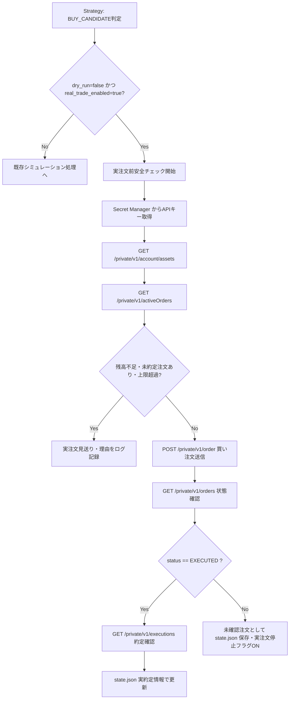

# GMOコイン リアル購入処理 詳細設計書

## 1. 目的
本詳細設計書は、GMOコイン Private API を利用した「リアル注文処理」の実装に向けて、呼び出すAPIの特定、DTOやアプリ内モデルの設計、ならびに安全な実注文実行に関する処理手順を定義することを目的とする。

## 2. 実装対象
- `dry_run=false` かつ `real_trade_enabled=true` の場合にのみ動作する実注文処理
- GMOコイン Private API の呼び出し（対象API: 資産残高取得、有効注文一覧、新規注文、注文情報取得、約定情報取得）
- infrastructure層に配置するリクエスト/レスポンスDTO（1クラス1ファイル）の作成と、アプリ内モデルへの変換処理
- GMO APIキーを GCP Secret Manager から取得する処理（必要なタイミングのみ）
- 注文後、約定が確認できた場合のみ `state.json` を更新する仕組み
- 初期対応としての現物取引（Spot）の「買い注文」の自動化

## 3. 実装対象外
- 自動売買の相場判断ロジック（Strategy の買い条件・売り条件の再実装は行わない）
- レバレッジ取引の対応
- 「売り注文（SELL）」の実売却自動化（初期対応では実売却注文は送信せず、ログへの記録のみに留める）
- `GmoPrivateApiModels.kt` のような複数DTOを1つのファイルにまとめる実装

## 4. 既存シミュレーション処理との関係
- リアル注文処理と既存の `Strategy` は明確に責務を分離する。
- 既存の `Strategy` は相場データ（KLineなど）を分析し、`TradeDecision` （`BUY_CANDIDATE`、`SELL_CANDIDATE`、`SKIP`、`HOLDING`）を出力するのみとする。
- リアル注文処理は `TradeDecision` を受け取り、残高や上限設定などの「安全面」のチェックを行い、条件をクリアした場合のみAPI呼び出しを行う。

## 5. dry-run 時の処理
- **条件:** `dry_run=true` または `real_trade_enabled=false`
- **動作:**
  - 既存のシミュレーション動作を維持する。
  - GMO Private API は一切呼び出さない。
  - GCP Secret Manager からのAPIキー取得も行わない。
  - 疑似 `orderId` を生成しない。
  - 既存のシミュレーション処理として `state.json` の残金、保有数量、確定損益などを更新し、CSV・ログを出力する。

## 6. 実注文ON時の処理
- **条件:** `dry_run=false` かつ `real_trade_enabled=true`
- **動作:**
  - この条件を満たした場合のみ、実注文処理に進む。
  - 初期対応は現物の「買い注文」のみ。
  - GMO Private API を呼び出して注文を送信し、APIから `orderId` が返却された時点では「保有状態（isHolding=true）」にはしない。
  - GMO側で約定済み（EXECUTED）であることを確認できた場合のみ、実約定価格および実約定数量で `state.json` の保有状態を更新する。
  - 約定が確認できない場合は未確認注文として保存し、次回以降の実注文を停止する。

## 7. BUY_CANDIDATE の処理
- **実注文実行条件（安全チェック）:**
  1. `real_trade_enabled=true` である。
  2. `dry_run=false` である。
  3. 現在対象銘柄を保有中ではない（二重注文・多重保有の防止）。
  4. GMO側に未約定の注文（Active Orders）が存在しない。
  5. GMO Private API で確認した利用可能なJPY残高（`available`）が、今回の注文予定額以上である。
  6. 注文予定額が、1回あたりの注文金額上限（`max_order_jpy`）を超えない。
  7. 1日の累計注文額が、上限（`max_daily_order_jpy`）を超えない。
  8. 現在の保有金額と注文予定額の合計が最大保有金額（`max_position_jpy`）を超えない。
- **実行:** 全て満たす場合のみ、APIキーを取得して買い注文APIを送信する。

## 8. SELL_CANDIDATE の処理
- **dry-run時の処理:**
  既存シミュレーションとして売却処理を実行し、`state.json` とCSV/ログを更新する。
- **実注文ON時の処理:**
  初期対応として実売却注文は行わず、ログに「実売却指示が発生（自動実行は未対応）」の旨を記録するのみとする。

## 9. GMO Private API IFマッピング

| 処理 | GMO API | HTTP Method | Request DTO | Response DTO | アプリ内モデル | 利用箇所 | 備考 |
|---|---|---|---|---|---|---|---|
| 残高確認 | `/private/v1/account/assets` | GET | なし | `GmoAccountAssetsResponse` | `ExchangeAsset` | `BUY_CANDIDATE`時の残高チェック | 利用可能残高(available)を確認 |
| 未約定注文確認 | `/private/v1/activeOrders` | GET | `GmoActiveOrdersRequest` | `GmoActiveOrdersResponse` | `ExchangeActiveOrder` | `BUY_CANDIDATE`時の二重注文防止チェック | 処理中の注文がないか確認 |
| 買い注文送信 | `/private/v1/order` | POST | `GmoOrderRequest` | `GmoOrderResponse` | `AcceptedOrder` | 安全チェック通過後の注文発注 | 戻り値の orderId を取得 |
| 注文状態確認 | `/private/v1/orders` | GET | `GmoOrdersStatusRequest` | `GmoOrdersStatusResponse` | `ExchangeOrderStatus` | 注文送信直後または次回起動時の状態確認 | status (EXECUTED/CANCELED等) を確認 |
| 約定確認 | `/private/v1/executions` | GET | `GmoExecutionsRequest` | `GmoExecutionsResponse` | `ExecutedOrder` | `ExchangeOrderStatus`が約定済みの場合の詳細確認 | 実約定価格・実約定数量の取得 |

**各APIの詳細:**
- **残高確認 (`GET /private/v1/account/assets`)**
  - **目的:** 注文予定額以上の JPY 利用可能残高（`available`）があるか確認する。
  - **タイミング:** `BUY_CANDIDATE` 判定後、注文前安全チェック時。
  - **エラー時:** 以降の注文処理を中止。
  - **dry-run:** 呼び出さない。
- **未約定注文確認 (`GET /private/v1/activeOrders`)**
  - **目的:** 既存の未約定注文が存在しないか確認し、二重注文を防止する。
  - **タイミング:** `BUY_CANDIDATE` 判定後、注文前安全チェック時。
  - **リクエスト項目:** `symbol`
  - **レスポンスから使う項目:** `list` (未約定注文のリスト)
  - **エラー時:** 以降の注文処理を中止。
  - **dry-run:** 呼び出さない。
- **買い注文送信 (`POST /private/v1/order`)**
  - **目的:** 実際にGMOへ買い注文を送信する。
  - **タイミング:** 安全条件をすべてクリアした後。
  - **リクエスト項目:** `symbol`, `side` (BUY), `executionType` (MARKET), `size`
  - **レスポンスから使う項目:** `data` (orderId)
  - **エラー時:** 未確認注文として扱い、以降の注文を強制停止。
  - **dry-run:** 呼び出さない。
- **注文状態確認 (`GET /private/v1/orders`)**
  - **目的:** 発注した注文が約定(EXECUTED)したか、キャンセルされたか確認する。
  - **タイミング:** 買い注文送信後（または次回起動時）。
  - **リクエスト項目:** `orderId`
  - **レスポンスから使う項目:** `list` 内の `status`
  - **エラー時:** 未確認注文として扱い、状態不整合を防ぐため次回以降の実注文を停止。
  - **dry-run:** 呼び出さない。
- **約定確認 (`GET /private/v1/executions`)**
  - **目的:** 約定済み注文の実際の約定価格や約定数量を取得する。
  - **タイミング:** 注文状態確認で `EXECUTED` が確認できた場合。
  - **リクエスト項目:** `orderId`
  - **レスポンスから使う項目:** `list` 内の `executionPrice`, `executionSize`
  - **エラー時:** 未確認注文として扱い、次回以降の実注文を停止。
  - **dry-run:** 呼び出さない。

## 10. 注文送信と約定確認の流れ
1. Strategy から `BUY_CANDIDATE` を受け取る。
2. APIキーを取得し、`/private/v1/account/assets` と `/private/v1/activeOrders` を呼んで安全チェックを行う。
3. 条件をクリアしたら `/private/v1/order` を呼び、返却された `orderId` を一時記録する。
4. 直後に `/private/v1/orders` を呼び出し、該当 `orderId` のステータスを確認する。
5. `status` が `EXECUTED` の場合、`/private/v1/executions` を呼び、実際の約定価格と数量を取得し、`state.json` を保有状態として更新する。
6. `status` が未約定の場合は、`state.json` に未確認注文として保存し、次回実行時に再度状態確認を行う。

## 11. state.json の拡張内容
実注文ONで注文を送信した場合、以下の情報を `state.json`（またはそれに準ずる永続化オブジェクト）に追加する。
- `realOrderId`: 注文ID
- `realOrderSymbol`: 注文対象銘柄
- `realOrderSide`: 注文方向
- `realOrderAmount`: 注文予定額
- `realOrderSize`: 注文数量
- `realOrderPrice`: 注文時価格
- `realOrderStatus`: 注文ステータス
- `realOrderExecutionConfirmed`: 約定確認結果フラグ
- `realOrderTimestamp`: 注文実行時刻

## 12. 追加・変更する設定項目
運用・金額に関する値のデフォルト値は設定しないこと（明示的な指定を必須とする）。
| 設定名 | 日本語の意味 | 目的 | デフォルト値ポリシー |
|---|---|---|---|
| `trading.real_trade_enabled` | リアル注文有効化 | 実注文処理を許可するためのフラグ | `false` （必須） |
| `trading.stop_on_unconfirmed_order` | 未確認注文時の停止 | 注文状態が確定できない場合に以降の実注文を停止するか | `true` （必須） |
| `trading.max_order_jpy` | 1回の最大注文金額 | 誤発注を防ぐための1回あたりの金額上限 | デフォルトなし（明示的指定必須） |
| `trading.max_daily_order_jpy` | 1日の最大注文金額 | 暴走時の被害を抑えるための1日の累計上限 | デフォルトなし（明示的指定必須） |
| `trading.max_position_jpy` | 最大保有金額 | 過剰保有を防ぐための上限額 | デフォルトなし（明示的指定必須） |

## 13. 追加・変更するクラス一覧
- **Infrastructure DTO (1クラス1ファイル)**
  - `GmoAccountAssetsResponse`
  - `GmoActiveOrdersRequest`
  - `GmoActiveOrdersResponse`
  - `GmoOrderRequest`
  - `GmoOrderResponse`
  - `GmoOrdersStatusRequest`
  - `GmoOrdersStatusResponse`
  - `GmoExecutionsRequest`
  - `GmoExecutionsResponse`
- **Application/Domain Model**
  - `ExchangeAsset`
  - `ExchangeActiveOrder`
  - `AcceptedOrder`
  - `ExchangeOrderStatus`
  - `ExecutedOrder`
- **サービス・UseCase**
  - `GmoPrivateApiClient` （インフラ側: DTOからアプリ内モデルへの変換含む）
  - `RealTradeOrderUseCase` または相当する責務を持つService

## 14. 追加・変更するファイル一覧
（1ファイルにつき1つのDTO、モデルの原則に従う）
- `infrastructure/exchange/gmo/model/GmoAccountAssetsResponse.kt`
- `infrastructure/exchange/gmo/model/GmoActiveOrdersRequest.kt`
- `infrastructure/exchange/gmo/model/GmoActiveOrdersResponse.kt`
- `infrastructure/exchange/gmo/model/GmoOrderRequest.kt`
- `infrastructure/exchange/gmo/model/GmoOrderResponse.kt`
- `infrastructure/exchange/gmo/model/GmoOrdersStatusRequest.kt`
- `infrastructure/exchange/gmo/model/GmoOrdersStatusResponse.kt`
- `infrastructure/exchange/gmo/model/GmoExecutionsRequest.kt`
- `infrastructure/exchange/gmo/model/GmoExecutionsResponse.kt`
- `domain/model/order/ExchangeAsset.kt`
- `domain/model/order/ExchangeActiveOrder.kt`
- `domain/model/order/AcceptedOrder.kt`
- `domain/model/order/ExchangeOrderStatus.kt`
- `domain/model/order/ExecutedOrder.kt`
- その他、設定ロードクラスや設定YAMLの変更、およびApiClientクラス。

## 15. DTOとアプリ内モデルの対応
DTOはあくまで GMO API との通信仕様を反映したデータ構造（業務ロジックなし）とし、それを `GmoPrivateApiClient` 等のインフラ層内部でドメイン/アプリケーション層で利用するモデルに変換する。
- `GmoAccountAssetsResponse` → `ExchangeAsset` (必要な `symbol` と `available` などを抽出)
- `GmoActiveOrdersResponse` → `ExchangeActiveOrder`
- `GmoOrderResponse` → `AcceptedOrder` (発注成功時の `orderId`)
- `GmoOrdersStatusResponse` → `ExchangeOrderStatus` (ステータス等)
- `GmoExecutionsResponse` → `ExecutedOrder` (実約定価格、数量など)

## 16. APIキー取得方法
- **GCP Secret Manager** を使用して取得する。
- 起動時に全取得してメモリに保持するのではなく、`BUY_CANDIDATE` が発生して実注文前チェック（安全チェック）を行う直前に、必要なタイミングでのみ取得する。
- ログ出力へのAPIキー、Secret Key、署名文字列の表示は厳禁とする。

## 17. エラー時・約定未確認時の停止処理
- **強制停止の条件:**
  - APIからのエラーレスポンス（`ERR-xxx`コードなど）
  - 通信タイムアウト、署名エラー
  - 注文送信後、約定ステータスが正しく確認できない状態（`stop_on_unconfirmed_order=true` 時）
  - 未定義のシステム例外
- **動作:**
  - `state.json` に未確認注文やエラーステータスを記録し、次回起動時以降の実注文処理をスキップ（停止）する。
  - 復旧は手動によるフラグリセット・状態修正のみとする。

## 18. Mermaid による処理フロー

## 19. テスト観点
- `dry_run=true` 時、GMO Private API が絶対に呼ばれないこと（MockやWireMockで検証）。
- 異常な残高やアクティブな注文が存在する場合に、正しく実注文が見送られること（安全チェックロジックの単体テスト）。
- DTOとアプリ内モデルへの変換が正しく行われること。
- `GmoPrivateApiModels.kt` が存在せず、DTOが1クラス1ファイルで配置され、ドメインに漏れ出していないこと（ArchitectureTestによるKonsist検証）。
- `orderId` は返却されたが約定確認が取れない場合、正しく停止処理へ移行すること。
- 金額等の運用パラメータにデフォルト値が設定されていないこと（設定未指定時はパースエラーなどで起動しないこと）。

## 20. 実装PRの分割方針
本仕様の実装は規模が大きくなる可能性があるため、以下の単位でPRを分割して実装する。
1. **APIクライアントとDTO/モデル定義の追加:** GMO Private API クライアント、DTOクラス、アプリ内モデルの基盤実装。
2. **安全チェックロジックと設定項目の追加:** `BUY_CANDIDATE` 判定後の残高チェック・注文上限チェックロジックの追加。
3. **実注文処理と状態保存の結合:** 実際の注文送信、約定確認、および `state.json` 拡張を含む一連のパイプラインの実装。

## 21. 受け入れ条件
- 全ての要件（DTO/モデル分離、1クラス1ファイル、設定デフォルトなしルール）が遵守されたコードが実装されていること。
- 既存の `dry-run` 時のシミュレーション動作に影響を与えていないこと（既存テストが全てパスすること）。
- ArchitectureTest などの Konsist テストを通過すること。
- 売り注文指示時、実売却は行われずログへの記録が行われること。
- APIエラー発生時や未確認注文発生時に、次回以降の実注文が強制的にスキップされる仕組みが確認できること。
