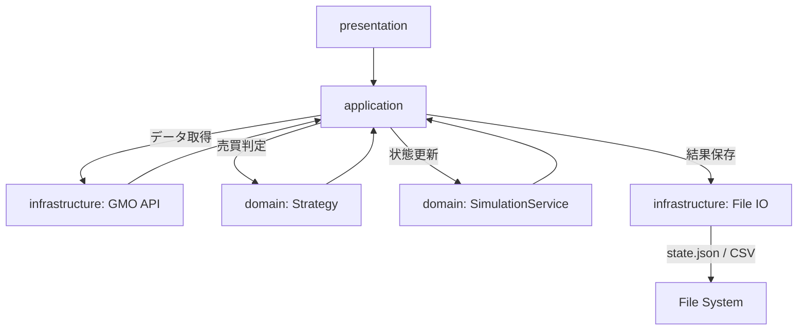

# システム全体構成 設計書

| 項目 | 内容 |
| --- | --- |
| 想定読者 | このアプリの全体構成を把握したい開発者 |
| 読んだあとできること | パッケージ構成と1回の実行の流れを説明できる |
| 状態 | 現行 |
| 機密区分 | 公開可 |
| 作成者 | リポジトリ管理者 |
| 保守責任者 | リポジトリ管理者 |
| 最終確認日 | 2026-08-30 |

## 1. 文書の目的

この文書では、対応する仕様（Phase1 シミュレーション基盤）をどのように実装するか、システム全体の構成とパッケージ設計の方針を定義する。

## 2. 対応する仕様書

- [対応する仕様書](../specifications/phase1-simulation.md)

## 3. 設計方針

- レイヤードアーキテクチャを採用し、ビジネスロジックと外部I/Oを分離する。
- `domain` には外部API通信やファイル保存を書かない。
- `application` は処理の流れのオーケストレーションのみを担当する。
- `infrastructure` は外部API通信やファイル入出力を担当する。
- 依存関係のルールは自動テスト（Konsist等）によって強制する。

## 4. 責務分担

| 層・部品 | 役割 |
| --- | --- |
| presentation | クラウド環境（Cloud Run等）やローカルからの実行エントリポイント |
| application | 定期実行の全体の流れ（設定読み込み、データ取得、判定、保存）の順序管理 |
| domain | 仮想残高の計算、取引ルール（Strategy）に基づく売買判定 |
| infrastructure | GMO Public API通信、CSV出力、`state.json`の入出力、設定ファイルのパース |

## 5. 配置予定のクラス・ファイル（パッケージ構成方針）

| パッケージ | 役割 |
| --- | --- |
| `presentation` | 起動スクリプト、CLIエントリ、DIコンテナの初期化 |
| `application` | ユースケース（例：`TradingApplication`） |
| `domain` | `Strategy`（戦略）、`SimulationState`（状態モデル）、`SimulationService`（状態更新ロジック） |
| `infrastructure` | APIクライアント、ファイルIOリポジトリの実装クラス |

## 6. 処理フロー

1. `presentation` が起動し、依存オブジェクト（DI）を組み立てる
2. `application` が `infrastructure` を通じて設定を読み込む
3. `application` が `infrastructure` を通じてGMO APIから市場データ（K線など）を取得する
4. `application` が `domain` の `TradingStrategy` にデータを渡し、売買判定を行う
5. 判定結果に基づき、`domain` の `SimulationService` で仮想の残高や保有状態を更新する
6. `application` が更新後の状態を `infrastructure` に渡し、JSONやCSVへ保存する

## 7. Mermaid による設計フロー

## 8. データの流れ

| データ | 発生元 | 渡し先 | 説明 |
| --- | --- | --- | --- |
| K線データ | infrastructure (API) | domain (Strategy) | 売買判定に使う市場の価格データ |
| 判定結果 | domain (Strategy) | application | 買うか、売るか、見送るかのシグナル |

## 9. 状態管理

| 保存先 | 保存内容 | 更新タイミング |
| --- | --- | --- |
| `data/state.json` | 仮想の残金、保有状態、買値、保有数量 | 毎回の売買判定終了時 |

## 10. エラー処理設計

| エラー | 検知する場所 | 扱い |
| --- | --- | --- |
| API通信エラー | infrastructure | application に伝播し、今回の実行をスキップしてログ出力 |

## 11. 具体例

実装時に判断が分かれやすい箇所を、具体的な処理の流れで示します。

### 例1: 正常処理

- 10:00 に `presentation` が起動する
- `application` が GMO APIから最新価格 10,000,000 円を取得する
- `domain` の `SafeReboundStrategy` が `BUY_CANDIDATE` を返す
- `domain` の `SimulationService` が仮想資金を減らし保有量を増やす
- `infrastructure` が `state.json` に直近の保有情報を書き込む

## 12. テスト方針

| テスト対象 | 確認内容 |
| --- | --- |
| domain | APIやファイルに依存せず、計算・判定ロジックが正しいこと |
| Architecture | パッケージ間の依存方向がルール通りであること（Konsist使用） |

## 13. 関連ドキュメント

- [対応する仕様書](../specifications/phase1-simulation.md)
