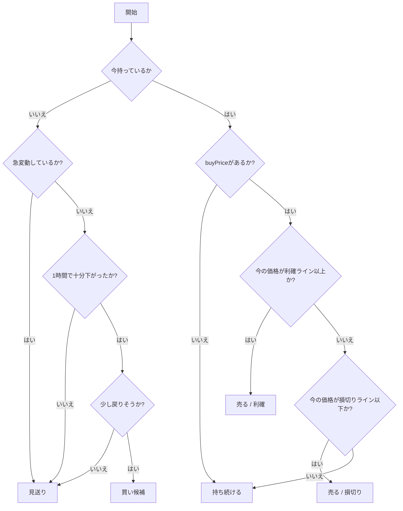

# 売買戦略の設計方針

| 項目 | 内容 |
| --- | --- |
| 想定読者 | 売買ロジックの中身を知りたい人 |
| 読んだあとできること | どんなときに買い、どんなときに売るかを判定順に説明できる |
| 状態 | 現行 |
| 機密区分 | 公開可 |
| 作成者 | リポジトリ管理者 |
| 保守責任者 | リポジトリ管理者 |
| 最終確認日 | 2026-08-30 |

## 文書の目的

- どのような時に「買う」判断をするのか
- どのような時に「売る」判断をするのか
- 何もしない（見送る）のはどのような時か
- `SafeReboundStrategy` と `SimpleContrarianStrategy` の違い
- ボラティリティや急変動のチェックが、どの判断で使われるか

## 対象読者

- 開発者、運用者
- どのような基準で売買が判断されているのかを知りたい方

## 関連ドキュメント

- [../specifications/phase1-simulation.md](../specifications/phase1-simulation.md)
- [CooldownReboundStrategy 仕様書](../specifications/strategies/cooldown-rebound-strategy.md)
- [TrendConfirmReboundStrategy 仕様書](../specifications/strategies/trend-confirm-rebound-strategy.md)
- [AtrTrendConfirmReboundStrategy 仕様書](../specifications/strategies/atr-trend-confirm-rebound-strategy.md)

## 現在の採用戦略

- 現在のデフォルト設定（売買ルール）は **`SafeReboundStrategy`** です。
- `SafeReboundStrategy` は、**買った価格（buyPrice）を基準**に売るかどうかを判断します。
- 派生戦略が3つあります。詳細は各仕様書にあります。
  - **`CooldownReboundStrategy`**: 損切り後の再エントリーを制限する
  - **`TrendConfirmReboundStrategy`**: 短期トレンドの上向きを確認する
  - **`AtrTrendConfirmReboundStrategy`**: ATR を用いた変動幅で利確・損切りする
- **Phase1 では実際の取引所に注文を出しません**。シミュレーション上の状態更新だけを行います。

## 用語補足

この文書に出てくる語のうち、初めて読む人がつまずきやすいものを並べます。

| 用語 | 意味 |
| --- | --- |
| Strategyパターン | 売買ルールを切り替えられるようにする仕組み |
| エントリー | 買う判断 |
| イグジット | 売る判断 |
| 利確 | 利益が出たので売ること |
| 損切り | 損が大きくなる前に売ること |
| ボラティリティ | 価格変動の大きさ |
| 反発 | 価格が下がったあとに、少し戻る動き |
| 見送り | 売ることも買うこともせず、何もしないこと |
| 保有中 | すでに買って、仮想通貨を持っている状態 |
| K線 | 一定時間の価格データをまとめたもの（ローソク足） |

## SafeReboundStrategy の判定ルール

買う条件と売る条件を、それぞれの判定順に示します。

### エントリー条件（買う条件）

まだ何も持っていない場合にだけ、以下の条件をすべて満たしたら「買い候補」になります。

- 直近1時間の下落率が、設定した買いのしきい値（`trading.buy_threshold`）以上である
- 直近15分で危険な急変動が起きていない
- 直近のK線が、少し戻りそうな形（反発）になっている

### エントリー見送り条件

以下の場合は安全を優先し、買いません（見送り）。

- データが足りない
- 直近15分で急に大きく動いている（危ない動き）
- 直近1時間の下落率が、買いのしきい値に届いていない
- 下がっていても、少し戻りそうな動きが確認できない
- すでに保有中である

### イグジット条件（売る条件）

「保有中」の場合にだけ売り判断を行います。基準は買った時の価格（buyPrice）です。

- 今の価格が buyPrice より一定割合以上高くなったら、利益が出たので売る（利確）
- 今の価格が buyPrice より一定割合以上低くなったら、損が大きくなる前に売る（損切り）

### 保有継続条件

以下の場合は、そのまま持ち続けます。

- 利確のしきい値（`trading.sell_threshold`）に届いていない
- まだ損切りラインまで下がっていない
- buyPrice が未設定または不正な場合は、安全のため保有継続にする

## SimpleContrarianStrategy の位置づけ

- 過去の検証・比較用に残している旧ロジックです。既定の戦略には使いません。
- 買った価格を使わず、直近1時間の値動きをもとに買い・売りを判断します。

## 判定例

**前提:**

- 買った価格: 100円
- 売り判定の基準: 5% (105円で利確、95円で損切り)

1. **今が106円の場合**: 105円以上なので、利益が出たとして「売る（利確）」。
2. **今が94円の場合**: 95円以下なので、損が大きくなる前に「売る（損切り）」。
3. **今が102円の場合**: どちらのラインにも届かないため「売らない（保有継続）」。

## 判断フロー

1回の実行で、どの順に判定していくかを図にしています。

### 図1: SafeReboundStrategy の判断フロー

## 判断ルールの補足

- **今は本当に取引所に売り注文を出すのか？**: 出しません。シミュレーションだけです。
  - シミュレーション上の残金を `state.json` に保存します。
  - 買い判定時は残金を減らして保有BTC数量を更新し、売り判定時は残金を増やして確定損益を更新します。
  - buyPrice は SafeReboundStrategy の売り判定と損益計算に使われます。
- **ボラティリティで売るのか？**: 売りません。買った価格（buyPrice）を基準にします。
- **価格が下がったら必ず買うのか？**: 買いません。急変動がなく、少し戻りそうな動きがある場合だけです。

## 更新方針

戦略が追加・変更されたときに更新してください。実注文が導入されたときも同様です。
