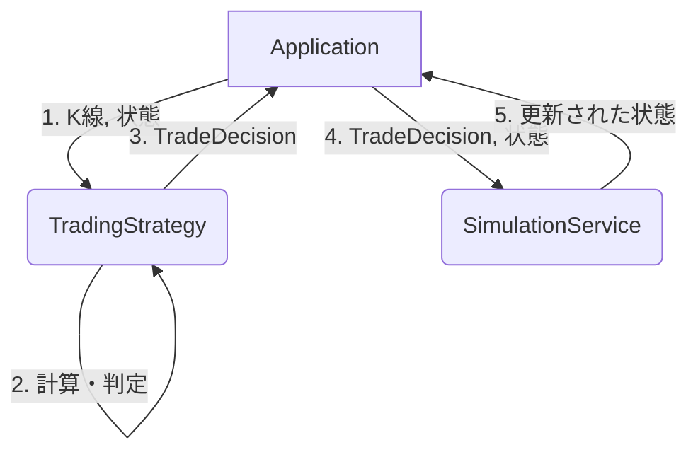

# 売買戦略（Trading Strategy） 設計書

## 1. 文書の目的

この文書では、対応する仕様（各種売買戦略）をどのように実装するか、Strategyパターンの活用やSimulationServiceとの連携方法を定義する。

## 2. 対応する仕様書

- [CooldownReboundStrategy 仕様書](../specifications/strategies/cooldown-rebound-strategy.md)
- [TrendConfirmReboundStrategy 仕様書](../specifications/strategies/trend-confirm-rebound-strategy.md)
- [AtrTrendConfirmReboundStrategy 仕様書](../specifications/strategies/atr-trend-confirm-rebound-strategy.md)

## 3. 設計方針

- **Strategyパターン**: 各売買戦略は共通のインターフェース（`TradingStrategy`）を実装し、呼び出し側（`application`や`SimulationService`）が具体的なロジックを意識せず切り替えられるようにする。
- **状態を持たない（Stateless）**: `TradingStrategy` のインスタンス自体は状態（前回の判定結果や実行時間など）を持たせない。必要な状態は引数（`SimulationState`等）として毎回渡し、更新後の状態を返すか、呼び出し側に委ねる。
- **責務の分離**: Strategyは「判定（買うべきか、売るべきか）」のみを行い、実際の残高やポジションの更新は `SimulationService` や `RealTradingService` が行う。

## 4. 責務分担

| 層・部品 | 役割 |
| --- | --- |
| interface `TradingStrategy` | 全ての戦略が実装すべきメソッド（例: `evaluate()`）を定義する |
| class 各種Strategy | 渡されたK線データと状態をもとに `TradeDecision` を返す |
| enum `TradeDecision` | 判定結果（`BUY_CANDIDATE`, `SELL_CANDIDATE`, `HOLDING`, `SKIP`）を表す |
| class `SimulationService` | Strategyの判定結果を受け取り、仮想資産の計算・更新を行う |

## 5. 配置予定のクラス・ファイル

| 種類 | 配置 | 役割 |
| --- | --- | --- |
| interface | `domain.strategy.TradingStrategy` | 戦略の共通インターフェース |
| enum | `domain.strategy.TradeDecision` | 売買の判定結果 |
| class | `domain.strategy.CooldownReboundStrategy` | クールダウン機能を持つ戦略の実装 |
| class | `domain.simulation.SimulationService` | 仮想資産の更新ロジック |

## 6. 処理フロー

1. `application` が現在の設定から使用する Strategy 実装クラスを生成・取得する
2. `application` が最新のK線リストと現在の状態（`SimulationState`）を Strategy に渡す
3. Strategy が内部で計算（MAやATRなど）を行い、`TradeDecision` を返す
4. `application` がその `TradeDecision` を `SimulationService`（またはリアル注文サービス）に渡す
5. `SimulationService` が新しい状態（更新された `SimulationState`）を返す

## 7. Mermaid による設計フロー

## 8. データの流れ

| データ | 発生元 | 渡し先 | 説明 |
| --- | --- | --- | --- |
| K線リスト | application | TradingStrategy | 判定に必要な過去データ |
| SimulationState | application | TradingStrategy | 現在の保有状況やクールダウン情報 |
| TradeDecision | TradingStrategy | application | BUY, SELL などの判定結果 |

## 9. 状態管理

Strategy内で発生した「次に引き継ぐべき状態」（例: 損切りしてクールダウンを開始した時刻、ATRの値など）は、`SimulationState` などのドメインモデルに記録して保存する。Strategyクラス自体にプロパティとして保持してはいけない。

## 10. エラー処理設計

計算に必要なデータ（K線本数など）が不足している場合、例外を投げず、安全側に倒して `TradeDecision.SKIP` または `HOLDING` を返すようにする。

## 11. 具体例

### 例1: クールダウン期間中の処理

- `application` が `CooldownReboundStrategy.evaluate()` を呼び出す。
- 渡された `SimulationState` に「最後に損切りした時刻」が記録されている。
- Strategy内で現在時刻と比較し、クールダウン期間中であると判定する。
- 買い条件（反発など）を計算する前に直ちに `TradeDecision.SKIP` を返す。

## 12. テスト方針

| テスト対象 | 確認内容 |
| --- | --- |
| 各種Strategy | K線のパターンと状態（保有の有無など）を入力とし、期待する `TradeDecision` が返されるか網羅的にテストする |

## 13. 関連ドキュメント

- [CooldownReboundStrategy 仕様書](../specifications/strategies/cooldown-rebound-strategy.md)
