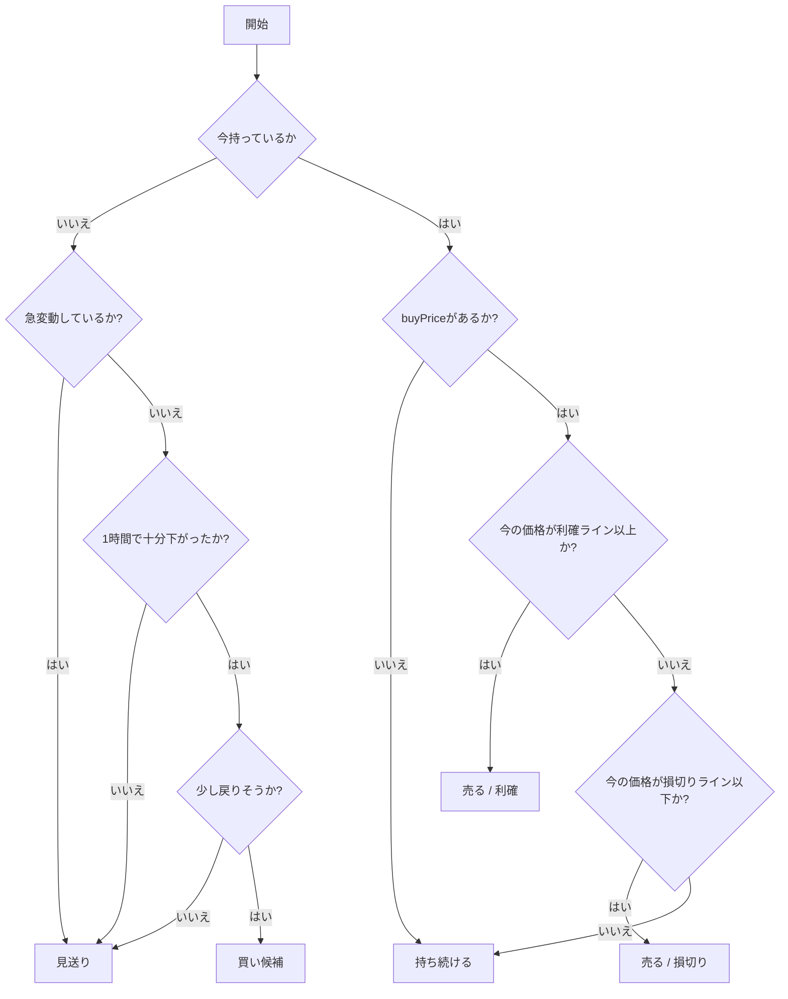

# 売買ロジック説明

## 概要
本ドキュメントは、現在アプリケーションに実装されている売買判定ロジックについて、初心者にも分かりやすく説明するものです。システムの内部でいつ、どのように「買うか」「売るか」を判断しているのかを解説します。

**重要な前提:**
- 今のアプリには「買う判定」があります。
- 今のアプリには「売る判定」もあります。
- ただし **Phase1 では実際の取引所に注文を出しません**。
- Phase1 の「買う」「売る」は、シミュレーション上の状態更新（記録の書き換え）であり、**実際の資金は一切動きません**。

## 対象読者
- 開発者、運用者
- どのような基準で売買が判断されているのかを知りたい方

## この文書で分かること
- どのような時に「買う」判断をするのか
- どのような時に「売る」判断をするのか
- 何もしない（見送る）のはどのような時か
- `SafeReboundStrategy` と `SimpleContrarianStrategy` の違い
- ボラティリティや急変動のチェックが、どの判断で使われるか

## まず結論
- 現在のデフォルト設定（売買ルール）は **`SafeReboundStrategy`** です。
- `SafeReboundStrategy` は、**買った価格（buyPrice）を基準**に売るかどうかを判断します。
- `SafeReboundStrategy` では、すでに保有している場合の売り判定にボラティリティは使わず、買った価格を基準にします。
- もう一つのルール `SimpleContrarianStrategy` は、過去の比較用に残している旧ロジックです。
- `SimpleContrarianStrategy` は、買った価格を使わず、直近1時間の値動きをもとに買い・売りを判断します。

## よく出る言葉の簡単な説明
- **Strategyパターン**: 売買ルールを簡単に切り替えられるようにする仕組み
- **エントリー**: 買うこと
- **イグジット**: 売ること
- **利確**: 利益が出たので売ること
- **損切り**: 損が大きくなる前に売ること
- **ボラティリティ**: 値動きの大きさ
- **反発**: 価格が下がったあとに、少し戻る動き
- **見送り**: 売ることも買うこともせず、何もしないこと
- **保有中**: すでに買って、仮想通貨を持っている状態
- **K線**: 一定時間の「始まりの値段」「一番高い値段」「一番安い値段」「終わりの値段」をまとめたデータ（ローソク足とも呼ばれます）

## 現在の売買判定の全体像
本アプリでは5分ごとに最新のデータを取得し、Strategy（戦略）と呼ばれるルールに従って判定を行います。
Phase1では、判定の結果が「買い」なら持っていることにしてシミュレーションの記録を更新し、「売り」なら手放したことにして記録を更新します。

## SafeReboundStrategy の説明
現在のメインである `SafeReboundStrategy`（安全な反発狙い戦略）のルールです。

### 買うとき
まだ「未保有（何も持っていない）」の場合にだけ、買い判断を行います。
以下の条件をすべて満たした場合に「買い候補」になります。

- 直近1時間で価格が十分に下がっている
- 直近15分で危険な急変動が起きていない
- 最新のK線が、少し戻りそうな形（反発）になっている

### 買わないとき
以下の場合は安全を優先し、買いません（見送り）。

- データが足りない
- 直近15分で急に大きく動いている（危ない動き）
- 直近1時間で十分に下がっていない
- 下がっていても、少し戻りそうな動きが確認できない
- すでに保有中である

### 売るとき
すでに「保有中」の場合にだけ、売り判断を行います。
売る条件は、**買った時の価格（buyPrice）**を基準にして決まります。

- 今の価格が buyPrice より一定割合以上高くなったら、利益が出たので売る（利確）
- 今の価格が buyPrice より一定割合以上低くなったら、損が大きくなる前に売る（損切り）

**重要:** `SafeReboundStrategy` の売り判断は、ボラティリティ（直近の値動きの大きさ）ではなく、**buyPrice を基準**に行います。

### 売らないとき
以下の場合は、そのまま持ち続けます。

- まだ十分に利益が出ていない
- まだ損切りラインまで下がっていない
- buyPrice が未設定または不正な場合は、安全のため保有継続にする

## SimpleContrarianStrategy の説明
比較用に残されている古いルールの `SimpleContrarianStrategy` のルールです。

- 過去の検証・比較用に残している旧ロジックです。
- 未保有で、直近1時間で大きく下がったら買い候補にします。
- 保有中で、直近1時間で大きく上がったら売り候補にします。
- 既存のボラティリティ不足チェックや直近15分の急変動チェックも維持しています。
- buyPrice を基準にした安全な売り判定ではないため、現在のデフォルトは `SafeReboundStrategy` となっています。

## 具体例
数字を使って、分かりやすい価格でシミュレーションの動きを見てみましょう。

**共通の前提:**
- 初期仮想元本: 10,000円
- 1回の買付金額: 1,000円
- 買った価格: 100円
- 売り判定の基準: 5%

100円のときに1,000円分買ったので、10枚の仮想通貨を持っている状態（保有中）になります。
この時、買った価格から5%上がった「105円以上」になったら利益が出たので売ります。
逆に5%下がった「95円以下」になったら損が大きくなる前に売ります。

### 必ず説明するケース
1. **100円で買って、今が106円の場合**
   - 判断: 売る
   - 理由: 105円以上なので利確ラインを超えている
   - 結果: 10枚なら1,060円で売る。1,000円で買っていたので60円の利益が出ます。

2. **100円で買って、今が94円の場合**
   - 判断: 売る
   - 理由: 95円以下なので損切りラインを下回っている
   - 結果: 10枚なら940円で売る。1,000円で買っていたので60円の損失になります。

3. **100円で買って、今が102円の場合**
   - 判断: 売らない（保有継続）
   - 理由: 利確ライン（105円）にも損切りライン（95円）にも届いていないためです。

4. **まだ何も持っていない状態で、1時間前110円、今100円、最後に少し戻る動きがある場合**
   - 判断: 買い候補
   - 理由: 1時間で下落し、最後に反発の兆しが見えるためです。1,000円分買うなら10枚手に入ります。

5. **まだ何も持っていない状態で、直近15分に価格が激しく上下している場合**
   - 判断: 買わない（見送り）
   - 理由: 危ない動きなので取引を見送ります。

## Mermaid 図による視覚的な説明

### 図1: SafeReboundStrategy の判断フロー

### 図2: 100円で買った場合の価格ライン

```mermaid
%%{init: {'theme': 'base', 'themeVariables': { 'primaryColor': '#ffffff', 'edgeLabelBackground':'#ffffff', 'tertiaryColor': '#f4f4f4'}}}%%
flowchart LR
    P106["106円〜"]:::profit
    P105["105円 (利確ライン)"]:::profit
    P102["102円 (持ち続ける)"]:::hold
    P100["100円 (買った価格)"]:::buy
    P95["95円 (損切りライン)"]:::loss
    P94["〜94円"]:::loss

    P106 --- P105 --- P102 --- P100 --- P95 --- P94

    classDef profit fill:#e6ffe6,stroke:#00cc00,stroke-width:2px;
    classDef hold fill:#f2f2f2,stroke:#999999,stroke-width:2px;
    classDef buy fill:#e6f2ff,stroke:#0066cc,stroke-width:2px;
    classDef loss fill:#ffe6e6,stroke:#cc0000,stroke-width:2px;
```

## よくある誤解

### 誤解1: 今は本当に取引所に売り注文を出すのか？
**回答: 出しません。**
Phase1では実注文は行わず、シミュレーション上の状態更新だけを行います。

### 誤解2: SafeReboundStrategy はボラティリティで売るのか？
**回答: 売りません。**
`SafeReboundStrategy` の売り判断は buyPrice を基準にした利確・損切りのみです。

### 誤解3: SimpleContrarianStrategy はもう消していいのか？
**回答: 消しません。**
過去比較用に残します。

### 誤解4: 価格が下がったら必ず買うのか？
**回答: 買いません。**
下がったうえで、危険な急変動がなく、少し戻りそうな動きがある場合だけ買い候補にします。

## 関連ドキュメント
- [人間向けドキュメント一覧](./README.md)
- [Phase1 の仕様](./phase1.md)
- [プロジェクトの全体像](../../README.md)

## 更新タイミング
取引ロジックや戦略（Strategy）が追加・変更された場合や、Phase2へ移行して実注文が導入された際に更新してください。