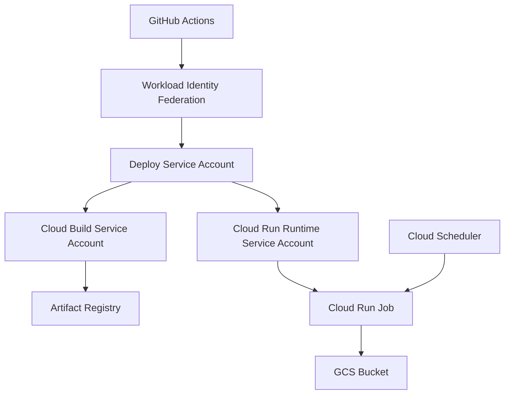

# GCP インフラコード設計書

このドキュメントは、TerraformなどでGCPインフラを0からコード化して作成するための設計書です。

## 1. 設計の目的

この章では、本ドキュメントの目的を定義します。

- この設計書はアプリ実装ではなく、GCPインフラ構成を扱う。
- GCP上に必要なリソースをコードで再現できるようにする。
- 手作業やGitHub Actions内の `gcloud` コマンドに依存しすぎない構成にする。
- IAM権限、サービスアカウント、保存先、デプロイ先の関係を設計として明確にする。

## 2. 全体構成

この章では、GCPインフラとGitHub Actionsの全体的なアーキテクチャ構成を定義します。

本システムのGCPインフラは、GitHub Actionsからデプロイを行い、Cloud Run Jobとして実行される構成となっています。
権限とリソースの関係は以下の通りです。

### 各要素の役割

| 要素 | 役割 | Terraform管理対象 |
|---|---|---|
| GitHub Actions | デプロイやジョブ実行の起点 | 定義しない。workflow側で管理する |
| Workload Identity Federation | GitHub ActionsからGCPへ接続するための認証基盤 | 接続基盤として別扱い |
| Deploy Service Account | GitHub ActionsがGCPを操作するためのService Account | 接続基盤として別扱い |
| Cloud Build Service Account | Docker image の build / push を行う実行主体 | 管理対象 |
| Cloud Run Runtime Service Account | Cloud Run Job 実行時に使うService Account | 管理対象 |
| Artifact Registry | Docker image の保存先 | 管理対象 |
| GCS Bucket | シミュレーション結果や状態ファイルの保存先、およびTerraform stateの保存先 | 管理対象 |
| Cloud Run Job | アプリを実行するジョブ | 管理対象 |
| Cloud Scheduler | Cloud Run Jobの定期実行起点 | 管理対象 |
| Secret Manager | APIキーや取引用Secretの保存先 | 管理対象 |

## 3. リソース設計

この章では、Terraformなどのインフラコードで作成・管理するGCP上の構成要素を定義します。
ここでいう「リソース」とは、GCP上に作成・設定する個別のクラウド部品のことです（AWSでいうEC2インスタンス、S3バケット、IAM Roleなどのようなもの）。

| 構成要素 | 何を定義するか | 用途 | Terraform管理方針 |
|---|---|---|---|
| GCP API | 利用するGCPサービスAPI | Cloud Build, Cloud Run, Artifact Registryなどを使えるようにする | 管理する |
| Artifact Registry repository | Docker image の保存先リポジトリ | Cloud Run Jobにデプロイするimageを保存する | 管理する |
| アプリ用 GCS Bucket | アプリデータの保存先 | シミュレーション結果やアプリの状態ファイルを保存する | 管理する |
| state用 GCS Bucket | 管理情報の保存先 | terraform.tfstate を保存する | 管理する |
| Secret Manager secret | Secretの入れ物 | Cloud Run Job が参照するAPIキーや取引用Secretの入れ物 | 管理する |
| Cloud Build Service Account | build/push を実行する主体 | Docker imageを作成しArtifact Registryへpushする | 管理する |
| Cloud Run Runtime Service Account | Cloud Run Job実行時の主体 | ジョブ実行時にGCSへ読み書きする | 管理する |
| IAM binding | 誰にどの権限を与えるか | 各Service Accountの操作範囲を制御する | 管理する |
| Cloud Run Job | アプリを実行するジョブ定義 | 定期または手動で売買ロジックを実行する | 管理する |
| Cloud Scheduler | Cloud Run Jobの定期実行起点 | 決まった時刻にジョブを起動する | 管理する |

### GCS Bucketの用途設計

| Bucket | 用途 | Terraformで定義する内容 |
|---|---|---|
| アプリ用Bucket | シミュレーション結果やアプリ状態ファイルを保存する | bucket名、location、IAM |
| state用Bucket | `terraform.tfstate` を保存する | bucket名、location、IAM、backend設定で参照する値 |

## 4. Terraform ファイル構成案

この章では、Terraformのコードをどのように分割して配置するかを定義します。

- infra/
  - terraform/
    - gcp/
      - versions.tf
      - providers.tf
      - variables.tf
      - apis.tf
      - artifact-registry.tf
      - storage.tf
      - service-accounts.tf
      - iam.tf
      - cloud-run-job.tf
      - scheduler.tf
      - secrets.tf
      - outputs.tf
      - terraform.tfvars.example

| ファイル | 役割 |
|---|---|
| versions.tf | Terraform本体とGoogle providerのバージョンを固定する |
| providers.tf | Google Cloud provider の設定を書く |
| variables.tf | project_id, region など外から渡す値を定義する |
| apis.tf | 有効化するGCP APIを定義する |
| artifact-registry.tf | Artifact Registry を定義する |
| storage.tf | アプリ用およびstate用のGCS Bucket を定義する |
| service-accounts.tf | Service Account を定義する |
| iam.tf | IAM binding を定義する |
| cloud-run-job.tf | Cloud Run Job の定義を書く |
| scheduler.tf | Cloud Scheduler の定義を書く |
| secrets.tf | Secret Manager のsecret本体（入れ物）を定義する |
| outputs.tf | 作成したリソース名などを出力する |
| terraform.tfvars.example | 設定値の例を書く |

## 5. 変数設計

この章では、インフラコードに渡す外部設定値を定義します。

| 変数名 | 意味 | 例 |
|---|---|---|
| project_id | GCPプロジェクトID | crypto-autotrading-lab |
| region | GCPリージョン | asia-northeast1 |
| artifact_repository_name | Artifact Registry名 | crypto-autotrading-lab |
| gcs_bucket_name | アプリ用GCS Bucket名 | crypto-autotrading-lab |
| state_bucket_name | Terraform state用GCS Bucket名 | crypto-autotrading-lab-tfstate |
| build_service_account_name | Cloud Build用SA名 | cloud-build-builder |
| runtime_service_account_name | Cloud Run実行用SA名 | crypto-autotrading-lab-runner |
| deploy_service_account_email | GitHub Actions用SAメール | github-actions-deployer@crypto-autotrading-lab.iam.gserviceaccount.com |
| cloud_run_job_name | Cloud Run Job名 | 既存のGitHub Actions varsに合わせる |
| secret_names | Secret ManagerのSecret名一覧 | `["GMO_API_KEY", "GMO_API_SECRET"]` |
| scheduler_job_name | Cloud Scheduler名 | crypto-autotrading-lab-scheduler |
| scheduler_cron | 定期実行のcron式 | `0 9 * * *` |
| scheduler_time_zone | 定期実行のタイムゾーン | `Asia/Tokyo` |

※ SA は Service Account の略です。
Service Account は、GCP上でプログラムやGitHub Actionsが操作するときに使う専用アカウントです。

## 6. IAMリソース設計

この章では、各Service Accountに対して、どのGCPリソースへの操作権限を付与するかを定義します。

### Service Account同士の関係と権限

- Deploy Service Account は、GitHub ActionsがGCPを操作するための入口である。
- Deploy Service Account は、Cloud Build Service Accountを指定してbuildできる必要がある。
- Deploy Service Account は、Cloud Run Runtime Service AccountをCloud Run Jobに設定できる必要がある。
- Cloud Build Service Account は、Artifact RegistryへDocker imageをpushできる必要がある。
- Cloud Run Runtime Service Account は、Cloud Run Job実行時にGCS Bucketへ読み書きできる必要がある。
- Cloud Run Runtime Service Account は、Cloud Run Job実行時にSecret ManagerからAPIキーなどを読める必要がある。

### 権限一覧

| 操作主体 | 対象リソース | 付与する権限 | Terraform resource候補 | 理由 |
|---|---|---|---|---|
| Cloud Build Service Account | Artifact Registry repository | roles/artifactregistry.writer | google_artifact_registry_repository_iam_member | Docker imageをpushするため |
| Cloud Build Service Account | Cloud Logging | roles/logging.logWriter | google_project_iam_member | buildログを書き込むため |
| Cloud Build Service Account | GCS Bucket | roles/storage.objectViewer | google_storage_bucket_iam_member | build時に必要なファイルを読むため |
| Cloud Run Runtime Service Account | GCS Bucket | roles/storage.objectAdmin | google_storage_bucket_iam_member | 実行結果や状態ファイルを読み書きするため |
| Cloud Run Runtime Service Account | Secret Manager secret | roles/secretmanager.secretAccessor | google_secret_manager_secret_iam_member | 実行時に必要なSecretを読むため |
| Deploy Service Account | Cloud Build Service Account | roles/iam.serviceAccountUser | google_service_account_iam_member | Cloud Build用Service Accountを指定してbuildするため |
| Deploy Service Account | Cloud Run Runtime Service Account | roles/iam.serviceAccountUser | google_service_account_iam_member | Cloud Run JobにRuntime Service Accountを設定するため |

- project全体に広く付ける権限と、特定リソースにだけ付ける権限を分ける。
- 可能なものは project IAM ではなく、Artifact Registry、GCS Bucket、Secret単位で付与する。
- `google_project_iam_policy` は使わない。
- 理由は、プロジェクト全体のIAMを上書きして既存権限を壊す可能性があるため。
- 基本は `google_project_iam_member`、`google_storage_bucket_iam_member`、`google_artifact_registry_repository_iam_member`、`google_secret_manager_secret_iam_member`、`google_service_account_iam_member` を使う。

## 7. state設計

この章では、Terraformのstateをどこに保存し、誰が扱い、どのように保護するかを定義します。

| 設計項目 | 定義内容 |
|---|---|
| stateの役割 | Terraformが管理するGCPリソースの状態を記録する |
| 保存先 | GCS backend |
| state用Bucket | アプリ用Bucketとは分ける |
| state用Bucketに保存するもの | terraform.tfstate |
| アプリ用Bucketに保存するもの | シミュレーション結果やアプリの状態ファイル |
| prefix | terraform/gcp |
| stateを読み書きする主体 | Terraformを実行するService Account |
| Git管理 | `terraform.tfstate` はGit管理しない |
| Secret対策 | Secret実値をTerraform管理に含めない |

- state用Bucketとアプリ用Bucketは用途が違うため分ける。
- stateにはTerraformが管理するリソース情報が入る。
- Secret実値をTerraformで扱うとstateに残る可能性がある。
- そのため、Secret実値はTerraformコード、terraform.tfvars、stateに含めない設計にする。

## 8. Secretリソース設計

この章では、APIキーや取引用Secretなどの機密情報を、GCP上でどのリソースとして定義し、Cloud Run Jobからどう参照するかを定義します。

| 設計項目 | 定義内容 |
|---|---|
| 利用するGCPサービス | Secret Manager |
| Terraformで定義するもの | Secret Manager の secret本体、必要なIAM、Cloud Run Jobからの参照設定 |
| Terraformで定義しないもの | Secretの実値 |
| Secretの実値の登録 | Terraformとは別の安全な手段で登録する |
| Secretを参照する主体 | Cloud Run Runtime Service Account |
| Cloud Run Jobからの参照方法 | 環境変数またはSecret参照設定として参照する |
| GitHub Actions secretsの用途 | GitHub Actions自身がGCPへ接続・デプロイするために使う値を扱う |
| GCP Secret Managerの用途 | Cloud Run Jobが実行時に使うAPIキーや取引用Secretを扱う |

- TerraformではSecretの「入れ物」を作る。
- Secretの値そのものはTerraformコードや `terraform.tfvars` には書かない。
- Secretの値をTerraformに渡すとstateに残る可能性があるため、Secret実値はTerraform管理に含めない。
- Cloud Run Jobは、Secret値を直接ファイルやコードに持たず、Secret Managerを参照して利用する。
- Cloud Run Runtime Service Accountには、必要なSecretを読む権限を付与する。

| Terraform resource候補 | 用途 |
|---|---|
| google_secret_manager_secret | Secretの入れ物を作る |
| google_secret_manager_secret_iam_member | Cloud Run Runtime Service AccountにSecret参照権限を付与する |
| google_cloud_run_v2_job | Cloud Run JobからSecretを参照する設定を書く |

※ `google_secret_manager_secret_version` でSecret実値をTerraform管理する設計にはしない（Secret実値がstateに残る可能性があるため）。

### 値の置き場所と用途の整理

| 置き場所 | 置くもの | 使う主体 |
|---|---|---|
| GitHub Actions secrets | GitHub ActionsがGCPへ接続するために必要な値 | GitHub Actions |
| GitHub Actions vars | project_id、region、job名など、機密ではない設定値 | GitHub Actions |
| GCP Secret Manager | Cloud Run Jobが実行時に使うAPIキー、取引用Secretなど | Cloud Run Job |
| Terraform variables | project_id、region、resource名、Secret名など、機密ではない設計値 | Terraform |

## 9. GitHub Actionsとの責務分離

この章では、TerraformとGitHub Actionsの間でインフラ操作の責務をどのように分担するかを定義します。
Terraformで「ジョブ定義」を管理し、GitHub Actionsでは「実行」を担当する責務にしています。

| 対象 | Terraform側 | GitHub Actions側 |
|---|---|---|
| GCP API有効化 | 定義する | 原則やらない |
| Artifact Registry作成 | 定義する | 原則やらない |
| GCS Bucket作成 | 定義する | 原則やらない |
| Service Account作成 | 定義する | 原則やらない |
| IAM付与 | 定義する | 原則やらない |
| Cloud Run Job定義 | 定義する | 原則やらない |
| Cloud Scheduler定義 | 定義する | 原則やらない |
| Docker image build | 定義しない | 実行する |
| Docker image push | 定義しない | 実行する |
| Cloud Run Job execute | 定義しない | 実行する |

## 10. 命名設計

この章では、TerraformコードやGCPリソースの命名規則を定義します。

- 既存の GitHub Actions vars と名前を合わせる。
- GCPリソース名はプロジェクト名を基準にする。
- Service Account名は用途が分かる名前にする。
- Terraform resource名はGCP上の表示名ではなく、コード上の役割が分かる名前にする。
