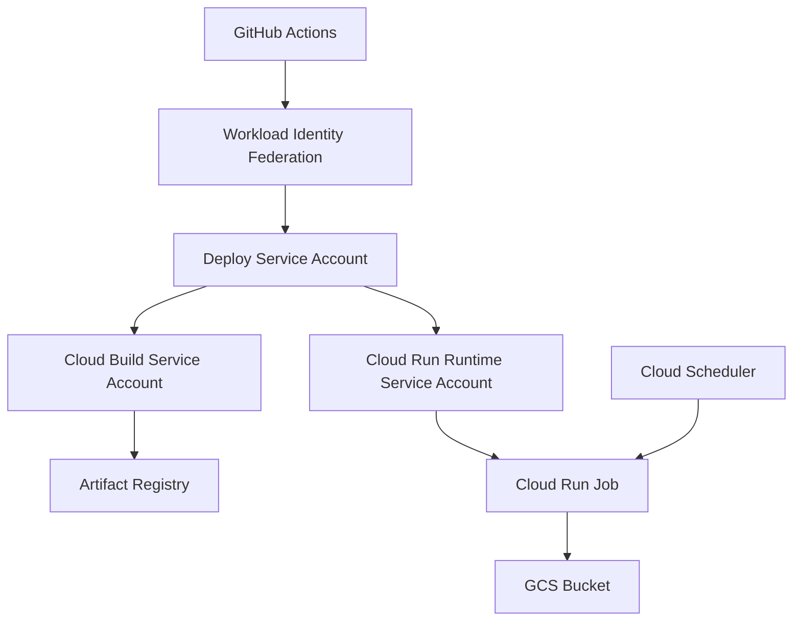

# GCP インフラコード設計書

このドキュメントは、TerraformなどでGCPインフラをコード化するための設計書です。

## 1. 設計の目的

この章では、本ドキュメントの目的を定義します。

- この設計書はアプリ実装ではなく、GCPインフラ構成を扱う。
- GCP上に必要なリソースをコードで再現できるようにする。
- 手作業やGitHub Actions内の `gcloud` コマンドに依存しすぎない構成にする。
- IAM権限、サービスアカウント、保存先、デプロイ先の関係を設計として明確にする。

## 2. 全体構成

この章では、GCPインフラとGitHub Actionsの全体的なアーキテクチャ構成を定義します。

本システムのGCPインフラは、GitHub Actionsからデプロイを行い、Cloud Run Jobとして実行される構成となっています。
権限とリソースの関係は以下の通りです。

### 各要素の役割

- **GitHub Actions**: デプロイやジョブ実行の起点になる。
- **Workload Identity Federation**: GitHub Actions からGCPへ安全に接続するための仕組み。
- **Deploy Service Account**: GitHub Actions がGCPを操作するときに使うサービスアカウント。
- **Cloud Build Service Account**: Docker image の build / push を行う実行主体。
- **Cloud Run Runtime Service Account**: Cloud Run Job の実行時に使うサービスアカウント。
- **Artifact Registry**: Docker image の保存先。
- **GCS Bucket**: シミュレーション結果や状態ファイルの保存先。
- **Cloud Scheduler**: 将来的な定期実行の起点。

## 3. リソース設計

この章では、Terraformなどのインフラコードで作成・管理するGCP上の構成要素を定義します。
ここでいう「リソース」とは、GCP上に作成・設定する個別のクラウド部品のことです（AWSでいうEC2インスタンス、S3バケット、IAM Roleなどのようなもの）。

| 構成要素 | 何を定義するか | 用途 | Terraform管理方針 |
|---|---|---|---|
| GCP API | 利用するGCPサービスAPI | Cloud Build, Cloud Run, Artifact Registryなどを使えるようにする | 管理する |
| Artifact Registry repository | Docker image の保存先リポジトリ | Cloud Run Jobにデプロイするimageを保存する | 管理する |
| GCS Bucket | 結果・状態ファイルの保存先 | シミュレーション結果や状態ファイルを保存する | 管理する |
| Cloud Build Service Account | build/push を実行する主体 | Docker imageを作成しArtifact Registryへpushする | 管理する |
| Cloud Run Runtime Service Account | Cloud Run Job実行時の主体 | ジョブ実行時にGCSへ読み書きする | 管理する |
| IAM binding | 誰にどの権限を与えるか | 各Service Accountの操作範囲を制御する | 管理する |
| Cloud Run Job | アプリを実行するジョブ定義 | 定期または手動で売買ロジックを実行する | 将来的に管理する |
| Cloud Scheduler | Cloud Run Jobの定期実行起点 | 決まった時刻にジョブを起動する | 将来的に管理する |

## 4. Terraform ファイル構成案

この章では、Terraformのコードをどのように分割して配置するかを定義します。

- infra/
  - terraform/
    - gcp/
      - versions.tf
      - providers.tf
      - variables.tf
      - apis.tf
      - artifact-registry.tf
      - storage.tf
      - service-accounts.tf
      - iam.tf
      - cloud-run-job.tf
      - outputs.tf
      - terraform.tfvars.example

| ファイル | 役割 |
|---|---|
| versions.tf | Terraform本体とGoogle providerのバージョンを固定する |
| providers.tf | Google Cloud provider の設定を書く |
| variables.tf | project_id, region など外から渡す値を定義する |
| apis.tf | 有効化するGCP APIを定義する |
| artifact-registry.tf | Artifact Registry を定義する |
| storage.tf | GCS Bucket を定義する |
| service-accounts.tf | Service Account を定義する |
| iam.tf | IAM binding を定義する |
| cloud-run-job.tf | Cloud Run Job の定義を書く |
| outputs.tf | 作成したリソース名などを出力する |
| terraform.tfvars.example | 設定値の例を書く |

## 5. 変数設計

この章では、インフラコードに渡す外部設定値を定義します。

| 変数名 | 意味 | 例 |
|---|---|---|
| project_id | GCPプロジェクトID | crypto-autotrading-lab |
| region | GCPリージョン | asia-northeast1 |
| artifact_repository_name | Artifact Registry名 | crypto-autotrading-lab |
| gcs_bucket_name | GCS Bucket名 | crypto-autotrading-lab |
| build_service_account_name | Cloud Build用SA名 | cloud-build-builder |
| runtime_service_account_name | Cloud Run実行用SA名 | crypto-autotrading-lab-runner |
| deploy_service_account_email | GitHub Actions用SAメール | github-actions-deployer@crypto-autotrading-lab.iam.gserviceaccount.com |
| cloud_run_job_name | Cloud Run Job名 | 既存のGitHub Actions varsに合わせる |

※ SA は Service Account の略です。
Service Account は、GCP上でプログラムやGitHub Actionsが操作するときに使う専用アカウントです。

## 6. IAM設計

この章では、どのサービスアカウントに何の権限を与えるかのIAM割り当て方針を定義します。

| 付与先 | 権限 | 目的 |
|---|---|---|
| Cloud Build Service Account | roles/artifactregistry.writer | Docker image を Artifact Registry にpushするため |
| Cloud Build Service Account | roles/logging.logWriter | buildログを書き込むため |
| Cloud Build Service Account | roles/storage.objectViewer | build時に必要なオブジェクトを読むため |
| Cloud Run Runtime Service Account | roles/storage.objectAdmin on GCS Bucket | 実行結果や状態ファイルを読み書きするため |
| Deploy Service Account | roles/iam.serviceAccountUser on Cloud Build SA | Cloud Build用SAを指定してbuildするため |
| Deploy Service Account | roles/iam.serviceAccountUser on Runtime SA | Cloud Run Jobに実行用SAを指定するため |

**禁止事項:**
- IAM全体を上書きしないこと。
- `google_project_iam_policy` は使わない（プロジェクト全体のIAMを上書きして既存権限を壊す危険があるため）。
- IAMは以下の個別付与で管理すること。
  - `google_project_iam_member`
  - `google_storage_bucket_iam_member`
  - `google_service_account_iam_member`

## 7. state設計

この章では、Terraformが管理するリソースの現在の状態（state）の扱いを定義します。

- stateとは、Terraformが「どのGCPリソースを管理しているか」を記録する情報である。
- state はローカルPCだけに置かない。
- `terraform.tfstate` をGitで管理してはいけない（機密情報が含まれる可能性があるため）。
- GCS Bucket を backend として使う想定である。
- state の保存先 prefix は `terraform/gcp` のようにする。
- 今回のPRでは backend の実装コードは追加しない。

## 8. Secret管理方針

この章では、APIキーや認証情報など、コードに直接書いてはいけない値の扱いを定義します。

- APIキーやSecret値などの機密情報は、Terraformコードに直接書かない。
- `terraform.tfvars` にも実Secret値を書かない。
- Secretの保存先は、将来的にGCP Secret Managerを候補とする。
- GitHub Actionsのvars/secretsとGCP Secret Managerの責務を分ける。
- 今回のPRではSecret ManagerのTerraform実装は追加しない。

## 9. 既存リソース取り込み設計

この章では、既に手動等で作成された既存リソースをTerraformの管理下に移す方針を定義します。

- importとは、すでにGCP上に存在するリソースをTerraform管理へ取り込む作業である。
- 取り込み対象:
  - Artifact Registry
  - GCS Bucket
  - Cloud Build Service Account
  - Cloud Run Runtime Service Account
  - 必要な IAM binding
- importせずに `terraform apply` すると、同じ名前のリソースを新規作成しようとして失敗する可能性があるため必ず行う。

## 10. GitHub Actionsとの責務分離

この章では、TerraformとGitHub Actionsの間でインフラ操作の責務をどのように分担するかを定義します。

| 対象 | Terraform側 | GitHub Actions側 |
|---|---|---|
| GCP API有効化 | 管理する | 原則やらない |
| Artifact Registry作成 | 管理する | 原則やらない |
| GCS Bucket作成 | 管理する | 原則やらない |
| Service Account作成 | 管理する | 原則やらない |
| IAM付与 | 管理する | 原則やらない |
| Docker image build | 管理しない | 実行する |
| Docker image push | 管理しない | 実行する |
| Cloud Run Job deploy | 将来的に管理候補 | 当面実行する |
| Cloud Run Job execute | 管理しない | 実行する |

## 11. 命名設計

この章では、TerraformコードやGCPリソースの命名規則を定義します。

- 既存の GitHub Actions vars と名前を合わせる。
- GCPリソース名はプロジェクト名を基準にする。
- Service Account名は用途が分かる名前にする。
- Terraform resource名はGCP上の表示名ではなく、コード上の役割が分かる名前にする。
