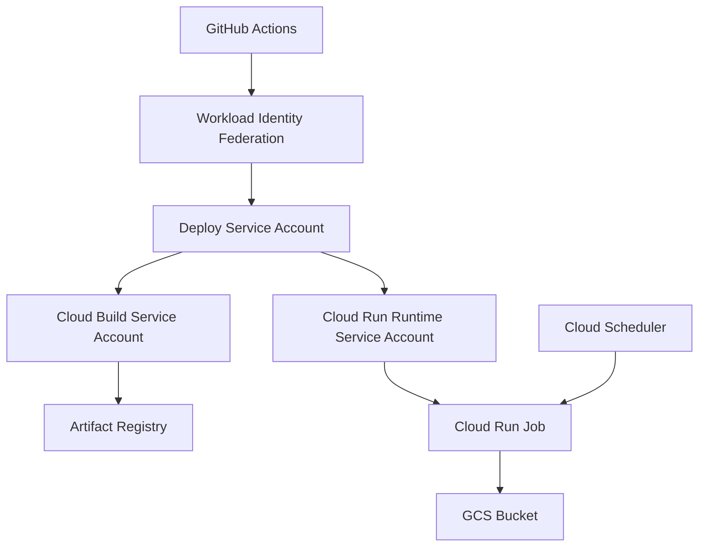

# GCP インフラコード設計書

このドキュメントは、TerraformなどでGCPインフラを0からコード化して作成するための設計書です。

## 1. 設計の目的

この章では、本ドキュメントの目的を定義します。

- この設計書はアプリ実装ではなく、GCPインフラ構成を扱う。
- GCP上に必要なリソースをコードで再現できるようにする。
- 手作業やGitHub Actions内の `gcloud` コマンドに依存しすぎない構成にする。
- IAM権限、サービスアカウント、保存先、デプロイ先の関係を設計として明確にする。

## 2. 全体構成

この章では、GCPインフラとGitHub Actionsの全体的なアーキテクチャ構成を定義します。

本システムのGCPインフラは、GitHub Actionsからデプロイを行い、Cloud Run Jobとして実行される構成となっています。
権限とリソースの関係は以下の通りです。

### 各要素の役割

| 要素 | 役割 | インフラコードで定義する内容 |
|---|---|---|
| GitHub Actions | デプロイやジョブ実行の起点 | インフラコードでは定義しない。workflow側で管理する |
| Workload Identity Federation | GitHub Actions からGCPへ安全に接続する仕組み | providerや接続先として参照する |
| Deploy Service Account | GitHub Actions がGCPを操作するときに使うService Account | メールアドレスを変数として扱う |
| Cloud Build Service Account | Docker image の build / push を行う実行主体 | Service Account と必要なIAMを定義する |
| Cloud Run Runtime Service Account | Cloud Run Job 実行時に使うService Account | Service Account と必要なIAMを定義する |
| Artifact Registry | Docker image の保存先 | repository名、region、形式を定義する |
| GCS Bucket | シミュレーション結果や状態ファイルの保存先 | bucket名、location、権限を定義する |
| Cloud Run Job | アプリを実行するジョブ | job名、region、実行Service Account、環境変数、volume設定などを定義する |
| Cloud Scheduler | Cloud Run Jobの定期実行起点 | job名、スケジュール、実行先を定義する |

## 3. リソース設計

この章では、Terraformなどのインフラコードで作成・管理するGCP上の構成要素を定義します。
ここでいう「リソース」とは、GCP上に作成・設定する個別のクラウド部品のことです（AWSでいうEC2インスタンス、S3バケット、IAM Roleなどのようなもの）。

| 構成要素 | 何を定義するか | 用途 | Terraform管理方針 |
|---|---|---|---|
| GCP API | 利用するGCPサービスAPI | Cloud Build, Cloud Run, Artifact Registryなどを使えるようにする | 管理する |
| Artifact Registry repository | Docker image の保存先リポジトリ | Cloud Run Jobにデプロイするimageを保存する | 管理する |
| GCS Bucket | 結果・状態ファイルの保存先 | シミュレーション結果や状態ファイルを保存する | 管理する |
| Cloud Build Service Account | build/push を実行する主体 | Docker imageを作成しArtifact Registryへpushする | 管理する |
| Cloud Run Runtime Service Account | Cloud Run Job実行時の主体 | ジョブ実行時にGCSへ読み書きする | 管理する |
| IAM binding | 誰にどの権限を与えるか | 各Service Accountの操作範囲を制御する | 管理する |
| Cloud Run Job | アプリを実行するジョブ定義 | 定期または手動で売買ロジックを実行する | 管理する |
| Cloud Scheduler | Cloud Run Jobの定期実行起点 | 決まった時刻にジョブを起動する | 管理する |

## 4. Terraform ファイル構成案

この章では、Terraformのコードをどのように分割して配置するかを定義します。

- infra/
  - terraform/
    - gcp/
      - versions.tf
      - providers.tf
      - variables.tf
      - apis.tf
      - artifact-registry.tf
      - storage.tf
      - service-accounts.tf
      - iam.tf
      - cloud-run-job.tf
      - outputs.tf
      - terraform.tfvars.example

| ファイル | 役割 |
|---|---|
| versions.tf | Terraform本体とGoogle providerのバージョンを固定する |
| providers.tf | Google Cloud provider の設定を書く |
| variables.tf | project_id, region など外から渡す値を定義する |
| apis.tf | 有効化するGCP APIを定義する |
| artifact-registry.tf | Artifact Registry を定義する |
| storage.tf | GCS Bucket を定義する |
| service-accounts.tf | Service Account を定義する |
| iam.tf | IAM binding を定義する |
| cloud-run-job.tf | Cloud Run Job の定義を書く |
| outputs.tf | 作成したリソース名などを出力する |
| terraform.tfvars.example | 設定値の例を書く |

## 5. 変数設計

この章では、インフラコードに渡す外部設定値を定義します。

| 変数名 | 意味 | 例 |
|---|---|---|
| project_id | GCPプロジェクトID | crypto-autotrading-lab |
| region | GCPリージョン | asia-northeast1 |
| artifact_repository_name | Artifact Registry名 | crypto-autotrading-lab |
| gcs_bucket_name | GCS Bucket名 | crypto-autotrading-lab |
| build_service_account_name | Cloud Build用SA名 | cloud-build-builder |
| runtime_service_account_name | Cloud Run実行用SA名 | crypto-autotrading-lab-runner |
| deploy_service_account_email | GitHub Actions用SAメール | github-actions-deployer@crypto-autotrading-lab.iam.gserviceaccount.com |
| cloud_run_job_name | Cloud Run Job名 | 既存のGitHub Actions varsに合わせる |

※ SA は Service Account の略です。
Service Account は、GCP上でプログラムやGitHub Actionsが操作するときに使う専用アカウントです。

## 6. IAM設計

この章では、どのサービスアカウントに何の権限を与えるかのIAM割り当て方針を定義します。

### Service Account同士の関係と権限

- Deploy Service Account は、GitHub ActionsがGCPを操作するための入口である。
- Deploy Service Account は、Cloud Build Service Accountを指定してbuildできる必要がある。
- Deploy Service Account は、Cloud Run Runtime Service AccountをCloud Run Jobに設定できる必要がある。
- Cloud Build Service Account は、Artifact RegistryへDocker imageをpushできる必要がある。
- Cloud Run Runtime Service Account は、Cloud Run Job実行時にGCS Bucketへ読み書きできる必要がある。

### 権限一覧

| 付与先 | 権限 | 目的 |
|---|---|---|
| Cloud Build Service Account | roles/artifactregistry.writer | Docker image を Artifact Registry にpushするため |
| Cloud Build Service Account | roles/logging.logWriter | buildログを書き込むため |
| Cloud Build Service Account | roles/storage.objectViewer | build時に必要なオブジェクトを読むため |
| Cloud Run Runtime Service Account | roles/storage.objectAdmin on GCS Bucket | 実行結果や状態ファイルを読み書きするため |
| Deploy Service Account | roles/iam.serviceAccountUser on Cloud Build SA | Cloud Build用SAを指定してbuildするため |
| Deploy Service Account | roles/iam.serviceAccountUser on Runtime SA | Cloud Run Jobに実行用SAを指定するため |

**禁止事項:**
- IAM全体を上書きしないこと。
- `google_project_iam_policy` は使わない（プロジェクト全体のIAMを上書きして既存権限を壊す危険があるため）。
- IAMは以下の個別付与で管理すること。
  - `google_project_iam_member`
  - `google_storage_bucket_iam_member`
  - `google_service_account_iam_member`

## 7. state設計

この章では、Terraformのstateをどこに保存し、誰が扱い、どのように保護するかを定義します。

| 設計項目 | 方針 |
|---|---|
| 保存先 | ローカルPCではなくGCS backendを使う |
| state用Bucket | アプリの実行結果保存用Bucketとは分ける方針にする |
| prefix | terraform/gcp を基本にする |
| 管理主体 | Terraformを実行するGitHub Actions用Service Accountがstateを読み書きする |
| Git管理 | `terraform.tfstate` はGit管理しない |
| Secret混入対策 | APIキーやSecret値をTerraform変数やstateに含めない設計にする |
| このPRでやること | backendの実装コードは追加せず、設計方針のみを書く |

補足として、アプリ用Bucketとstate用Bucketは用途が違うため、同じBucketにしない方針にします。
- アプリ用Bucket: シミュレーション結果や状態ファイルを保存する
- state用Bucket: Terraformの管理情報を保存する

## 8. Secret管理方針

この章では、APIキーや認証情報など、コードに直接書いてはいけない値の扱いを定義します。

- Secret値をTerraform変数に直接渡すと、stateに残る可能性がある。
- そのため、APIキーや取引用SecretはTerraformコードや `terraform.tfvars` に直接書かない。
- Secret本体は将来的にGCP Secret Managerで管理する。
- TerraformではSecretの「入れ物」や参照関係だけを管理する方針にする。
- GitHub Actionsのvars/secretsとGCP Secret Managerの責務を分ける。
- 今回のPRではSecret ManagerのTerraform実装は追加しない。

## 9. GitHub Actionsとの責務分離

この章では、TerraformとGitHub Actionsの間でインフラ操作の責務をどのように分担するかを定義します。
Terraformで「ジョブ定義」を管理し、GitHub Actionsでは「実行」を担当する責務にしています。

| 対象 | Terraform側 | GitHub Actions側 |
|---|---|---|
| GCP API有効化 | 定義する | 原則やらない |
| Artifact Registry作成 | 定義する | 原則やらない |
| GCS Bucket作成 | 定義する | 原則やらない |
| Service Account作成 | 定義する | 原則やらない |
| IAM付与 | 定義する | 原則やらない |
| Cloud Run Job定義 | 定義する | 原則やらない |
| Cloud Scheduler定義 | 定義する | 原則やらない |
| Docker image build | 定義しない | 実行する |
| Docker image push | 定義しない | 実行する |
| Cloud Run Job execute | 定義しない | 実行する |

## 10. 命名設計

この章では、TerraformコードやGCPリソースの命名規則を定義します。

- 既存の GitHub Actions vars と名前を合わせる。
- GCPリソース名はプロジェクト名を基準にする。
- Service Account名は用途が分かる名前にする。
- Terraform resource名はGCP上の表示名ではなく、コード上の役割が分かる名前にする。
