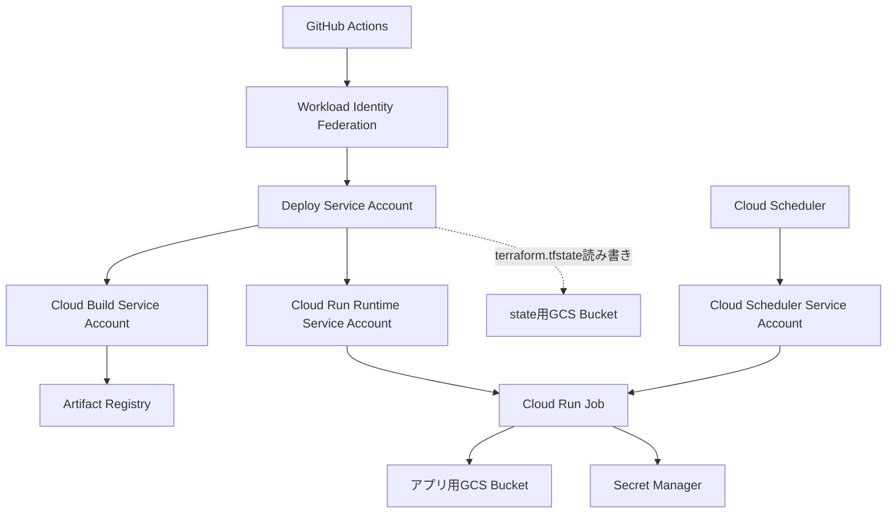

# GCP インフラコード設計書

このドキュメントは、TerraformなどでGCPインフラを0からコード化して作成するための設計書です。

## 1. 設計の目的

この章では、本ドキュメントの目的を定義します。

- この設計書はアプリ実装ではなく、GCPインフラ構成を扱う。
- GCP上に必要なリソースをコードで再現できるようにする。
- 手作業やGitHub Actions内の `gcloud` コマンドに依存しすぎない構成にする。（**現状はこの方針を満たしていない。** 下の「現状との差」を参照）
- IAM権限、サービスアカウント、保存先、デプロイ先の関係を設計として明確にする。

### 現状との差

この文書は目指す姿を書いたものです。実際のリポジトリは次の状態にあります。

| 項目 | 目指す姿 | 現状 |
| --- | --- | --- |
| リソースの作成 | Terraform | GitHub Actions の `gcloud`（`bootstrap-create-gcp.yml` / `bootstrap-grant-iam.yml`） |
| Cloud Run Job のデプロイ | Terraform | GitHub Actions の `gcloud run jobs deploy`（`deploy-gcp.yml`） |
| Cloud Scheduler の管理 | Terraform | GitHub Actions の `gcloud`（`scheduler-gcp.yml`） |
| Cloud Scheduler Service Account への `roles/run.invoker` | Cloud Run Job 単位で付与 | project 単位で付与（[setup-scheduler-service-account.sh](https://github.com/ht-0328/crypto-autotrading-lab/blob/main/scripts/ops/setup-scheduler-service-account.sh)） |
| Terraform コード | 正 | [infra/terraform/gcp/](https://github.com/ht-0328/crypto-autotrading-lab/tree/main/infra/terraform/gcp/) に存在するが `terraform apply` は運用していない。環境変数の集合は gcloud 側と一致させている |

**現時点で正となるのは GitHub Actions（gcloud）側です。** 一本化するかどうかの判断と、既存リソースの `terraform import` を含む移行は今後の課題として [改善計画のバックログ](../../improvements/backlog.md) に登録しています。

## 2. 全体構成

この章では、GCPインフラとGitHub Actionsの全体的なアーキテクチャ構成を定義します。

本システムのGCPインフラは、GitHub Actionsからデプロイを行い、Cloud Run Jobとして実行される構成となっています。
権限とリソースの関係は以下の通りです。

### 各要素の役割

| 要素 | 役割 | Terraform管理対象 |
|---|---|---|
| GitHub Actions | デプロイやジョブ実行の起点 | 定義しない。workflow側で管理する |
| Workload Identity Federation | GitHub ActionsからGCPへ接続するための認証基盤 | 接続基盤として別扱い |
| Deploy Service Account | GitHub ActionsがGCPを操作するためのService Account | 接続基盤として別扱い |
| Cloud Build Service Account | Docker image の build / push を行う実行主体 | 管理対象 |
| Cloud Run Runtime Service Account | Cloud Run Job 実行時に使うService Account | 管理対象 |
| Cloud Scheduler Service Account | Cloud Scheduler が Cloud Run Job を起動する際に使うService Account | 管理対象 |
| Artifact Registry | Docker image の保存先 | 管理対象 |
| アプリ用GCS Bucket | シミュレーション結果や状態ファイルの保存先 | 管理対象 |
| state用GCS Bucket | Terraform stateの保存先 | Bootstrap用リソースとして別管理 |
| Cloud Run Job | アプリを実行するジョブ | 管理対象 |
| Cloud Scheduler | Cloud Run Jobの定期実行起点 | 管理対象 |
| Secret Manager | APIキーや取引用Secretの保存先 | 管理対象 |

## 3. リソース設計

この章では、Terraformなどのインフラコードで作成・管理するGCP上の構成要素を定義します。
ここでいう「リソース」とは、GCP上に作成・設定する個別のクラウド部品のことです（AWSでいうEC2インスタンス、S3バケット、IAM Roleなどのようなもの）。

| 構成要素 | 何を定義するか | 用途 | Terraform管理方針 |
|---|---|---|---|
| GCP API | 利用するGCPサービスAPI | 各種GCPサービスを使えるようにする | 管理する |
| Artifact Registry repository | Docker image の保存先リポジトリ | Cloud Run Jobにデプロイするimageを保存する | 管理する |
| アプリ用 GCS Bucket | アプリデータの保存先 | シミュレーション結果やアプリの状態ファイルを保存する | 管理する |
| state用 GCS Bucket | 管理情報の保存先 | `terraform.tfstate` を保存する | Bootstrap用リソースとして分ける |
| Secret Manager secret | Secretの入れ物 | Cloud Run Job が参照するAPIキーや取引用Secretの入れ物 | 管理する |
| Cloud Build Service Account | build/push を実行する主体 | Docker imageを作成しArtifact Registryへpushする | 管理する |
| Cloud Run Runtime Service Account | Cloud Run Job実行時の主体 | ジョブ実行時にGCSへ読み書きする | 管理する |
| Cloud Scheduler Service Account | 定期実行のトリガー主体 | SchedulerがJobを起動するための権限を持つ | 管理する |
| IAM binding | 誰にどの権限を与えるか | 各Service Accountの操作範囲を制御する | 管理する |
| Cloud Run Job | アプリを実行するジョブ定義 | 定期または手動で売買ロジックを実行する | 管理する |
| Cloud Scheduler | Cloud Run Jobの定期実行起点 | 決まった時刻にジョブを起動する | 管理する |

### GCP API 設計

Terraformで有効化するGCP API一覧は以下の通りです。

- `serviceusage.googleapis.com`
- `iam.googleapis.com`
- `iamcredentials.googleapis.com`
- `cloudbuild.googleapis.com`
- `artifactregistry.googleapis.com`
- `run.googleapis.com`
- `storage.googleapis.com`
- `secretmanager.googleapis.com`
- `cloudscheduler.googleapis.com`

### Cloud Run Job 設計

Terraformで定義するCloud Run Jobの詳細は以下の通りです。

| 設計項目 | Terraformで定義する内容 |
|---|---|
| image | Artifact Registry上のDocker image URIを指定する |
| region | GCPリージョンを指定する |
| runtime service account | Cloud Run Runtime Service Accountを指定する |
| 通常環境変数 | `APP_INTERVAL`, `APP_TRADING_STRATEGY_NAME`, `TRADING_SYMBOL`, `TRADING_INITIAL_CAPITAL`, `TRADING_TRADE_AMOUNT`, `TRADING_BUY_THRESHOLD`, `TRADING_SELL_THRESHOLD`, `TRADING_VOLATILITY_THRESHOLD`, `TRADING_SHARP_CHANGE_THRESHOLD`, `TRADING_COOLDOWN_LENGTH`, `TRADING_ATR_LENGTH`, `TRADING_ATR_PROFIT_MULTIPLIER`, `TRADING_ATR_LOSS_MULTIPLIER`, `API_RETRY_COUNT`, `API_PUBLIC_BASE_URL`, `API_PRIVATE_BASE_URL`, `OUTPUT_PATH`, `STATE_PATH`, `REAL_TRADING_DRY_RUN`, `REAL_TRADING_ENABLED`, `REAL_TRADING_STOP_ON_UNCONFIRMED_ORDER`, `REAL_TRADING_MAX_ORDER_JPY`, `REAL_TRADING_MAX_DAILY_ORDER_JPY`, `REAL_TRADING_MAX_POSITION_JPY` などを指定する |
| Secret環境変数 | GMO APIキー、GMO API SecretなどをSecret Manager参照で指定する |
| volume | アプリ用GCS BucketをCloud Run Jobにmountする |
| mount path | `/mnt/gcs` を使用する |
| tasks | 1 |
| max retries | 0 |

**補足事項:**
- Docker image の build / push はTerraformではなくGitHub Actionsで実行する。
- Terraformでは、Cloud Run Jobが参照する image URI を変数として受け取る。
- image tag は latest ではなく、GitHub SHAなどを使った固定タグを前提にする。
- Cloud Run Job の実行はTerraformではなく、GitHub ActionsまたはCloud Schedulerで行う。
- APIキーやAPI Secretは通常の環境変数ではなく、Secret Manager参照で渡す。

### GCS Bucketの用途設計

| Bucket | 用途 | 管理方針 |
|---|---|---|
| アプリ用Bucket | シミュレーション結果やアプリ状態ファイルを保存する | Terraformで管理する |
| state用Bucket | `terraform.tfstate` を保存する | Terraform bootstrap用リソースとして分ける |

## 4. Terraform ファイル構成案

この章では、Terraformのコードをどのように分割して配置するかを定義します。
state用Bucketを作成するための初期化（bootstrap）構成と、本体の構成を分けます。

- infra/
  - terraform/
    - bootstrap/
      - gcp/
        - versions.tf
        - providers.tf
        - storage.tf
        - outputs.tf
    - gcp/
      - versions.tf
      - providers.tf
      - variables.tf
      - apis.tf
      - artifact-registry.tf
      - storage.tf
      - service-accounts.tf
      - iam.tf
      - secrets.tf
      - cloud-run-job.tf
      - scheduler.tf
      - outputs.tf
      - terraform.tfvars.example

| ファイル | 役割 |
|---|---|
| versions.tf | Terraform本体とGoogle providerのバージョンを固定する |
| providers.tf | Google Cloud provider の設定を書く |
| variables.tf | `project_id`, `region` など外から渡す値を定義する |
| apis.tf | 有効化するGCP APIを定義する |
| artifact-registry.tf | Artifact Registry を定義する |
| storage.tf | アプリ用のGCS Bucket を定義する |
| service-accounts.tf | Service Account を定義する |
| iam.tf | IAM binding を定義する |
| secrets.tf | Secret Manager のsecret本体（入れ物）を定義する |
| cloud-run-job.tf | Cloud Run Job の定義を書く |
| scheduler.tf | Cloud Scheduler の定義を書く |
| outputs.tf | 作成したリソース名などを出力する |
| terraform.tfvars.example | 設定値の例を書く |

## 5. 変数設計

この章では、インフラコードに渡す外部設定値を定義します。
Secretの実値は変数に含めず、Secret名のみを変数として渡します。

| 変数名 | 意味 | 例 |
|---|---|---|
| project_id | GCPプロジェクトID | crypto-autotrading-lab |
| region | GCPリージョン | asia-northeast1 |
| artifact_repository_name | Artifact Registry名 | crypto-autotrading-lab |
| gcs_bucket_name | アプリ用GCS Bucket名 | crypto-autotrading-lab |
| state_bucket_name | Terraform state用GCS Bucket名 | crypto-autotrading-lab-tfstate |
| build_service_account_name | Cloud Build用SA名 | cloud-build-builder |
| runtime_service_account_name | Cloud Run実行用SA名 | crypto-autotrading-lab-runner |
| scheduler_service_account_name | Cloud Scheduler実行用SA名 | cloud-scheduler-invoker |
| deploy_service_account_email | GitHub Actions用SAメール | github-actions-deployer@crypto-autotrading-lab.iam.gserviceaccount.com |
| secret_names | Secret ManagerのSecret名一覧 | `["gmo-api-key", "gmo-api-secret"]` |
| cloud_run_job_name | Cloud Run Job名 | 既存のGitHub Actions varsに合わせる |
| image_uri | Cloud Run Jobで実行するDocker image URI | asia-northeast1-docker.pkg.dev/crypto-autotrading-lab/crypto-autotrading-lab/app:xxxxxxx |
| app_trading_strategy_name | 使用する売買戦略名 | SafeReboundStrategy |
| api_public_base_url | パブリックAPI接続先URL | https://api.coin.z.com/public |
| api_private_base_url | プライベートAPI接続先URL | https://api.coin.z.com/private |
| api_retry_count | APIリトライ回数 | 3 |
| app_interval | アプリ実行間隔 | 60 |
| output_path | 結果出力先 | /mnt/gcs/data/output.json |
| state_path | 状態ファイル保存先 | /mnt/gcs/data/state.json |
| trading_buy_threshold | 買い判定しきい値 | 既存設定に合わせる |
| trading_sell_threshold | 売り判定しきい値 | 既存設定に合わせる |
| trading_initial_capital | 初期資金 | 既存設定に合わせる |
| trading_trade_amount | 1回あたりの取引金額 | 既存設定に合わせる |
| trading_symbol | 取引対象 | BTC_JPY |
| trading_volatility_threshold | ボラティリティ判定値 | 既存設定に合わせる |
| trading_sharp_change_threshold | 急変判定値 | 既存設定に合わせる |
| scheduler_job_name | Cloud Scheduler名 | crypto-autotrading-lab-scheduler |
| scheduler_cron | 定期実行のcron式 | `0 9 * * *` |
| scheduler_time_zone | 定期実行のタイムゾーン | `Asia/Tokyo` |

※ SA は Service Account の略です。

## 6. IAMリソース設計

この章では、各Service Accountに対して、どのGCPリソースへの操作権限を付与するかを定義します。

| 操作主体 | 対象リソース | 権限 | 方針 |
|---|---|---|---|
| Terraform実行用Deploy Service Account | Terraform管理対象のGCPリソース | 作成・更新に必要な権限 | Terraform applyを実行できるようにする |
| Terraform実行用Deploy Service Account | state用GCS Bucket | state読み書き権限 | backend stateを扱うため |
| Cloud Build Service Account | Artifact Registry repository | roles/artifactregistry.writer | repository単位で付与 |
| Cloud Build Service Account | Cloud Logging | roles/logging.logWriter | project単位で付与 |
| Cloud Build Service Account | Cloud Buildのビルド入力読み取り | roles/storage.objectViewer | project単位、または専用staging bucket単位で付与 |
| Cloud Run Runtime Service Account | アプリ用GCS Bucket | roles/storage.objectAdmin | bucket単位で付与 |
| Cloud Run Runtime Service Account | Secret Manager secret | roles/secretmanager.secretAccessor | Secret単位で付与 |
| Deploy Service Account | Cloud Build Service Account | roles/iam.serviceAccountUser | Service Account単位で付与 |
| Deploy Service Account | Cloud Run Runtime Service Account | roles/iam.serviceAccountUser | Service Account単位で付与 |
| Cloud Scheduler Service Account | Cloud Run Job | roles/run.invoker | Cloud Run Job単位で付与 |

**禁止事項と付与方針:**
- project全体に広く付ける権限と、特定リソースにだけ付ける権限を分ける。
- 可能なものは project IAM ではなく、Artifact Registry、GCS Bucket、Secret単位で付与する。
- `google_project_iam_policy` は使わない。理由は、プロジェクト全体のIAMを上書きして既存権限を壊す可能性があるため。
- 基本は `google_project_iam_member`、`google_storage_bucket_iam_member`、`google_artifact_registry_repository_iam_member`、`google_secret_manager_secret_iam_member`、`google_service_account_iam_member` を使う。

## 7. state設計

この章では、Terraformのstateをどこに保存し、誰が扱い、どのように保護するかを定義します。

| 設計項目 | 定義内容 |
|---|---|
| stateの役割 | Terraformが管理するGCPリソースの状態を記録する |
| 保存先 | GCS backend |
| state用Bucket | アプリ用Bucketとは分ける |
| state用Bucketに保存するもの | `terraform.tfstate` |
| アプリ用Bucketに保存するもの | シミュレーション結果やアプリの状態ファイル |
| prefix | `terraform/gcp` |
| stateを読み書きする主体 | Terraformを実行するService Account |
| Git管理 | `terraform.tfstate` はGit管理しない |
| Secret対策 | Secret実値をTerraform管理に含めない |

- state用Bucketとアプリ用Bucketは用途が違うため明確に分ける。
- stateにはTerraformが管理するリソース情報が入る。
- Secret実値をTerraformで扱うとstateに残る可能性がある。
- そのため、Secret実値はTerraformコード、`terraform.tfvars`、stateに含めない設計にする。

## 8. Secretリソース設計

この章では、APIキーや取引用Secretなどの機密情報を、GCP上でどのリソースとして定義し、Cloud Run Jobからどう参照するかを定義します。リアルAPI接続で使うAPIキー/API Secretは、Secret Managerで扱う設計にします。

| 項目 | 内容 |
|---|---|
| 利用するGCPサービス | Secret Manager |
| 保存する値 | GMO APIキー、GMO API Secretなど |
| Terraformで定義するもの | Secretの入れ物、IAM、Cloud Run Jobからの参照設定 |
| Terraformで定義しないもの | Secretの実値 |
| 参照する主体 | Cloud Run Runtime Service Account |
| Cloud Run Jobからの参照方法 | Secret Manager参照の環境変数 |

- `google_secret_manager_secret` でSecretの「入れ物」を作る。
- `google_secret_manager_secret_iam_member` で参照権限を付与する。
- `google_secret_manager_secret_version` でSecret実値をTerraform管理しない。
- Secret実値はTerraform stateに残さない。Terraformとは別の安全な手段で登録する。

### Secret名と環境変数名のマッピング

| 用途 | Secret名 | Cloud Run Job側の環境変数名 |
|---|---|---|
| GMO APIキー | gmo-api-key | GMO_API_KEY |
| GMO API Secret | gmo-api-secret | GMO_API_SECRET |

### 値の置き場所と用途の整理

| 置き場所 | 置くもの | 使う主体 |
|---|---|---|
| GitHub Actions secrets | GitHub ActionsがGCPへ接続するために必要な値 | GitHub Actions |
| GitHub Actions vars | project_id、region、job名など、機密ではない設定値 | GitHub Actions |
| GCP Secret Manager | Cloud Run Jobが実行時に使うAPIキー、取引用Secretなど | Cloud Run Job |
| Terraform variables | project_id、region、resource名、Secret名など、機密ではない設計値 | Terraform |

## 9. GitHub Actionsとの責務分離

この章では、TerraformとGitHub Actionsの間でインフラ操作の責務をどのように分担するかを定義します。
Terraformで「ジョブ定義」を管理し、GitHub Actionsでは「実行」を担当する責務にしています。

| 対象 | Terraform側 | GitHub Actions側 |
|---|---|---|
| GCP API有効化 | 定義する | 原則やらない |
| Artifact Registry作成 | 定義する | 原則やらない |
| GCS Bucket作成 | 定義する | 原則やらない |
| Service Account作成 | 定義する | 原則やらない |
| IAM付与 | 定義する | 原則やらない |
| Cloud Run Job定義 | 定義する | 原則やらない |
| Cloud Scheduler定義 | 定義する | 原則やらない |
| Docker image build | 定義しない | 実行する |
| Docker image push | 定義しない | 実行する |
| Cloud Run Job execute | 定義しない | 実行する |

## 10. 命名設計

この章では、TerraformコードやGCPリソースの命名規則を定義します。

- 既存の GitHub Actions vars と名前を合わせる。
- GCPリソース名はプロジェクト名を基準にする。
- Service Account名は用途が分かる名前にする。
- Terraform resource名はGCP上の表示名ではなく、コード上の役割が分かる名前にする。
