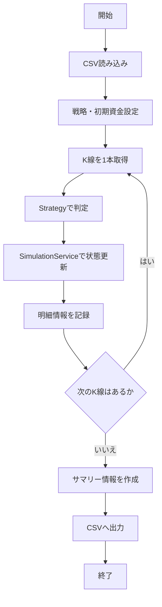

# バックテスト機能 仕様書

| 項目 | 内容 |
| --- | --- |
| 想定読者 | バックテスト機能を実装・レビューする開発者 |
| 読んだあとできること | バックテストの入力・出力・計算方法を、実装を見ずに説明できる |
| 状態 | 現行 |
| 機密区分 | 公開可 |
| 作成者 | リポジトリ管理者 |
| 保守責任者 | リポジトリ管理者 |
| 最終確認日 | 2026-08-30 |

## 1. 文書の目的

この文書は、バックテスト本体の仕様を定義するものです。

バックテストでは、過去K線CSVから読み込んだ List<Kline> を使い、既存の売買戦略を過去データ上で動かし、実際の注文を行う前に売買戦略の成績を確認します。

## 2. 対象範囲

この文書が扱う範囲と、扱わない範囲を示します。扱わないことには行き先を書いています。

### 対象

- K線データに対する順次処理（時間経過シミュレーション）
- TradingStrategy の呼び出し
- SimulationService を使った仮想資産状況の更新と記録
- バックテスト結果（サマリー・明細）の出力

### 対象外

- K線CSVデータの読み込み処理本体（別仕様書）
- 新しい売買戦略の作成

## 3. 用語

| 用語 | 意味 |
| --- | --- |
| K線 | 一定時間の始値・高値・安値・終値・出来高をまとめた価格データ |
| Strategy | 売買判断のルールを切り替えられるようにした部品 |

## 4. 機能概要

過去のK線データを古い順に1本ずつ処理し、その時点のデータを使って売買判定（Strategy）を行います。判定結果に応じて仮想の残高・保有数量・損益を更新し、バックテスト結果をサマリーおよび明細のCSVとして出力します。

判定に使ったK線の終値でそのまま約定させると、「終値を見てから、その終値で売買できる」ことになり成績が実態より良く出ます。これを避けるため、**K線 N の確定後に出したシグナルは K線 N+1 の始値で約定させます**。

## 5. 入力仕様

| 項目 | 例 | 必須 | 説明 |
| --- | --- | --- | --- |
| BACKTEST_KLINE_CSV_PATH | data/backtest/input/btc_5min_...csv | 必須 | 読み込む過去K線CSVのパス |
| BACKTEST_STRATEGY_NAME | SafeReboundStrategy | 必須 | 使用する売買戦略名 |
| BACKTEST_INITIAL_CAPITAL | 1000000 | 必須 | 開始時の仮想資金 |
| BACKTEST_SUMMARY_OUTPUT_PATH | data/backtest/output/summary_...csv | 必須 | サマリーの出力先 |
| BACKTEST_STEPS_OUTPUT_PATH | data/backtest/output/steps_...csv | 必須 | 明細の出力先 |
| BACKTEST_FEE_RATE | 0.0005 | 任意 | 約定額に対する手数料率。未指定時は 0 |
| BACKTEST_SLIPPAGE_RATE | 0.0005 | 任意 | 約定価格に対するスリッページ率。未指定時は 0 |
| APP_CONFIG_PATH | config/application-test.yaml | 必須 | 設定ファイルのパス |

`BACKTEST_FEE_RATE` と `BACKTEST_SLIPPAGE_RATE` は、指定されているのに数値として解釈できない場合、または負の値の場合はエラーとします（成績を誤って評価しないため）。

## 6. 出力仕様

バックテスト結果として、サマリー情報と各時点の明細情報の2つのCSVファイルを出力します。

### サマリー情報

バックテスト全体の成績を表します。

| 項目 | 説明 |
| --- | --- |
| 戦略名 | 使用した売買戦略名 |
| 初期資金 | 開始時点の仮想資金 |
| 最終総資産 | 終了時点の総資産額 |
| 確定損益 | 確定損益 |
| 利益率 | 初期資金に対する増減率 (totalReturnRate) 小数で出力 (例: 0.10) |
| 売買回数 | tradeCount (buyCount + sellCount) |
| 買い回数 | 実際に仮想購入が成立した回数 (buyCount) |
| 売り回数 | 実際に仮想売却が成立した回数 (sellCount) |
| 最大ドローダウン | maxDrawdown。途中の最高資産額からの一時的な下落率の最大値を小数で出力する（例: 0.10） |
| 利確回数 | 利確で売却した回数 |
| 損切り回数 | 損切りで売却した回数 |
| 勝率 | 売却回数のうち利確だった割合 (winRate) 小数で出力 (例: 0.60) |
| 平均利益 | 利確1回あたりの平均利益 |
| 平均損失 | 損切り1回あたりの平均損失 |
| 最大利益 | 1回の売却で得た最大利益 |
| 最大損失 | 1回の売却で出た最大損失 |
| 最大連続損切り回数 | 連続して損切りした最大回数 |
| 未決済ポジションあり | バックテスト終了時点で未売却の保有が残っているか |
| 手数料率 | 約定価格に織り込んだ手数料率。結果の前提として記録する |
| スリッページ率 | 約定価格に織り込んだスリッページ率。結果の前提として記録する |

### 明細情報

各K線時点での状態を表します。

| 項目 | 説明 |
| --- | --- |
| K線開始時刻 | K線の開始時刻 |
| 終値 | そのK線の終値 |
| 売買判定 | 売買判定結果 |
| 判定理由 | 判定理由 |
| 現金残高 | 仮想の現金残高 |
| 保有数量 | 仮想の保有数量 |
| 買値 | 保有中の買値 |
| 確定損益 | その時点までの確定損益 |
| 評価額 | 保有数量を現在価格で評価した金額 |
| 総資産額 | 現金残高と評価額を合計した総資産額 |

## 7. 処理仕様

**準備する**

1. 入力値から過去K線CSVのパスを取得する
2. 過去K線CSV読み込み機能を使って List<Kline> を取得する
3. 使用する売買戦略を取得する
4. 初期資金から SimulationState を作成する

**K線を1本ずつ回す**

5. K線データを openTime 昇順に処理する
6. 直前のK線で出たシグナルがあれば、**このK線の始値（open）を約定価格として** SimulationService で状態を更新する
7. その時点までのK線一覧を TradingStrategy に渡す
8. TradingStrategy の判定結果を受け取り、次のK線で約定させるシグナルとして保持する
9. cashBalance、holdingAmount、buyPrice、realizedProfitAndLoss を記録する
10. estimatedHoldingValue と totalAssetValue を、そのK線の終値（close）で計算する
11. 最後のK線で出たシグナルは、約定させるK線が存在しないため実行しない

**結果を出す**

12. 全K線の処理が完了したらサマリー情報を作成する
13. バックテスト結果をサマリー用と明細用の2つのファイルに出力する

明細CSVの各行は「そのK線で出たシグナル」と「そのK線の始値で約定した結果の状態」を並べて表します。したがって、ある行の売買判定が状態に反映されるのは次の行です。

## 8. 判定条件・業務ルール

| 条件 | 結果 |
| --- | --- |
| 約定価格の基準 | 判定に使ったK線の次のK線の始値(Kline.open) |
| 約定価格: 買い | 始値 × (1 + スリッページ率) × (1 + 手数料率) |
| 約定価格: 売り | 始値 × (1 - スリッページ率) × (1 - 手数料率) |
| 最後のK線の判定 | 約定させるK線がないため実行しない |
| 資産計算: estimatedHoldingValue | holdingAmount × 現在価格(Kline.close) |
| 資産計算: totalAssetValue | cashBalance + estimatedHoldingValue |
| 資産計算: finalAssetValue | 最後のK線時点の totalAssetValue |
| 資産計算: totalReturnRate | (finalAssetValue - initialCapital) / initialCapital |
| 資産計算: maxDrawdown | 過去最高の totalAssetValue からの下落率の最大値 |
| 計算型の扱い | 金額・数量計算にはすべて BigDecimal を使用する |
| データ不足による判定見送り | Strategyが判断不可を返した場合、そのまま見送る |

## 9. エラー仕様

| エラー条件 | 扱い | メッセージ方針 |
| --- | --- | --- |
| CSVの読み込み失敗・未指定 | エラーにする | 読み込みエラーである旨を伝える |
| 戦略名が対応していない | エラーにする | 利用可能な戦略名を提示する |
| 初期資金が0以下、または不正な値 | エラーにする | 正しい数値を指定するよう伝える |
| 出力先パスが未指定、または保存失敗 | エラーにする | 出力先パスと書き込み権限を確認させる |
| 手数料率・スリッページ率が不正な値、または負の値 | エラーにする | 設定名と正しい指定方法を伝える |

## 10. 具体例

代表的な入力と、そのときに期待する出力を示します。

### 例1: 正常に処理される場合

- 初期資金: 1,000,000円
- Strategy: `SafeReboundStrategy`
- 実行動作: 指定された1ヶ月分のK線を1本ずつ処理し、売買をシミュレートする。
- 期待する結果: サマリー用と明細用のCSVファイルが指定のパスに正常に出力される。

## 11. Mermaid による処理フロー

## 12. 関連ドキュメント

- [対応する設計書](../../architecture/backtest-design.md)
