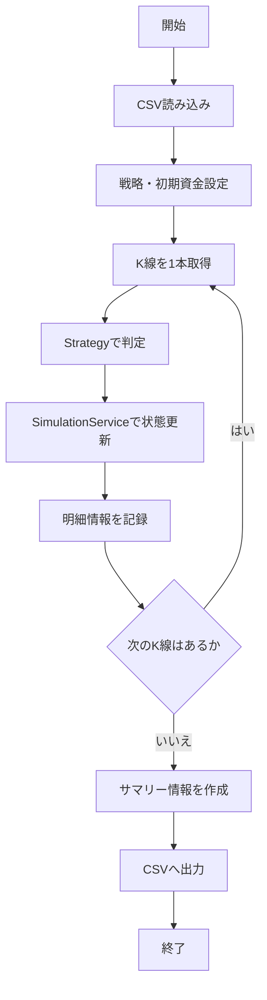

# バックテスト機能 仕様書

## 1. 文書の目的

この文書は、バックテスト本体の仕様を定義するものです。

バックテストでは、過去K線CSVから読み込んだ List<Kline> を使い、既存の売買戦略を過去データ上で動かし、実際の注文を行う前に売買戦略の成績を確認します。

## 2. 対象範囲

### 対象

- K線データに対する順次処理（時間経過シミュレーション）
- TradingStrategy の呼び出し
- SimulationService を使った仮想資産状況の更新と記録
- バックテスト結果（サマリー・明細）の出力

### 対象外

- K線CSVデータの読み込み処理本体（別仕様書）
- 新しい売買戦略の作成

## 3. 用語

| 用語 | 意味 |
| --- | --- |
| K線 | 一定時間の始値・高値・安値・終値・出来高をまとめた価格データ |
| Strategy | 売買判断のルールを切り替えられるようにした部品 |

## 4. 機能概要

過去のK線データを古い順に1本ずつ処理し、その時点のデータを使って売買判定（Strategy）を行います。判定結果に応じて仮想の残高・保有数量・損益を更新し、バックテスト結果をサマリーおよび明細のCSVとして出力します。

## 5. 入力仕様

| 項目 | 例 | 必須 | 説明 |
| --- | --- | --- | --- |
| BACKTEST_KLINE_CSV_PATH | data/backtest/input/btc_5min_...csv | 必須 | 読み込む過去K線CSVのパス |
| BACKTEST_STRATEGY_NAME | SafeReboundStrategy | 必須 | 使用する売買戦略名 |
| BACKTEST_INITIAL_CAPITAL | 1000000 | 必須 | 開始時の仮想資金 |
| BACKTEST_SUMMARY_OUTPUT_PATH | data/backtest/output/summary_...csv | 必須 | サマリーの出力先 |
| BACKTEST_STEPS_OUTPUT_PATH | data/backtest/output/steps_...csv | 必須 | 明細の出力先 |
| APP_CONFIG_PATH | config/application-test.yaml | 必須 | 設定ファイルのパス |

## 6. 出力仕様

バックテスト結果として、サマリー情報と各時点の明細情報の2つのCSVファイルを出力します。

### サマリー情報
戦略名、初期資金、最終総資産、確定損益、利益率(totalReturnRate)、売買回数(tradeCount)、買い回数(buyCount)、売り回数(sellCount)、最大ドローダウン(maxDrawdown)、利確回数、損切り回数、勝率(winRate)、平均利益、平均損失、最大利益、最大損失、最大連続損切り回数、未決済ポジションありフラグ。
※ 割合・率は小数（0.10など）で出力。

### 明細情報
各K線時点での、K線開始時刻、終値、売買判定、判定理由、現金残高、保有数量、買値、確定損益、評価額、総資産額。

## 7. 処理仕様

1. 入力値から過去K線CSVのパスを取得する
2. 過去K線CSV読み込み機能を使って List<Kline> を取得する
3. 使用する売買戦略を取得する
4. 初期資金から SimulationState を作成する
5. K線データを openTime 昇順に処理する
6. 各時点で、その時点までのK線一覧を TradingStrategy に渡す
7. TradingStrategy の判定結果を受け取る
8. K線の close を現在価格として扱う
9. SimulationService を使って状態を更新する
10. cashBalance、holdingAmount、buyPrice、realizedProfitAndLoss を記録する
11. estimatedHoldingValue と totalAssetValue を計算する
12. 全K線の処理が完了したらサマリー情報を作成する
13. バックテスト結果をサマリー用と明細用の2つのファイルに出力する

## 8. 判定条件・業務ルール

| 条件 | 結果 |
| --- | --- |
| 資産計算: estimatedHoldingValue | holdingAmount × 現在価格(Kline.close) |
| 資産計算: totalAssetValue | cashBalance + estimatedHoldingValue |
| 計算型の扱い | 金額・数量計算にはすべて BigDecimal を使用する |
| データ不足による判定見送り | Strategyが判断不可を返した場合、そのまま見送る |

## 9. エラー仕様

| エラー条件 | 扱い | メッセージ方針 |
| --- | --- | --- |
| CSVの読み込み失敗・未指定 | エラーにする | 読み込みエラーである旨を伝える |
| 戦略名が対応していない | エラーにする | 利用可能な戦略名を提示する |
| 初期資金が0以下、または不正な値 | エラーにする | 正しい数値を指定するよう伝える |
| 出力先パスが未指定、または保存失敗 | エラーにする | 出力先パスと書き込み権限を確認させる |

## 10. 具体例

### 例1: 正常に処理される場合

- 初期資金: 1,000,000円
- Strategy: `SafeReboundStrategy`
- 実行動作: 指定された1ヶ月分のK線を1本ずつ処理し、売買をシミュレートする。
- 期待する結果: サマリー用と明細用のCSVファイルが指定のパスに正常に出力される。

## 11. Mermaid による処理フロー

## 12. 関連ドキュメント

- [対応する設計書](../../architecture/backtest-design.md)
