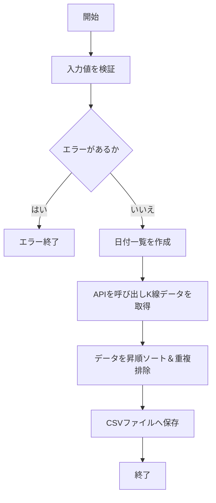

# 過去K線CSV作成機能 仕様書

## 1. 文書の目的

この文書は、バックテストで使用する過去K線CSVを作成する機能の仕様を定義するものです。

バックテストの入力データとして、GMOコイン Public API から取得したK線データをCSV形式で保存できるようにします。

## 2. 対象範囲

### 対象

- 指定された期間のK線データをGMOコイン Public APIから取得する処理
- 取得したK線データをCSVファイルとして保存する処理

### 対象外

- 保存したCSVを読み込む処理（別仕様書で定義）
- バックテスト自体の実行（別仕様書で定義）

## 3. 用語

| 用語 | 意味 |
| --- | --- |
| K線 | 一定時間の始値・高値・安値・終値・出来高をまとめた価格データ |

## 4. 機能概要

指定された開始日から終了日までの日付範囲を受け取り、1日ごとにGMOコイン Public APIのK線取得APIを呼び出します。取得したK線データを1つの一覧にまとめ、openTime の昇順に並べ、重複を排除した上でバックテスト入力用のCSVファイルとして保存します。

## 5. 入力仕様

| 項目 | 例 | 必須 | 説明 |
| --- | --- | --- | --- |
| APP_CONFIG_PATH | config/application-gmo.yaml | 必須 | アプリケーション設定ファイルのパス |
| APP_DATA_DIR | ../../data | 必須 | 出力ファイルの基準ディレクトリ |
| KLINE_EXPORT_SYMBOL | BTC | 必須 | 取得対象の通貨 |
| KLINE_EXPORT_INTERVAL | 5min | 必須 | K線の時間間隔 |
| KLINE_EXPORT_START_DATE | 20260501 | 必須 | 取得開始日 (yyyyMMdd形式) |
| KLINE_EXPORT_END_DATE | 20260531 | 必須 | 取得終了日 (yyyyMMdd形式) |
| KLINE_EXPORT_OUTPUT_PATH | backtest/input/btc_5min_20260501_20260531.csv | 必須 | CSVの出力先パス |

## 6. 出力仕様

| 項目 | 例 | 説明 |
| --- | --- | --- |
| 過去K線CSVファイル | data/backtest/input/btc_5min_20260501_20260531.csv | K線データを保存したCSVファイル |

CSVヘッダー:
`openTime,open,high,low,close,volume`

## 7. 処理仕様

1. アプリケーション設定を読み込む
2. 入力値から取得条件を組み立てる
3. 開始日から終了日までの日付一覧を作成する
4. 各日付についてGMOコイン Public APIのK線取得APIを呼び出す
5. 取得したK線データを一覧に追加する
6. 全日付の取得が完了したら、openTime の昇順に並べる
7. openTime が重複するデータを1件にまとめる
8. CSVファイルとして保存する

## 8. 判定条件・業務ルール

| 条件 | 結果 |
| --- | --- |
| 同じ openTime のデータが複数存在する | 1件だけを出力する |
| 指定された日付範囲 | 開始日と終了日の両方を含めて取得する |
| 出力先パスが相対パスである | `APP_DATA_DIR` 配下のパスとして扱う |
| 出力先の親ディレクトリが存在しない | CSV保存時に作成する |

## 9. エラー仕様

| エラー条件 | 扱い | メッセージ方針 |
| --- | --- | --- |
| 必須入力値が不足している | エラーにする | どの項目が不足しているか分かるようにする |
| 日付形式が yyyyMMdd ではない | エラーにする | 正しい形式を指定するよう案内する |
| 開始日が終了日より後になっている | エラーにする | 開始日と終了日の関係が不正であることを示す |
| GMOコイン Public APIからの取得に失敗した | エラーにする | 取得に失敗した日付や原因をログ出力する |
| CSVファイルの保存に失敗した | エラーにする | 保存先パスと書き込み権限を確認するよう促す |
| 取得結果が0件の日付がある | エラーにしない | 指定期間全体の結果をそのままCSV保存する |

## 10. 具体例

### 例1: 正常に処理される場合

- 実行時刻: 2026-06-01 10:00
- 入力:
  - 開始日: 20260501
  - 終了日: 20260503
- 現在状態: 指定された期間のK線データがGMOサーバーに存在する
- 期待する結果: 20260501, 20260502, 20260503 の3日分のK線データが取得され、1つのCSVファイルとして保存される。

## 11. Mermaid による処理フロー

## 12. 関連ドキュメント

- [対応する設計書](../../architecture/kline-csv-export-design.md)
