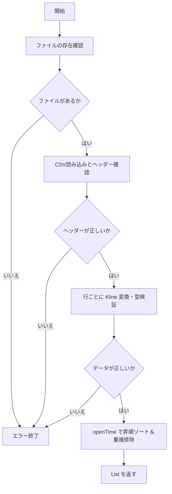

# 過去K線CSV読み込み機能 仕様書

| 項目 | 内容 |
| --- | --- |
| 想定読者 | K線CSV読み込み機能を実装・レビューする開発者 |
| 読んだあとできること | 読み込むCSVの形式と、異常データの扱いを説明できる |
| 状態 | 現行 |
| 機密区分 | 公開可 |
| 作成者 | リポジトリ管理者 |
| 保守責任者 | リポジトリ管理者 |
| 最終確認日 | 2026-08-30 |


## 1. 文書の目的

この文書は、バックテストで使用する過去K線CSVを読み込む機能の仕様を定義するものです。

過去K線CSVファイルを読み込み、K線データのリストとして提供します。

## 2. 対象範囲

この文書が扱う範囲と、扱わない範囲を示します。扱わないことには行き先を書いています。

### 対象

- 指定されたCSVファイルからK線データを読み込む処理
- データの形式チェックとソート・重複排除

### 対象外

- CSVファイルの作成処理（別仕様書で定義）
- 読み込んだK線データを使ったバックテストの実行（別仕様書で定義）

## 3. 用語

| 用語 | 意味 |
| --- | --- |
| K線 | 一定時間の始値・高値・安値・終値・出来高をまとめた価格データ |

## 4. 機能概要

指定された過去K線CSVファイルのパスからファイルを読み込み、ヘッダーとデータの検証を行い、時間（openTime）の昇順に並べ替え、重複を排除した `List<Kline>` に変換して返却します。

## 5. 入力仕様

| 項目 | 例 | 必須 | 説明 |
| --- | --- | --- | --- |
| BACKTEST_KLINE_CSV_PATH | ../../data/backtest/input/btc_5min_20260501.csv | 必須 | 読み込む過去K線CSVファイルのパス |

## 6. 出力仕様

| 項目 | 例 | 説明 |
| --- | --- | --- |
| K線データリスト | List<Kline> | CSVから読み込み、変換・ソートされたK線データのリスト |

## 7. 処理仕様

**ファイルを開く**

1. 入力値からCSVファイルパスを取得する
2. CSVファイルの存在を確認する
3. CSVファイルを読み込む

**1行ずつ読む**

4. 1行目をヘッダーとして読み込む
5. ヘッダーが `openTime,open,high,low,close,volume` の順番であることを確認する
6. 2行目以降をデータ行として読み込む（空行は無視）
7. 各データ行を `Kline` モデルに変換し、数値として解釈できるか確認する

**整える**

8. 読み込み完了後、`openTime` の昇順に並べる
9. `openTime` が重複するデータを1件にまとめる
10. `List<Kline>` として返す

## 8. 判定条件・業務ルール

| 条件 | 結果 |
| --- | --- |
| 同じ openTime のデータが複数存在する | CSV内で最初に出てきた行を1件として採用する |
| BACKTEST_KLINE_CSV_PATH が相対パス | 実行時のカレントディレクトリからの相対パスとして扱う |
| BACKTEST_KLINE_CSV_PATH が絶対パス | 指定された絶対パスをそのまま利用する |
| CSVのセルがダブルクォートで囲まれている | ダブルクォートを外して読み込む（opencsvの挙動） |

## 9. エラー仕様

以下の場合はエラーとして扱います。

| エラー条件 | 扱い | メッセージ方針 |
| --- | --- | --- |
| CSVファイルパスが指定されていない | エラーにする | パスが未指定であることを伝える |
| CSVファイルが存在しない | エラーにする | 指定されたパスにファイルがないことを伝える |
| CSVファイルを読み込めない | エラーにする | 権限やファイル破損などの原因を伝える |
| ヘッダーの順番が不正 | エラーにする | 期待するヘッダー順序を伝える |
| 必須項目が空になっている | エラーにする | 行番号と空の列名が分かるようにする |
| open等の一部項目が数値として解釈できない | エラーにする | 行番号と解釈できなかった値が分かるようにする |

## 10. 具体例

代表的な入力と、そのときに期待する出力を示します。

### 例1: 正常に処理される場合

- 入力パス: `data/test.csv`
- CSVの内容:
  ```csv
  openTime,open,high,low,close,volume
  1717200000000,10000000,10050000,9950000,10020000,12.5
  ```
- 期待する結果: 1件のKlineオブジェクトを含むリストが返却される。

### 例2: エラーになる場合

- 入力パス: `data/error.csv`
- CSVの内容:
  ```csv
  openTime,open,high,low,close,volume
  1717200000000,abc,10050000,9950000,10020000,12.5
  ```
- 期待する結果: 2行目の `open` が数値として解釈できないため、エラーが発生しメッセージが表示される。

## 11. Mermaid による処理フロー



## 12. 関連ドキュメント

- [対応する設計書](../../architecture/kline-csv-import-design.md)
