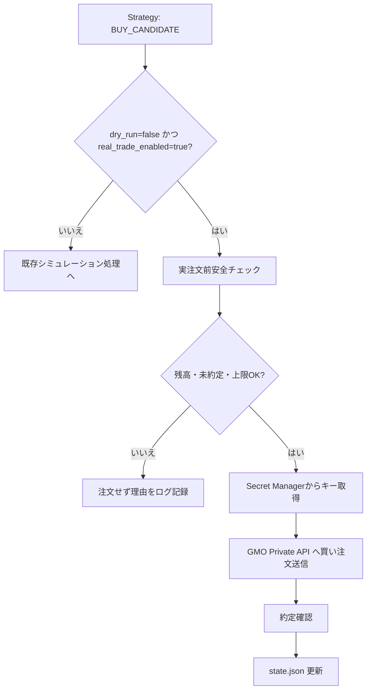

# リアル購入処理（GMOコイン） 仕様書

> **この仕様は Phase3（実注文 + 手動承認 + 安全制御）のスコープです。**
> 現在進行中の Phase1 では有効化しません。運用設定は `dry_run: true` / `real_trade_enabled: false` で固定されており、`app.phase` が 3 未満の場合は起動時ガードにより実注文経路に入る前に異常終了します。
> フェーズの定義は [ロードマップ](../../overview/roadmap.md)、Phase1 側の扱いは [Phase1 仕様書](../phase1-simulation.md) を参照してください。

## 1. 文書の目的

この文書は、GMOコイン Private API を利用した「リアル注文処理」の仕様を定義するものです。

既存の Strategy が出力した判定結果（シグナル）を元に、安全に実注文を行えるかどうかの確認とAPI呼び出しの条件を定めます。

## 2. 対象範囲

### 対象

- リアル注文実行のための安全条件（残高、未約定、上限のチェック）
- GMOコイン Private API への買い注文の送信
- `dry_run` モードと実注文モードの振る舞いの違い

### 対象外

- レバレッジ取引
- 売り注文（SELL）の自動化（初期対応は買いのみ）
- テクニカル分析や売買判断そのもの（Strategyの責務）

## 3. 用語

| 用語 | 意味 |
| --- | --- |
| dry-run | 実際のお金を動かさず、注文動作をシミュレーションするモード |
| BUY_CANDIDATE | Strategyから出力される、買い注文候補のシグナル |

## 4. 機能概要

リアル注文処理は相場の売買判断を行わず、Strategyからの「買い」シグナル（`BUY_CANDIDATE`）を受け取った際に、残高や上限設定などの「安全面」から実注文してよいかを判断し、条件をクリアした場合のみ GMOコイン Private API に注文を送信します。

## 5. 入力仕様

| 項目 | 例 | 必須 | 説明 |
| --- | --- | --- | --- |
| Strategy判定結果 | BUY_CANDIDATE | 必須 | Strategyが出力する売買シグナル |
| 設定: real_trade_enabled | true | 必須 | 実注文を許可するかのフラグ |
| 設定: dry_run | false | 必須 | シミュレーションモードかどうかのフラグ |
| 設定: max_order_jpy | 10000 | 必須 | 1回あたりの注文金額上限 |
| GMO API 情報 | - | 必須 | GCP Secret Managerから取得するAPIキー等 |

## 6. 出力仕様

| 項目 | 例 | 説明 |
| --- | --- | --- |
| state.json | data/state.json | 実注文の結果（orderId、約定状況など）を保存 |
| GMO Private API 注文リクエスト | - | 条件を満たした場合に送信されるAPIリクエスト |
| ログ出力 | - | エラーや注文見送りの理由を記録（機密情報は除く） |

## 7. 処理仕様

1. Strategy から判定結果を受け取る
2. 判定結果が `BUY_CANDIDATE` 以外の場合は何もしない（またはシミュレーション処理のみ）
3. `dry_run=false` かつ `real_trade_enabled=true` の場合、安全条件のチェックを開始する
4. GCP Secret Manager から APIキーを取得する
5. GMO API を使って残高確認と未約定注文の確認を行う
6. 安全条件をすべて満たす場合のみ、注文APIを呼び出す
7. 注文成功後、約定が確認できたら `state.json` の保有状態を更新する

## 8. 判定条件・業務ルール

以下の安全条件を**すべて満たす場合のみ**実注文を許可します。

| 条件 | 結果 |
| --- | --- |
| real_trade_enabled=true, dry_run=false である | 次のチェックへ |
| 対象の銘柄を保有中でない | 次のチェックへ（二重注文防止） |
| GMO側に未約定の注文が存在しない | 次のチェックへ（※1） |
| GMOの利用可能なJPY残高が注文予定額以上 | 次のチェックへ |
| 注文額が max_order_jpy 以下 | 次のチェックへ |
| 1日の累計注文額が max_daily_order_jpy 以下 | 次のチェックへ |
| 保有額と注文額の合計が max_position_jpy 以下 | 実注文を実行 |

> **（※1）`stop_on_unconfirmed_order` について**
> 設定キーとして存在しますが、**値に関わらず常に停止します**。`false` を有効にすると未確認注文がある状態でも発注できてしまい、安全側に倒す方針に反するためです。`false` を指定した場合は、設定が効いていないことに気付けるよう起動時に警告を出します。

## 9. エラー仕様

| エラー条件 | 扱い | メッセージ方針 |
| --- | --- | --- |
| 安全条件を1つでも満たさない | 実注文を見送る | 満たさなかった条件の理由をログに残す |
| APIからのエラーレスポンス | 以降の実注文を強制停止する | エラーコードを記録し復旧は手動とする |
| 注文送信後、約定ステータスが未確認 | 次回実注文を停止する | 未確認注文として記録し状態不整合を防ぐ |

## 10. 具体例

### 例1: 正常に処理される場合（実注文ON）

- 実行時刻: 2026-05-11 10:00
- 入力: `dry_run=false`, `real_trade_enabled=true`, シグナル=`BUY_CANDIDATE`
- 現在状態: 残高10万円、保有なし、未約定注文なし、上限チェックすべてクリア
- 期待する結果: Secret Managerからキーを取得し、GMO APIに注文を送信する。約定確認後、`state.json`に保有情報を更新する。

### 例2: エラーになる場合（残高不足による見送り）

- 実行時刻: 2026-05-11 10:00
- 入力: 同上
- 現在状態: GMO APIでの利用可能残高が500円（注文予定額1,000円未満）
- 期待する結果: 注文APIは呼ばず、「残高不足」の理由をログに記録して終了する。

## 11. Mermaid による処理フロー

## 12. 関連ドキュメント

- [対応する設計書](../../architecture/real-trading-gmo-order-design.md)
