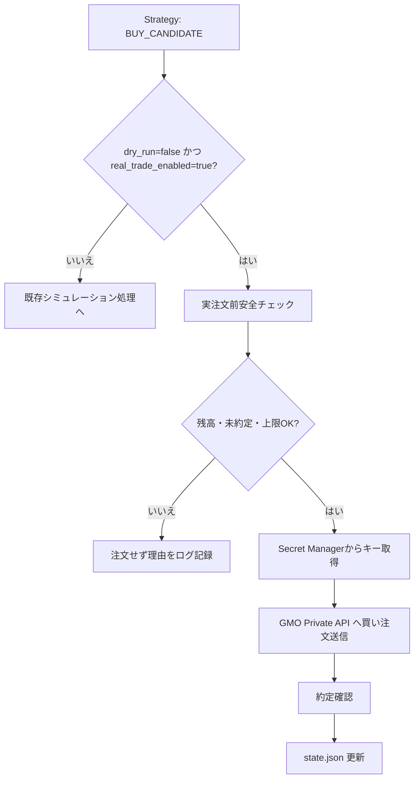
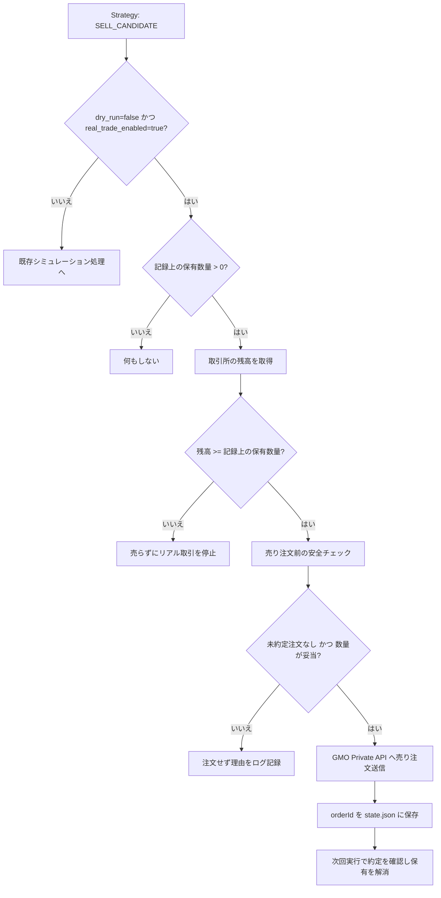

# リアル購入処理（GMOコイン） 仕様書

> **この仕様は Phase3（実注文 + 手動承認 + 安全制御）のスコープです。**
> 現在進行中の Phase1 では有効化しません。運用設定は `dry_run: true` / `real_trade_enabled: false` で固定されており、`app.phase` が 3 未満の場合は起動時ガードにより実注文経路に入る前に異常終了します。
> フェーズの定義は [ロードマップ](../../overview/roadmap.md)、Phase1 側の扱いは [Phase1 仕様書](../phase1-simulation.md) を参照してください。

## 1. 文書の目的

この文書は、GMOコイン Private API を利用した「リアル注文処理」の仕様を定義するものです。

既存の Strategy が出力した判定結果（シグナル）を元に、安全に実注文を行えるかどうかの確認とAPI呼び出しの条件を定めます。

## 2. 対象範囲

### 対象

- リアル注文実行のための安全条件（残高、未約定、上限のチェック）
- GMOコイン Private API への買い注文の送信
- GMOコイン Private API への売り注文（保有解消）の送信
- `dry_run` モードと実注文モードの振る舞いの違い

### 対象外

- レバレッジ取引
- 指値注文（現在は買い・売りとも成行のみ）
- 分割売却、トレーリングストップ
- テクニカル分析や売買判断そのもの（Strategyの責務）

## 3. 用語

| 用語 | 意味 |
| --- | --- |
| dry-run | 実際のお金を動かさず、注文動作をシミュレーションするモード |
| BUY_CANDIDATE | Strategyから出力される、買い注文候補のシグナル |

## 4. 機能概要

リアル注文処理は相場の売買判断を行わず、Strategyからのシグナルを受け取った際に、残高や上限設定などの「安全面」から実注文してよいかを判断し、条件をクリアした場合のみ GMOコイン Private API に注文を送信します。

- 「買い」シグナル（`BUY_CANDIDATE`）: 新規にポジションを取る注文を送信します。
- 「売り」シグナル（`SELL_CANDIDATE`）: 保有しているポジションを解消する注文を送信します。

注文の受付と約定は別のタイミングで起きます。**注文を送信した時点では保有状態を変更せず、次回以降の実行で注文照会と約定照会を行ってから状態に反映します。**

## 5. 入力仕様

| 項目 | 例 | 必須 | 説明 |
| --- | --- | --- | --- |
| Strategy判定結果 | BUY_CANDIDATE | 必須 | Strategyが出力する売買シグナル |
| 設定: real_trade_enabled | true | 必須 | 実注文を許可するかのフラグ |
| 設定: dry_run | false | 必須 | シミュレーションモードかどうかのフラグ |
| 設定: max_order_jpy | 10000 | 必須 | 1回あたりの注文金額上限 |
| 設定: min_order_size | 0.00001 | 必須 | 取引所が定める最小注文数量 |
| 設定: size_step | 0.00001 | 必須 | 取引所が定める注文数量の刻み |
| 設定: taker_fee_rate | 0.0005 | 必須 | 成行注文の手数料率。上限の判定に含める |
| 設定: max_slippage_rate | 0.005 | 必須 | 許容するスリッページの割合 |
| Ticker 最新価格 | 12447381 | 必須 | 注文数量と注文金額の計算に使う価格 |
| GMO API 情報 | - | 必須 | GCP Secret Managerから取得するAPIキー等 |

## 6. 出力仕様

| 項目 | 例 | 説明 |
| --- | --- | --- |
| state.json | data/state.json | 実注文の結果（orderId、約定状況など）を保存 |
| GMO Private API 注文リクエスト | - | 条件を満たした場合に送信されるAPIリクエスト |
| ログ出力 | - | エラーや注文見送りの理由を記録（機密情報は除く） |

## 7. 処理仕様

1. Strategy から判定結果を受け取る
2. 判定結果が `BUY_CANDIDATE` 以外の場合は何もしない（またはシミュレーション処理のみ）
3. `dry_run=false` かつ `real_trade_enabled=true` の場合、安全条件のチェックを開始する
4. GCP Secret Manager から APIキーを取得する
5. GMO API を使って残高確認と未約定注文の確認を行う
6. 安全条件をすべて満たす場合のみ、注文APIを呼び出す
7. 注文成功後、約定が確認できたら `state.json` の保有状態を更新する

## 8. 判定条件・業務ルール

以下の安全条件を**すべて満たす場合のみ**実注文を許可します。

| 条件 | 結果 |
| --- | --- |
| real_trade_enabled=true, dry_run=false である | 次のチェックへ |
| 対象の銘柄を保有中でない | 次のチェックへ（二重注文防止） |
| GMO側に未約定の注文が存在しない | 次のチェックへ（※1） |
| GMOの利用可能なJPY残高が注文予定額以上 | 次のチェックへ |
| 注文額が max_order_jpy 以下 | 次のチェックへ |
| 1日の累計注文額が max_daily_order_jpy 以下 | 次のチェックへ |
| 保有額と注文額の合計が max_position_jpy 以下 | 実注文を実行 |

### 8.1 売り注文の判定条件

売り注文は保有を解消する操作なので、買いとは判定内容が異なります。

| 条件 | 結果 |
| --- | --- |
| 記録上の保有数量が0より大きい | 次のチェックへ |
| 取引所の売却可能残高が、記録上の保有数量以上ある | 次のチェックへ（※2） |
| 未約定の注文が存在しない | 次のチェックへ |
| 売却数量が記録上の保有数量以下である | 売り注文を実行（※3） |

> **（※2）取引所の残高が記録より少ない場合**
> このアプリの知らないところで資産が動いています。そのまま売ると状態が食い違ったまま進むため、**売らずにリアル取引を停止**し、人の確認を待ちます。

> **（※3）売却数量の上限**
> 売却数量は**このアプリが約定として記録している保有数量を上限**とします。取引所の残高をそのまま全量売ると、同じ口座にある「このアプリ以外が買った資産」まで売ってしまうためです。可能であれば、このアプリ専用の口座を使ってください。

### 8.2 注文数量の丸めと端数（ダスト）

取引所は最小注文数量と数量の刻みを持ちます。刻みに合わない数量を送ると注文は拒否されます。GMOコインの BTC は `GET /public/v1/symbols` で確認でき、2026-08-29 時点では最小注文数量・刻みとも 0.00001 です。

| 状況 | 振る舞い |
| --- | --- |
| 計算した注文数量が刻みに合わない | 刻みの整数倍に**切り捨てる**。切り上げると注文金額の上限を超える可能性があるため |
| 丸めた結果が最小注文数量に満たない | **注文を見送る**（正常系）。停止させない |
| 保有数量が最小注文数量に満たない（ダスト） | **保有とみなさない**。ダストを保有とみなすと二重保有防止のチェックに永久に引っかかり、以後1回も買えなくなる |
| `min_order_size` / `size_step` が未設定 | **起動時に異常終了する**。設定漏れのまま実注文すると、注文のたびに拒否されて停止する |

売り注文の数量も同じ規則で丸めます。

### 8.3 注文価格の基準とスリッページ

注文数量は「注文金額 ÷ 価格」で決まります。**この価格には K線の終値ではなく、取引所の最新価格（Ticker の `last`）を使います。** K線の終値は最大で1本分（5分足なら5分）古いため、急騰しているときにその価格で割ると想定より多い数量を注文することになり、約定金額が `max_order_jpy` を超えます。

| 状況 | 振る舞い |
| --- | --- |
| Ticker が取得できない、または値が0以下 | **注文を見送る**。停止させない |
| K線の終値と Ticker の乖離が `max_slippage_rate` を超える | **注文を見送る**。どちらが正しい価格か判断できないため。停止させない |
| 約定価格が発注時の想定価格から `max_slippage_rate` を超えて乖離 | 約定を状態に反映したうえで、**新規の買いを止める**（`isStopped=true`） |

いずれの場合も、**未確認注文の照合は価格に関係なく行います。** 価格が取れないことを理由に、注文の行方が分からないまま放置してはいけません。

### 8.4 手数料の扱い

上限は「実際に口座から出ていく額」に対してかける必要があるため、**注文金額の判定には手数料を含めます**。

- `max_order_jpy` / `max_daily_order_jpy` / `max_position_jpy` の判定に使う金額は、手数料を含めた額です。端数は切り上げて安全側に倒します。
- `order_sizing_mode: ALL_IN` の場合、残高を全額注文に回すと手数料の分だけ足りなくなります。手数料を差し引いた額を注文金額にします。
- `state.json` に記録する `requestedAmountJpy` と `dailyOrderedJpy` も手数料を含めた額です。

確定損益に**買い時の手数料は反映されません**（売り時の手数料のみ差し引きます）。

### 8.5 停止中（`isStopped=true`）の振る舞い

| 注文 | 停止中の振る舞い |
| --- | --- |
| 買い | **実行しない** |
| 売り | **実行する** |

停止中に売りまで止めると、ポジションを抱えたまま損切りできなくなります。停止が止めるのは新規の買いだけです。ただし売り注文の処理中に例外が起きた場合は、他と同様に停止して人の確認を待ちます。

> **（※1）`stop_on_unconfirmed_order` について**
> 設定キーとして存在しますが、**値に関わらず常に停止します**。`false` を有効にすると未確認注文がある状態でも発注できてしまい、安全側に倒す方針に反するためです。`false` を指定した場合は、設定が効いていないことに気付けるよう起動時に警告を出します。

## 9. エラー仕様

| エラー条件 | 扱い | メッセージ方針 |
| --- | --- | --- |
| 安全条件を1つでも満たさない | 実注文を見送る | 満たさなかった条件の理由をログに残す |
| APIからのエラーレスポンス | 以降の実注文を強制停止する | エラーコードを記録し復旧は手動とする |
| 注文送信後、約定ステータスが未確認 | 次回実注文を停止する | 未確認注文として記録し状態不整合を防ぐ |

## 9.1 現在の制約

実注文を有効にする前に把握しておく必要がある制約です。

- **確定損益に買い時の手数料が含まれません。** 売り時の手数料のみを差し引いています。
- **クールダウンを使う Strategy を実取引で使ってはいけません。** 実注文の売りでは `lastStopLossTime` を更新しないため、`CooldownReboundStrategy` / `TrendConfirmReboundStrategy` / `AtrTrendConfirmReboundStrategy` のクールダウンが機能しません。実取引では `SafeReboundStrategy` を使ってください。
- **発注の「意図」を送信前に保存していません。** 注文送信後・状態保存前にプロセスが落ちると、取引所に注文があるのにアプリ側に記録が残りません。

これらの扱いは [実注文までの作業計画](../../plans/README.md) を参照してください。

## 10. 具体例

### 例1: 正常に処理される場合（実注文ON）

- 実行時刻: 2026-05-11 10:00
- 入力: `dry_run=false`, `real_trade_enabled=true`, シグナル=`BUY_CANDIDATE`
- 現在状態: 残高10万円、保有なし、未約定注文なし、上限チェックすべてクリア
- 期待する結果: Secret Managerからキーを取得し、GMO APIに注文を送信する。約定確認後、`state.json`に保有情報を更新する。

### 例2: エラーになる場合（残高不足による見送り）

- 実行時刻: 2026-05-11 10:00
- 入力: 同上
- 現在状態: GMO APIでの利用可能残高が500円（注文予定額1,000円未満）
- 期待する結果: 注文APIは呼ばず、「残高不足」の理由をログに記録して終了する。

## 11. Mermaid による処理フロー

### 売り注文のフロー

> 売り注文は `realTrading.isStopped=true` でも実行します（上記 8.5）。

## 12. 関連ドキュメント

- [対応する設計書](../../architecture/real-trading-gmo-order-design.md)
