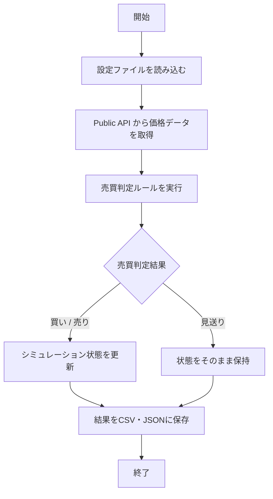

# Phase1（シミュレーション基盤構築） 仕様書

| 項目 | 内容 |
| --- | --- |
| 想定読者 | Phase1 の実装・レビューをする開発者 |
| 読んだあとできること | Phase1 が満たすべき入力・出力・判定条件を説明できる |
| 状態 | 現行 |
| 機密区分 | 公開可 |
| 作成者 | リポジトリ管理者 |
| 保守責任者 | リポジトリ管理者 |
| 最終確認日 | 2026-08-30 |

## 1. 文書の目的

この文書では、Phase1（最初の段階）で開発するシステムの仕様を定義します。

- 対象となる取引所と仮想通貨
- このフェーズでサポートする機能のスコープ
- プログラムが動く基本的な流れ
- 保存するデータの種類

## 2. 対象範囲

この文書が扱う範囲と、扱わない範囲を示します。扱わないことには行き先を書いています。

### 対象

- 安全を最優先とし、実資金による実際の注文を行わない「シミュレーション環境」の構築
- GMOコイン Public API を利用した市場データの取得
- 定期実行による売買判定処理
- CSVおよびJSONファイルへのシミュレーション結果の保存

### 対象外

- 実資金を使った実際の注文（リアル注文）
- GMOコイン Private API の利用
- レバレッジ取引

### 実注文機能の位置づけ

リアル注文機能（GMOコイン Private API の利用、`RealTradingService`）は **Phase3** のスコープですが、コード上には先行実装されています。Phase1 では次の3つで実行できないようにしています。

1. **起動時ガード**: `app.phase` が 3 未満のときに `real_trade_enabled: true` かつ `dry_run: false` を検出すると、Private API クライアントを組み立てる前に異常終了します。
2. **既定値**: [config/application-gmo.yaml](https://github.com/ht-0328/crypto-autotrading-lab/blob/main/config/application-gmo.yaml) は `dry_run: true` / `real_trade_enabled: false` です。
3. **CI**: [ci/prepare-ci-config.sh](https://github.com/ht-0328/crypto-autotrading-lab/blob/main/ci/prepare-ci-config.sh) は常に実注文を無効にした設定を生成します。切り替えの入力は用意していません。

リアル注文そのものの仕様は [リアル購入処理（GMOコイン） 仕様書](features/real-trading-gmo-order.md) を参照してください。フェーズの定義は [ロードマップ](../overview/roadmap.md) にあります。

## 3. 用語

| 用語 | 意味 |
| --- | --- |
| K線 | 一定時間の始値・高値・安値・終値・出来高をまとめた価格データ |
| Strategy | 売買判断のルールを切り替えられるようにした部品 |
| シミュレーション環境 | 実際の注文は行わず、手元のデータ上で仮想の売買を行う環境 |
| ステート | アプリの「今の状態」 |

## 4. 機能概要

Phase1は、安全を最優先とし、実資金による実際の注文を行わない「シミュレーション環境」を作るフェーズです。
定期的に市場データを取得し、設定された売買ルール（Strategy）に従って仮想の売買判定を行います。結果はファイルとして出力され、ユーザーが過去の売買成績を後から確認できるようにします。

## 5. 入力仕様

| 項目 | 例 | 必須 | 説明 |
| --- | --- | --- | --- |
| config/application-*.yaml | config/application-test.yaml | 必須 | 売買ルールや初期資金、ファイル保存先などを指定する設定ファイル |
| Public API K線データ | (GMO API レスポンス) | 必須 | GMOコイン Public API から取得した5分足などの価格データ |

## 6. 出力仕様

| 項目 | 例 | 説明 |
| --- | --- | --- |
| state.json | data/state.json | 現在仮想通貨を持っているかどうか、いくらで買ったか、仮想残高などを保存するJSONファイル |
| 実行履歴CSV | data/trades_20260501.csv | 1日1ファイル作成し、日時のほかに価格、判定理由、仮想損益などを保存するファイル。ファイル名は設定の `output.output_path`（既定 `trades.csv`）に日付を付けたもの |
| ログ出力 | (標準出力とファイル) | 実行ごとの判定結果やエラー情報などを、画面（コンソール）と `APP_DATA_DIR/app.log` の両方に出す。標準出力は Cloud Run のログ収集に拾わせるために必要 |

## 7. 処理仕様

プログラムは5分ごとに以下の順番で動きます。

1. 設定ファイル（YAML）を読み込む
2. GMOコイン Public API から直近の価格データを取得する
3. 価格データをもとに、売買の判定ルール（Strategy）を実行する
4. 判定結果に合わせて、シミュレーションの状態（仮想資金や保有ポジション）を更新する
5. 実行結果を画面（コンソール）に出す
6. 今回の結果をCSVに書き足し、実行後の状態をJSONファイルに保存する

## 8. 判定条件・業務ルール

売買の基本設定

| 条件 | 結果 |
| --- | --- |
| 初期仮想元本 | 10,000円から開始する |
| 1回の売買金額 | `order_sizing_mode` で決まる（下表）。既定は 1,000円固定 |
| ポジション上限 | 同時に持てるのは1つ（1ポジション）だけとする |

### 注文サイズの決め方（order_sizing_mode）

| モード | 動作 | Phase1 での扱い |
| --- | --- | --- |
| `FIXED_AMOUNT` | `trading.trade_amount` 円分だけ買う | **既定。Phase1 ではこちらのみを使う** |
| `ALL_IN` | 使える残高を全部使って買う | バックテストでの検証用。実運用の設定では使わない |

`ALL_IN` は1回の取引に資金を全額投じるため、Phase1 の「安全を最優先」という方針とは相容れません。戦略の比較検証でのみ使用してください。

### K線の取得対象日

K線の取得対象日は、取引所の営業日区切り（朝6時）に合わせて切り替わります。**当営業日分だけでなく、前営業日分もあわせて取得します。**

当営業日分だけを取得すると、6時を過ぎた直後は判定に必要な本数が揃いません。5分足の場合、毎日 6:00 から約75分間は判定がスキップされます。この間は保有中でも利確・損切りが働きません。前営業日分とあわせることで、営業日の境界をまたいで連続した系列になり、この時間帯も判定できます。

- 必要な本数は戦略により異なり、最大で15本（`atr_length` が 14 の場合）です。
- 2営業日分をつなげたあと、**判定に使うのは直近60本だけ**です。1日分すべてを検証対象にすると、判定に使わない古い箇所の欠損で見送りになってしまうためです。
- 前営業日分の取得に失敗した場合は、警告を残して当営業日分だけで判定を続けます。前営業日分は補助的な位置づけです。

## 9. エラー仕様

| エラー条件 | 扱い | メッセージ方針 |
| --- | --- | --- |
| APIからの価格データ取得に失敗した | 今回の定期実行をスキップする | 取得失敗の旨と理由をログに残す |
| CSVまたはJSONファイルの保存に失敗した | エラーをログに記録し終了する | ファイル保存パスや権限のエラーであることを明確にする |

## 10. 具体例

代表的な入力と、そのときに期待する出力を示します。

### 例1: 正常に処理される場合（シミュレーション買い）

- 実行時刻: 2026-05-11 10:00
- 入力: 最新価格 10,000,000 円
- 現在状態: 仮想資金 10,000円、保有なし
- 期待する結果: Strategy が買いを判定。仮想資金から1,000円分マイナスされ、仮想保有数が加算される。結果が `state.json` と CSV に保存される。

## 11. Mermaid による処理フロー

## 12. 関連ドキュメント

- [対応する設計書](../architecture/system-overview.md)
