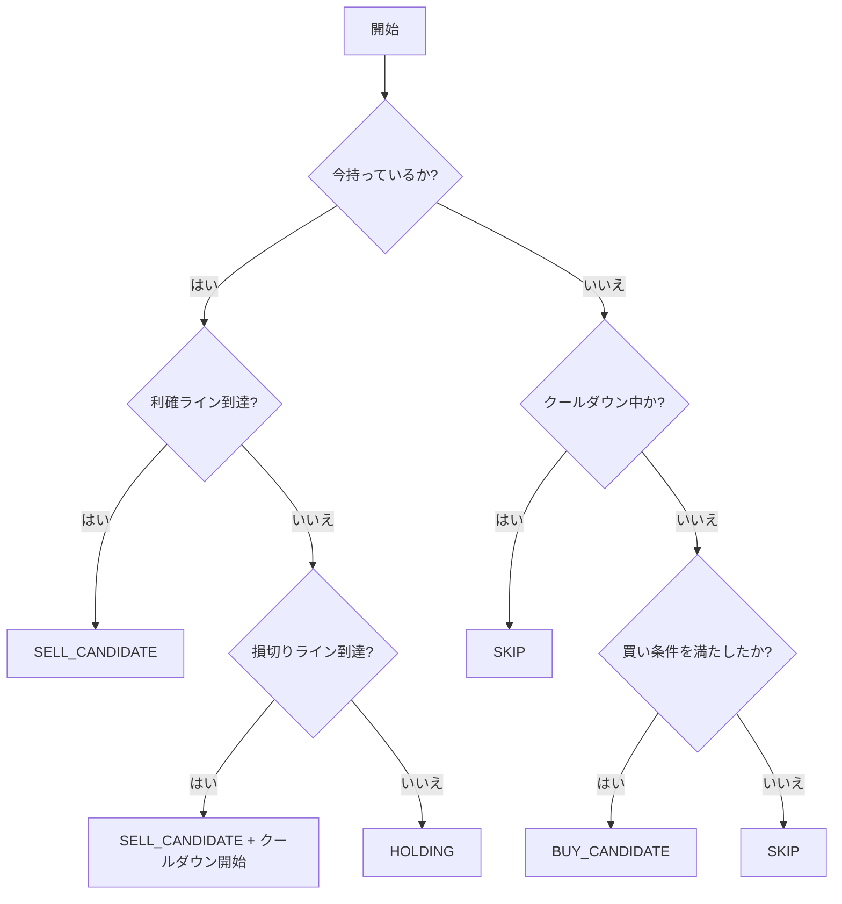

# CooldownReboundStrategy 仕様書

| 項目 | 内容 |
| --- | --- |
| 想定読者 | この戦略を実装・レビューする開発者 |
| 読んだあとできること | 損切り後のクールダウン判定の条件を説明できる |
| 状態 | 現行 |
| 機密区分 | 公開可 |
| 作成者 | リポジトリ管理者 |
| 保守責任者 | リポジトリ管理者 |
| 最終確認日 | 2026-08-30 |

## 1. 文書の目的

この文書では、新しい売買戦略 `CooldownReboundStrategy` の仕様を定義します。

損切り後にすぐ再エントリーしない（クールダウン）方針の具体的な仕様を決め、既存の `SafeReboundStrategy` との違いやバックテストでの比較観点を整理します。

## 2. 対象範囲

この文書が扱う範囲と、扱わない範囲を示します。扱わないことには行き先を書いています。

### 対象

- `CooldownReboundStrategy` の売買判定ルール
- クールダウン期間の開始と終了条件

### 対象外

- 他の戦略の仕様（別仕様書で定義）

## 3. 用語

| 用語 | 意味 |
| --- | --- |
| K線 | 一定時間の始値・高値・安値・終値・出来高をまとめた価格データ |
| Strategy | 売買判断のルールを切り替えられるようにした部品 |
| クールダウン | 損切り後、一定期間再エントリーを行わないこと |

## 4. 機能概要

`CooldownReboundStrategy` は、下落後の反発を狙うという点では `SafeReboundStrategy` と同じですが、「損切り直後の一定期間は、いかなる買い条件を満たしても再エントリーしない」というクールダウン期間を設けます。これにより、連続下落相場での「往復ビンタ（連続損切り）」を減らし、最大ドローダウンを抑えることを目的としています。

## 5. 入力仕様

| 項目 | 例 | 必須 | 説明 |
| --- | --- | --- | --- |
| K線リスト | List<Kline> | 必須 | 売買判定に用いる直近の価格データ |
| 状態 | SimulationState | 必須 | 現在の保有状態や最終損切り時刻などの状態 |

## 6. 出力仕様

| 項目 | 例 | 説明 |
| --- | --- | --- |
| 売買判定結果 | BUY_CANDIDATE | 買う、売る、保持、見送りのいずれか |

## 7. 処理仕様

1. 現在保有中かどうか確認する
2. 保有中の場合、利確または損切り条件を満たすか確認する
3. 損切り条件を満たした場合は、売り判定とともにクールダウンを開始（最終損切り時刻を記録）する
4. 非保有の場合、現在クールダウン期間中かどうか確認する
5. クールダウン期間中であれば、買い条件を満たしても見送りとする
6. クールダウン期間外であれば、買い条件を確認し、満たせば買い判定を出す

## 8. 判定条件・業務ルール

| 条件 | 結果 |
| --- | --- |
| 損切り条件を満たした | SELL_CANDIDATE + クールダウン開始 |
| 非保有かつクールダウン期間中 | SKIP（買い見送り） |
| 非保有かつクールダウン外かつ買い条件成立 | BUY_CANDIDATE |

**クールダウン期間の設定値**
初期値は 12本（5分足の場合は1時間）とします。

## 9. エラー仕様

（特になし）判定に必要なK線本数が足りない場合は見送りとします。

## 10. 具体例

代表的な入力と、そのときに期待する出力を示します。

### 例1: 正常に処理される場合（損切り後のクールダウン）

- 現在状態: 保有中
- 価格変動: 損切りラインに到達
- 期待する結果: `SELL_CANDIDATE` となり、以降12本のK線の間は、条件を満たしても買わずに見送る。

## 11. Mermaid による処理フロー

## 12. 関連ドキュメント

- [対応する設計書](../../architecture/trading-strategy-design.md)
