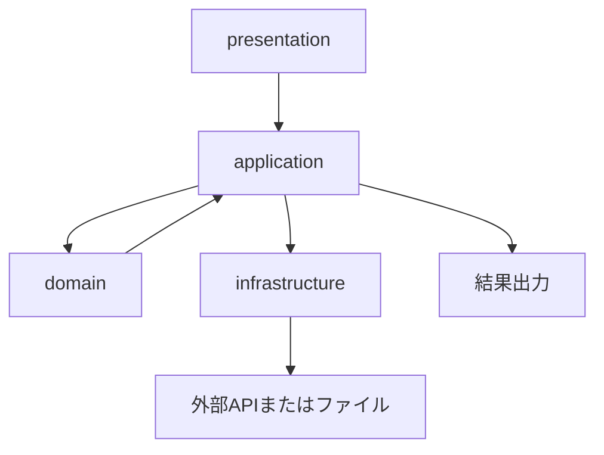

# {機能名} 設計書

## 1. 文書の目的

この文書では、対応する仕様をどのように実装するかを定義する。

## 2. 対応する仕様書

- [対応する仕様書](../specifications/features/example.md)

## 3. 設計方針

この機能を実装するときの基本方針を書く。

例:

- domain には外部API通信やファイル保存を書かない
- application は処理の流れを管理する
- infrastructure は外部API通信やファイル入出力を担当する

## 4. 責務分担

| 層・部品 | 役割 |
| --- | --- |
| presentation | 実行入口 |
| application | 処理順序の管理 |
| domain | 判定・計算などの中心ルール |
| infrastructure | API通信、CSV入出力、ファイル保存 |

## 5. 配置予定のクラス・ファイル

| 種類 | 配置 | 役割 |
| --- | --- | --- |
| class | `domain.example.ExampleService` | 中心処理を担当 |
| interface | `domain.repository.ExampleRepository` | 外部処理の抽象化 |
| class | `infrastructure.example.ExampleFileRepository` | ファイル保存の実装 |

## 6. 処理フロー

実装上の処理の流れを書く。

1. presentation が起動する
2. application が設定を読み込む
3. domain の処理を呼び出す
4. infrastructure 経由で外部APIまたはファイルを扱う
5. 結果を返す

## 7. Mermaid による設計フロー

## 8. データの流れ

| データ | 発生元 | 渡し先 | 説明 |
| --- | --- | --- | --- |
| Kline | infrastructure | domain | 売買判定に使う価格データ |

## 9. 状態管理

状態を保存する場合は、どこに何を保存するかを書く。

| 保存先 | 保存内容 | 更新タイミング |
| --- | --- | --- |
| `state.json` | 保有状態、買値、残高 | 売買判定後 |

## 10. エラー処理設計

| エラー | 検知する場所 | 扱い |
| --- | --- | --- |
| CSVが存在しない | infrastructure | application にエラーを返す |

## 11. 具体例

具体例は抽象的にせず、時刻、価格、金額、状態などを入れる。

### 例1: 正常処理

- 10:00 にアプリが起動する
- 現在価格が 10,000,000 円
- Strategy が `BUY_CANDIDATE` を返す
- application が SimulationService を呼び出す
- `state.json` に保有数量と買値が保存される

## 12. テスト方針

| テスト対象 | 確認内容 |
| --- | --- |
| domain | 判定・計算が正しいこと |
| application | 処理の呼び出し順が正しいこと |
| infrastructure | CSVやAPIの入出力が正しいこと |

## 13. 関連ドキュメント

- [対応する仕様書](../specifications/features/example.md)
