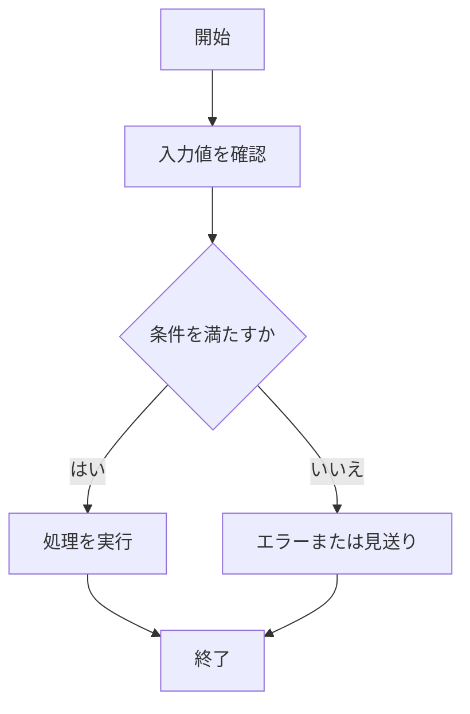

# {機能名・戦略名} 仕様書

| 項目 | 内容 |
| --- | --- |
| 状態 | 現行 / 将来案 / 廃止 のいずれかを書く |
| 最終確認日 | YYYY-MM-DD（実装と突き合わせて確認した日） |

## 1. 文書の目的

この文書で何を決めるのかを書く。

例:

- この機能が受け取る入力
- この機能が出力する内容
- 正常時の動き
- エラー時の扱い
- 判定条件

## 2. 対象範囲

### 対象

- この仕様書で扱うこと

### 対象外

- この仕様書では扱わないこと

## 3. 用語

| 用語 | 意味 |
| --- | --- |
| K線 | 一定時間の始値・高値・安値・終値・出来高をまとめた価格データ |
| Strategy | 売買判断のルールを切り替えられるようにした部品 |

## 4. 機能概要

利用者またはシステムから見て、この機能が何をするのかを書く。

## 5. 入力仕様

| 項目 | 例 | 必須 | 説明 |
| --- | --- | --- | --- |
| EXAMPLE_VALUE | sample | 必須 | 入力値の説明 |

## 6. 出力仕様

| 項目 | 例 | 説明 |
| --- | --- | --- |
| result | SUCCESS | 出力値の説明 |

## 7. 処理仕様

処理の順番を番号付きで書く。

1. 入力値を受け取る
2. 入力値を検証する
3. 必要な処理を実行する
4. 結果を返す、または保存する

## 8. 判定条件・業務ルール

条件分岐や判定ルールを書く。

| 条件 | 結果 |
| --- | --- |
| 条件Aを満たす | 処理Aを行う |
| 条件Aを満たさない | 処理Bを行う |

## 9. エラー仕様

| エラー条件 | 扱い | メッセージ方針 |
| --- | --- | --- |
| 必須項目がない | エラーにする | どの項目が不足しているか分かるようにする |

## 10. 具体例

具体例は抽象的にせず、時刻、価格、金額、状態などを入れる。

### 例1: 正常に処理される場合

- 実行時刻:
- 入力:
- 現在価格:
- 現在状態:
- 期待する結果:

### 例2: エラーになる場合

- 実行時刻:
- 入力:
- 現在状態:
- 期待する結果:

## 11. Mermaid による処理フロー

## 12. 関連ドキュメント

- [対応する設計書](../architecture/example-design.md)
